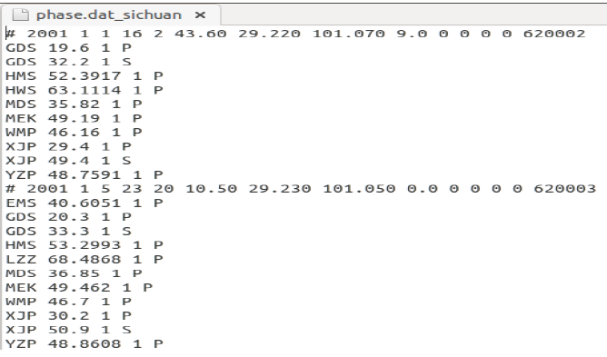
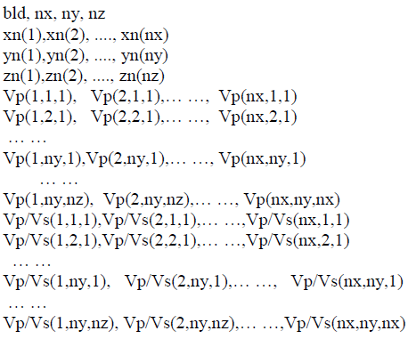
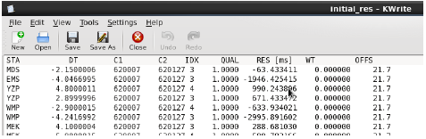

Body Wave Tomography
==========================

The significance of velocity model in seismology
____________________________________________________________

Velocity is the essential physical property of underground objects. It can be used to detect the presence (location and size) of different geological objects underground and can be used to search for oil and metal deposits. Furthermore, velocity models can be used to investigate the evolution of the earth, as well as the location and origin of earthquakes. Body waves and surface waves are two types of seismic waves. For velocity inversion, we can use body waves (P- and S-waves), surface waves, or joint body waves and surface waves. There are many velocity inversion methods, such as one-dimensional model inversion, tomographic velocity inversion, and full waveform inversion. These methods have different computational efficiency and accuracy. The research method to use is determined by the accuracy requirements of the research objectives, the quality of seismic data, and the economic cost. Here we introduce a seismic traveltime tomographic inversion method. It uses first arrivals of body waves and plays an important role in detecting the internal structure of the solid earth.

Brief introduction of the tomography inversion method-TomoDD 
______________________________________________________________________

TomoDD is a local-scale (<100 km) seismic tomography software based on ray travel time. It is a gird-based 3-D velocity inversion method that uses absolute and relative arrival times to invert both the velocity structure and the event location. The relative arrival time is the differential arrival time of the event pair. Relative arrival times can reduce systematic errors and thus generate more accurate velocity models than standard tomography methods that only use absolute arrival times. TomoDD is an optimization inversion method in which the LSQR algorithm (Paige et al., 1982) is used to minimize the residual between forward data and observed data, so as to obtain the final velocity model. The forward travel time calculation is computed by the pseudo-bending ray tracing algorithm (Koketsu and Sekine, 1998).

.. note::

 | Professor Haijiang Zhang of the University of Science and Technology of China and Professor Clifford H. Thurber of the University of Wisconsin-Madison collaborated on the software. Thanks to Prof. Haijiang Zhang and his team members for their sharing of ``TomoDD`` codes and tutorials. ``TomoDD`` is modified from ``hypoDD`` (Waldhauser 2001), so it is recommended to learn ``hypoDD`` before you learn ``TomoDD``.

An introduction to the use of TomoDD software 
-------------------------------------------------------
 
The use of ``TomoDD`` software mainly consists of three steps: 1) Preparation of input data; 2) Modify parameter files and perform field data inversion; 3) Resolution test of inversion results. Here we give a practical data processing example to illustrate the use of the ``TomoDD`` software. Download the ``TomoDD`` example package :download:`here <./USTC-tomoDD-SE-training2020.tar>`. After unzipping, we can see that the package contains four folders. The ``Doc`` folder stores the input/output parameters and file format description files of ``TomoDD``, as well as two pieces of literatures related to ``TomoDD``. The folder ``Example`` shows an actual velocity inversion case. The ``Script`` folder shows some MATLAB drawing scripts, and the text file named ``illustration`` shows how to use them. The folder ``Src`` contains ``TomoDD``'s source code as well as the code for calculating differential arrival times. The platform and software needed to run the program: ubuntu, gfortran, matlab.

1 preparation of input data
*************************************

1.1 Prepare the seismic phase file (``phase.dat``) and station file (``station.dat``)
^^^^^^^^^^^^^^^^^^^^^^^^^^^^^^^^^^^^^^^^^^^^^^^^^^^^^^^^^^^^^^^^^^^^^^^^^^^^^^^^^^^^^^^^^^^^^^^^^
1.1.1 Seismic phase file: the format of this file is shown below (as shown in ``Example/ph2dt``)
##########################################################################################################

Figure 1. The format of the seismic phase file. Lines that begin with ``#`` represent event information, while lines that do not begin with ``#`` represent the station that received the event. 

The meaning of the event and the station line is:

.. code::

 # Year   Month   day   hour   minute   second   latitude longitude   depth (km)   EH   EV   RMS   Event ID
 Station name   travel time   data quality   seismic phase  
 ……
.. note::

 | The data quality value is generally between 0 and 3. If it is greater than 3, the data will be removed.

1.1.2 Seismic phase file: the format of this file is shown below (as shown in ``Example/ph2dt``)
###############################################################################################################

Figure 2. The format of the seismic phase file

The meaning of each line is:

.. code::

 Station name    Latitude    longitude elevation (m) 
 ……

1.2 Calculating absolute arrival times (``absolute.dat``), differential arrival times of event pair (``dt.ct``) and event information (``event.dat``). 
^^^^^^^^^^^^^^^^^^^^^^^^^^^^^^^^^^^^^^^^^^^^^^^^^^^^^^^^^^^^^^^^^^^^^^^^^^^^^^^^^^^^^^^^^^^^^^^^^^^^^^^^^^^^^^^^^^^^^^^^^^^^^^^^^^^^^^^^^^^^^^^^^^^^^^^^^^^^^^^^^^^^^

1.2.1 Compile program (input: ``ph2dt.inc``; output: ``ph2dtN3``)
###############################################################################

 | a. Change the path to ``Src/ph2dt/include`` and change the three parameters in ``ph2dt.inc``: MEV, MSTA, MOBS. 
 | b. Change the path to ``Src/ph2dt`` and use the following two command: ``make clean``; ``make``. Then we can obtain the executable file named ``ph2dtN3``. ``make clean`` means deleting the files generated by the previous compilation, ``make`` means compiling the code and generating executable files.

.. note::

  | A detailed illustration for this subprogram is provided in Waldhauser, F. (2001). HypoDD A program to compute double difference Hypocenter    Locations, pages 4-6 and 15-16.

1.2.2 Execute the generated compiler to calculate differential times (input: ``ph2dt.inp``; output: ``absolute.dat``, ``dt.ct``, ``event.dat``)
#############################################################################################################################################################

Copy the executable file ``ph2dtN3`` to the folder ``Example/ph2dt``  and edit the parameter file ``ph2dt.inp`` in that folder. Then, enter ``./ph2dtN3 ph2dt.inp`` in the command line, and click enter to complete.

1.2.3 Convert the resulting ``event.dat`` file to the data format required by ``TomoDD``, as shown below
#######################################################################################################################

.. code::

 awk -f addEve0.awk event.dat > event.dat

############################################################################################################################################################
``addEve0.awk`` is the conversion program used here. The meaning of the format conversion here is to add a data identifier to the end of the parameter file to define the data type to be used here. ‘0’ denotes natural earthquake, ‘1’ denotes shot data (the time and location of the event are known), ‘2’ represents blast data (the location of the event is known).

At this point, we have all the data we need for ``TomoDD`` software, which are ``absolute.dat``, ``dt.ct``, ``event.dat``, ``station.dat``.

2 Inversion example
***************************

2.1 Preparation of the initial velocity model
^^^^^^^^^^^^^^^^^^^^^^^^^^^^^^^^^^^^^^^^^^^^^^^^^^^^^^^^^^^^^

1 The initial velocity model may be given a transversely homogeneous gradient model increasing by depth.
###########################################################################################################

2 In addition, the initial velocity model can also be obtained by using the ``VELEST`` (Kissling et al., 1994) program.
##############################################################################################################################

The format of the initial velocity model is as follows

Figure 3. The format of the initial velocity model. ``bld`` is 1 or 0.1 or 0.01, which depends on the minimum precision of the grid points in the x, y, and z directions. ``nx``, ``ny``, and ``nz`` are the number of grid nodes in x, y and z directions. ``xn(1)``, ``xn(nx)``, ``yn(1)``, ``yn(ny)``, ``zn(1)`` and ``zn(nz)`` are boundary nodes that must be large enough to hold all the events and stations.

2.2 TomoDD source code compilation: ``tomoDD-SE``
^^^^^^^^^^^^^^^^^^^^^^^^^^^^^^^^^^^^^^^^^^^^^^^^^^^^^^^^^^^^^^^^

2.2.1 Allocate the memory required by the program by modifying the following parameter file
#########################################################################################################

 | a. Under the folder ``Src/tomoDD-SE/include``, modify the following parameters of ``RaySPDR.inc``:

  maxnx---maximum number of nodes in x direction 
  
  maxny--- maximum number of nodes in y direction 
  
  maxnz--- maximum number of nodes in z direction 
   
  mxpari--- maximum number of parameters to invert for.
  
  maxpar--- maximum number of potential parameters that could be included in the inversion. For ``tomoDD``, mxpari is equal to maxpar. Both of them should be at least equal to iuses*(maxnz-2)*(maxny-2)*(maxnz-2).

 | b. Under the folder ``Src/tomoDD-SE/include``, modify the following parameters of ``tomoFDD.inc``:

  MAXEVE: maximum number of events used in the inversion.
 
  MAXSTA: maximum number of stations used in the inversion. 

  MAXDATA: maximum number of phase data including both absolute and differential data. 

  MAXNODE: maximum number of inversion nodes for each ray to sample (~4*MAXNZ). 

  MAXND: it is used to control the maximum number of nonzero slowness partial derivatives (MAXND*MAXDATA) (<4*MAXNZ).

2.2.2 Compile program 
###############################

In the folder ``Src/tomoDD-SE``, run ``make clean`` and ``make`` in sequence to obtain the executable file ``tomoDD-SE`` for inversion. 

.. note::

  | For 32-bit computers: use ``Makefile.32`` & ``Makefile.32_syn``; Terminal operation: ``make clean -f Makefile.32; make -f Makefile.32`` and ``make clean -f Makefile.32_syn; make -f Makefile.32_syn``

  | For 64-bit computers: use ``Makefile`` & ``Makefile_syn``; Terminal operation: ``make clean; make`` and ``make clean -f Makefile_syn; make -f Makefile_syn``

  | ``Makefile.32_syn`` and ``Makefile_syn`` are used to generate the forward simulation executable, ``Makefile.32`` and ``Makefile`` are used to generate velocity inversion executables.

  |  It requires downloading an older version of the gfortran compiler, such as ``gfortran 4.7`` or lower, updating the compiler name in the Makefile (line 5) to the newly downloaded version, and then recompiling.

2.3 Preparation of parameter file: ``tomoDD-SE.inp``
^^^^^^^^^^^^^^^^^^^^^^^^^^^^^^^^^^^^^^^^^^^^^^^^^^^^^^^^^^^^^^^^^^^^^^^^^^^^^^

This file is shown in ``Example/RealData-Inversion``. Change the inversion parameters in the file according to the filed data, and the meaning of the parameters is clearly explained in the parameter file. 

For parameter adjusting, we need to emphasize the following points:

a. The absolute data is given a large weight (WTDD) to invert the overall velocity structure; In order to better constrain the source region structure, more weight (WTCTP, WTCTS) is given to the differential arrival times data.

b. Since the convergence of velocity in joint inversion is faster than that of seismic location, it is suggested to add a location-only inversion (JOINT = 0) after each joint inversion.

c. How to select WRCT, WRCC, WDCT and WDCC in each group of iteration parameters?
  
  WRCT, WRCC: The program will weight each data according to its residual. That is, the larger the residual of a data, the smaller its weight, or even 0. WDCT, WDCC: The program will weight the data according to the distance between earthquakes. That is, the greater the distance between earthquakes, the smaller the weight will be. After the distance exceeds the distance, the weight will be 0. None of these parameters can be used (set to -9). Especially for the joint inversion of velocity and position, WDCT and WDCC may not be used. It is generally recommended to use WDCT and WDCC unless the data is ideal and the values are gradually reduced. If the data quality is very high, you are advised to set WDCT and WDCC to about 3.

d. The regularization parameters smooth and damp are selected using the L-curve method. For the L-curve method, please refer to Sections 5.1 and 5.2 of Parameter Estimation and Inverse Problems (Richard C. Aster et al. 2005). In ``Example/RealData-Inversion-Lcurve``, the procedure for choosing smooth using L-Curve is shown. The selection process for damp is the same as for smooth.

2.4 Prepare the folder for input data: ``Input_Files``
^^^^^^^^^^^^^^^^^^^^^^^^^^^^^^^^^^^^^^^^^^^^^^^^^^^^^^^^^^^^^^^^^^^^^^

As shown in ``Example\RealData-Inversion\Input_Files``, place the prepared files (``absolute.dat``, ``dt.ct``, ``event.dat``, ``station.dat``) into it. 

2.5 Prepare the folder for output data: ``Output_Files``
^^^^^^^^^^^^^^^^^^^^^^^^^^^^^^^^^^^^^^^^^^^^^^^^^^^^^^^^^^^^^^^^^^^^^^^^

The velocity model and source location information generated by inversion procedure are placed in folder ``Example\RealData-Inversion\Output_Files``. In ``Output_Files``, matlab programs in this folder can be used to draw the earthquake location and velocity model in three directions of the slice map.

2.6 Perform inversion
^^^^^^^^^^^^^^^^^^^^^^^^^^^^^^^^^^^^^^^^^

After the above five steps are completed, copy the executable files to the folder ``Example/RealData-Inversion`` and execute ``./tomoDD SE tomoDD SE.inp`` in the terminal to carry out velocity inversion. Note that ``ak135.15.SKS``, ``layer-16.dat`` are files that are prepared for the ``TomoDD`` executable file. We don't need to change it.

2.7 Display of inversion results
^^^^^^^^^^^^^^^^^^^^^^^^^^^^^^^^^^^^^^^^^^^^^^^^^^^^

The figure below shows the velocity model of inversion, which is drawn by the matlab script under the folder ``Example\RealData-Inversion\Output_Files``.

Figure 4. Inversion results

2.8 Data residuals
^^^^^^^^^^^^^^^^^^^^^^^^^^^^^^^^^^^^^^

The initial residual file is ``tomoDD-SE.res.ini``, as shown below. Its default output is in the directory where the program is run.

Figure 5. The initial residual file. ``IDX`` represents data type (1 denotes P-wave cross-correlation data; 2 denotes S-wave cross-correlation data; 3 denotes P-wave directory data; 4 denotes S-wave directory data), ``RES`` represents residual (ms).

``tomoDD.res`` represents the travel time residual of the data after final inversion. It can be found in the folder of ``Example/RealData-Inversion/Output_Files`` and is in the same format as the ``tomoDD-SE.res.ini``. We can make use of the above two data files to plot the changes in residual errors of travel time before and after inversion. See, for example, the following figure:

Figure 6. Residual misfit improvement.

.. note::

 | All parameters and file formats used in this tutorial are defined in ``Doc/tomoDD_manual`` and can be queried if necessary

3 Resolution test of inversion results
***************************************************

We need to know the reliability of the obtained velocity model, as well as its horizontal and vertical resolution, in order to conduct further research on seismogenesis interpretation. We can use the ray distribution density diagram and the checkerboard test to study the resolution of the velocity model. 

3.1 Ray distribution density
^^^^^^^^^^^^^^^^^^^^^^^^^^^^^^^^^^^^^^^

The script ``extract_dws.awk`` in the folder ``Example\RealData-Inversion\Output_Files`` can be used to extract the ray density (DWS_P, DWS_S) of each grid point from ``tomoDD.vel``. By doing ``awk -f extract_DWS.awk tomoDD.vel`` at the terminal, we can obtain ``DWS_P`` and ``DWS_S``. The data format of ``DWS_P`` and ``DWS_S`` is the same as ``Vp_model.dat`` and ``Vs_model.dat``

3.2 Synthetic resolution test (checkboard test)
^^^^^^^^^^^^^^^^^^^^^^^^^^^^^^^^^^^^^^^^^^^^^^^^^^^^^^^^^^

The checkerboard test can be explained as follows: first, the checkerboard velocity model with different grid sizes is constructed, and then the theoretical observation record is calculated by using the constructed velocity model and the same recording geometry as in the field. Then, the inversion method is used for the simulated observation record. By comparing the inversion model with the real checkerboard model, the region with the better inversion of checkerboard velocity and size is the region with higher resolution. An example is shown in the folder ``Example/checkerboard``. As follows the specific implementation process:

3.2.1 Forward modeling and inversion code compilation
######################################################################

Previously, we compiled the executable ``tomoDD-SE`` for inversion, so we only need to compile the additional executable ``tomoDD-SE_syn`` for forward modeling. Changeing the folder to ``Src/tomoDD-SE``. By executing ``make clean -f Makefile_syn``, ``make -f Makefile_syn`` in sequence on the terminal, we can obtain the executable ``tomoDD-SE_syn``.

3.2.2 Generate synthetic data
##############################################

Copy the generated forward and inverse executable files to folder ``Example/checkerboard``.  Use the checkerboard velocity model and the actual recording geometry to simulate the travel time of the first-arrival (the generated data is put in the folder ``Syn``).

3.2.3 Inversion velocity model
###############################################

Velocity inversion is carried out by using the calculated travel time and the initial model (the inversion results are placed in the folder ``Vel``). 
In this example, ``checkerboard.pl`` integrates accurate checkerboard velocity model construction, travel time forward calculation, and velocity inversion. So simply execute the ``checkerboard.pl`` in the folder ``Example/checkerboard`` to implement checkerboard testing.

3.2.4 Display of inversion results 
######################################################

The real checkerboard model and the inverted checkerboard model are shown below.

Figure 7. A real checkerboard model

     
Figure 8. The inverted checkerboard model

By comparison with Figures. 7 and 8, the inversion accuracy of field data is also higher in the region where velocity value and checkerboard size are better recovered.

Reference:
___________________

Paige, C. C. and Saunders, M. A., 1982, LSQR: Sparse Linear Equations and Least Squares Problems. ACM Transactions on Mathematical Software, 8 (2), 195–209. 

Kissling, E., Ellsworth, W. L., Eberhart-Phillips, D. and Kradolfer, U., 1994, Initial reference models in local earthquake tomography. Journal of Geophysical Research: Solid Earth, 99, 19635–19646.

Koketsu, K. & Sekine, S., 1998, Pseudo-bending method for three-dimensional seismic ray tracing in a spherical earth with discontinuities. Geophysical Journal International 132, 339–346.

Waldhauser, F., 2001, hypoDD--A Program to Compute Double-Difference Hypocenter Locations (hypoDDversion 1.0-03/2001).US Geol. Surv. Open-File Rept. 01,113.

Zhang, H. J. and Thurber, C. H., 2003, Double-Difference Tomography: The Method and Its Application to the Hayward Fault, California: Bulletin of the Seismological Society of America, 93 (5), 1875–1889.

Richard C. Aster, Brian Borchers, Clifford H. Thurber, 2005, Parameter Estimation and Inverse Problems.

Zhang, H. J. and Thurber, C. H., 2006, Development and Applications of Double-difference Seismic Tomography: Pure and Applied Geophysics, 163, 373–403. 

