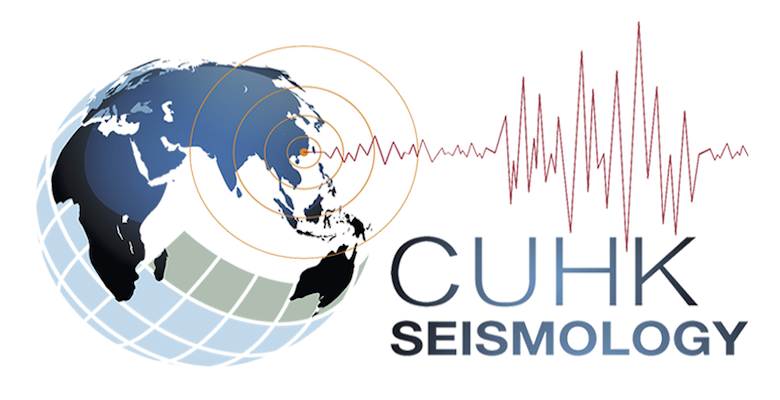

Tutorials in Seismology by CUHK
###############################

This document is developed and maintained by `CUHK Seismology LAB <http://www.cuhk.edu.hk/sci/essc/yang>`__.

.. rubric:: Structure of this doc

#. Entry level
#. Intermediate level
#. Advanced level

.. rubric:: Useful links

.. hlist::
    :columns: 2

    - `CUHK EASC Graduate Division <http://www.cuhk.edu.hk/sci/essc/pg_prg.html>`__
    - `CUHK Cryosphere Lab <https://cryocuhk.github.io>`__

.. toctree::
   :caption: CUSeisTut
   :hidden:

   intro/index
