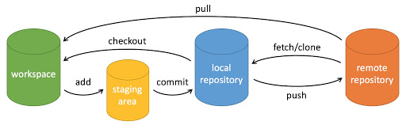

How to contribute
=================

It's very easy for students to help make contributions to the CUSeisTut

Here are several steps based on github commands:

#. open a terminal in your computer
#. run: git clone https://github.com/JunhaoSong/cuseistut.git
#. enter the cloned directory named “cuseistut” (you will find a hidden local repository named ".git" in the cloned directory)
#. make modifications
#. after 4, run: git add <modified files/folders>
#. after 5, run: git commit -m “message”
#. after 6, run: git push (username and token are required, please contact Junhao Song for the temporary token.)

steps 5, 6, 7 can be easily understood based on the figure below. 

After successfully pushing your modifications, check the updated `CUSeisTut website <https://cuseistut.readthedocs.io>`__
