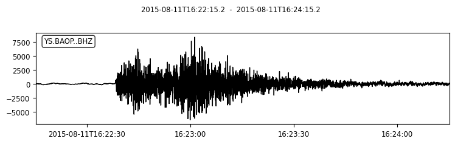
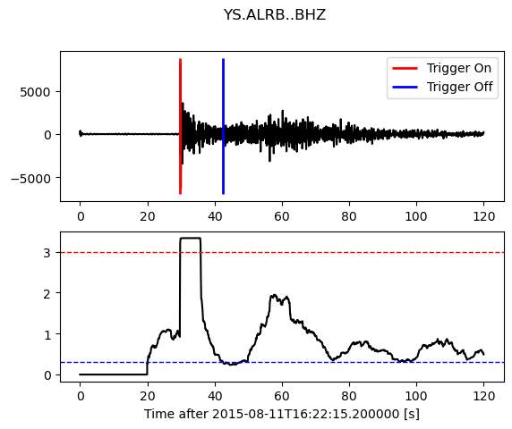
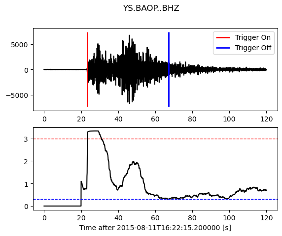

Earthquake Detection STA/LTA
============================

Developer: Hui LIU, Earth Science System Program, CUHK

Testers: Zhangyu SUN & Ng Kai Yin, Earth Science System Program, CUHK

Brief Introduction
------------------

Why do we use STA/LTA?
**********************

By introducing digital seismic data acquisition, long-term continuous recording and archiving of seismic signals has become a demanding technical problem. A seismic network or even a single seismic station operating continuously at high sampling frequency produces an enormous amount of data, which is often difficult to store (and analyze) locally or even at the recording center of a network. This situation has forced seismologists to invent triggered seismic data acquisition. In a triggered mode, a seismic station or a seismic network still processes all incoming seismic signals in real time (or in near-real-time) but incoming data is not stored continuously and permanently. Processing software - a trigger algorithm - serves for the detection of typical seismic signals (earthquakes, controlled source seismic signals, underground nuclear explosion signals, etc.) in the constantly present seismic noise signal. Once an assumed seismic event is detected, recording and storing of all incoming signals starts. It stops after the trigger algorithm 'declares' the end of the seismic signal.

The short-time-average/long-time-average **STA/LTA** trigger is usually used in weak-motion applications that try to record as many seismic events as possible. These are the applications where the **STA/LTA** algorithm is most useful. It is nearly a standard trigger algorithm in portable seismic recorders, as well as in many real time processing software packages of the weak-motion seismic networks. However, it may also be useful in many strong motion applications, except when interest is limited to the strongest earthquakes.

How does STA/LTA works?
***********************

The **STA/LTA** algorithm processes filter seismic signals in two moving time windows – a short-time average window
(STA) and a long-time average window (LTA). The STA measures the 'instant' amplitude of the seismic signal and watches for earthquakes. The LTA takes care of the current average seismic noise amplitude.

First, the absolute amplitude of each data sample of an incoming signal is calculated. Next, the average of absolute amplitudes in both windows is calculated. In a further step, a ratio of both values — STA/LTA ratio—is calculated. This ratio is continuously compared to a user selected threshold value - STA/LTA trigger threshold level. If the ratio exceeds this threshold, a channel trigger is declared. A channel trigger does not necessarily mean that a multi-channel
data logger or a network actually starts to record seismic signals. All seismic networks and most seismic recorders have a 'trigger voting' mechanism built in that defines how many and which channels have to be in a triggered state before the instrument or the network actually starts to record data. To simplify the explanation, we shall observe only one signal channel. We will assume that a channel trigger is equivalent to a network or a recorder trigger.

After the seismic signal gradually terminates, the channel detriggers. This happens when the current STA/LTA ratio falls below another user-selected parameter - STA/LTA detrigger threshold level. Obviously, the STA/LTA detrigger threshold level should be lower (or rarely equal) than the STA/LTA trigger threshold level.

In addition to the data acquired during the 'trigger active' time, seismic networks and seismic recorders add a certain amount of seismic data to the event file before triggering – pre-event-time (PEM) data. After the trigger active state terminates, they also add post-event-time (PET).
data.

For better understanding, Figure 1 shows a typical local event and the trigger variables (simplified) during STA/LTA triggering. Graph a) shows an incoming continuous seismic signal (filtered); graph b) shows an averaged absolute signal in the STA and LTA windows, respectively, as they move in time toward the right side of the graph; and graph c) shows the ratio of both. In addition, the trigger active state (solid line rectangle), the post-event time (PET), and the pre-event time (PEM) (dotted line rectangles) are shown. In this example, the trigger threshold level parameter was set to 10 and the detrigger threshold level to 2 (two short horizontal dotted lines). One can see that the trigger became active when the STA/LTA ratio value exceeded 10. It was deactivated when the STA/LTA ratio value fell below 2. On graph d) the actually recorded data file is shown. It includes all event phases of significance and a portion of the seismic noise at the beginning. In reality, the STA/LTA triggers are usually slightly more complicated, however, the details
are not essential for the understanding and proper setting of trigger parameters.

   
Aim of this Module
******************

The STA/LTA trigger parameter settings are always a tradeoff among several seismological and instrumental considerations. Successful capturing of seismic events depends on proper settings of the trigger parameters. To help with this task, this module explains the STA/LTA trigger functioning and gives general instructions on selecting its parameters. In addition, several different STA/LTA methods will also be introduced in this module.

Activate ObsPy environment
**************************

.. note::
 | We here assume you have already installed ObsPy package in the opspy environment on your computer after finishing the previous **Python ObsPy Tutorial**. 

Open your terminal and run the following commands.

.. code:: 

 $ conda activate obspy

Import necessary packages
*************************

.. code:: python

  from obspy.signal.trigger import plot_trigger
  from obspy.signal.trigger import classic_sta_lta 

1 Choose an Event and Read the Waveform Data
--------------------------------------------

1.1 Choose an event
*******************

.. code-block:: python

  from obspy import UTCDateTime
  origin_time = UTCDateTime("2015-08-11T16:22:15.200000")

  # Coordinates and the magnitude of the event
  eq_lon = 123.202
  eq_lat = -8.624
  eq_dep = 171.9
  eq_mag = 3.9

1.2 Choose a station and get the waveform
*****************************************

.. code-block:: python

  from obspy.clients.fdsn import Client

  # IRIS is one of those providers.
  client = Client('IRIS')

  # Input station informations
  # network
  net = 'YS'
  # station
  sta = 'BAOP'
  # location
  loc = ''
  # channel
  cha = 'BHZ'

  # starttime
  stt = origin_time
  # endtime
  edt = origin_time + 120

  # Get the waveforms from client
  st= client.get_waveforms(net, sta, loc, cha, stt, edt)
  st.plot()
  st.spectrogram()
 

1.3 Filter Data
***************

.. code-block:: python

  # copy the raw data
  st2 = st.copy()  
  # apply the bandpass between 1.0HZ and 10.0HZ, in order to filter the noise.
  st2.filter("bandpass",freqmin=1.0, freqmax=10.0) 
  st2.plot()
 

1.4 Triggering Example
**********************

.. code-block:: python

  df = st2[0].stats.sampling_rate
  # set the STA=5 seconds, LTA=20 seconds
  cft = classic_sta_lta(st2[0].data, int(5 * df), int(20 * df)) 
  # set the trigger threshold=1.5, detrigger threshold=0.27
  plot_trigger(st2[0], cft, 1.5, 0.27) 

2 How to adjust STA/LTA trigger parameters
------------------------------------------

To set the basic STA/LTA trigger algorithm parameters one has to select the following: 

 | 1. ``STA window duration``
 | 2. ``LTA window duration`` 
 | 3. ``STA/LTA trigger threshold level`` 
 | 4. ``STA/LTA detrigger threshold level``

2.1 Selection of short-time average window (STA) duration
*********************************************************

Short-time average window measures the 'instant' value of a seismic signal or its envelope. Generally, STA duration must be longer than a few periods of a typically expected seismic signal. If the STA is too short, the averaging of the seismic signal will not function properly. The STA is no longer a measure of the average signal (signal envelope) but becomes influenced by individual periods of the seismic signal. On the other hand, STA duration must be shorter than the shortest events we expect to capture.

The STA can be considered as a signal filter. The shorter the duration selected, the higher the trigger’s sensitivity to short lasting local earthquakes compared to long lasting and lower frequency distant earthquakes. The longer the STA duration selected, the less sensitive it is for short local earthquakes. Therefore, by changing the STA duration one can prioritize capturing of distant or local events.

For regional events, a typical value of STA duration is between 1 and 2 sec. For local earthquakes shorter values around 0.5 to 0.3 s are commonly used in practice.

.. code-block:: python
 
  df = st2[0].stats.sampling_rate
  # only set different short-time average window (STA) durations
  # sta=5 seconds
  cft = classic_sta_lta(st2[0].data, int(5 * df), int(20 * df))
  plot_trigger(st2[0], cft, 1.5, 0.27)
  # sta=0.5 seconds, represents a smaller value
  cft = classic_sta_lta(st2[0].data, int(0.5 * df), int(20 * df))
  plot_trigger(st2[0], cft, 1.5, 0.27)
  # sta=10 seconds, represents a larger value
  cft = classic_sta_lta(st2[0].data, int(10 * df), int(20 * df))
  plot_trigger(st2[0], cft, 1.5, 0.27)

2.2 Selection of long-time average window (LTA) duration
********************************************************

The LTA window measures average amplitude seismic noise. It should last longer than a few 'periods' of typically irregular seismic noise fluctuations. By changing the LTA window duration, one can make the recording more or less sensitive to regional events in the 'Pn'-wave range from about 200 to 1500 km epicentral distance. These events typically have the low-amplitude emergent Pn- waves as the first onset. A short LTA duration allows the LTA value more or less to adjust to the slowly increasing amplitude of emergent seismic waves. Thus the STA/LTA ratio remains low in spite of increasing STA (nominator and denominator of the ratio increase). This effectively diminishes trigger sensitivity to such events. In the opposite case, using a long LTA window duration, trigger sensitivity to the emergent earthquakes is increased because the LTA value is not so rapidly influenced by the emergent seismic signal, allowing Sg/Lg waves to trigger the recording.

The LTA duration of 60 seconds is a common initial value. A shorter LTA duration is needed to exclude emergent regional events from triggering, if desired, or if quickly changing manmade noise is typical for the site. A longer LTA can be used for distant regional events with very long S-P times and potentially emergent P waves.

.. code-block:: python

  # only set different long-time average window (STA) durations
  # lta=20 seconds
  cft = classic_sta_lta(st2[0].data, int(5 * df), int(20 * df))
  plot_trigger(st2[0], cft, 1.5, 0.27)
  # lta=10 seconds, represents a smaller value
  cft = classic_sta_lta(st2[0].data, int(5 * df), int(10 * df))
  plot_trigger(st2[0], cft, 1.5, 0.27)
  # lta=50 seconds, represents a larger value
  cft = classic_sta_lta(st2[0].data, int(5 * df), int(50 * df))
  plot_trigger(st2[0], cft, 1.5, 0.27)

2.3 Selection of STA/LTA trigger threshold level
************************************************

The STA/LTA trigger threshold level to the greatest extent determines which events will be recorded and which will not. The higher value one sets, the more earthquakes will not be recorded, but the fewer false-triggers will result. The lower the STA/LTA trigger threshold level is selected, the more sensitive the seismic station will be and the more events will be recorded. However, more frequent false triggers also will occupy data memory and burden the analyst. An optimal STA/LTA trigger threshold level depends on seismic noise conditions at the site and on one’s tolerance to falsely triggered records. Not only the amplitude but also the type of seismic noise influence the setting of the optimal STA/LTA trigger threshold level. A statistically stationary seismic noise (with less irregular fluctuations) allows a lower STA/LTA trigger threshold level; completely irregular behavior of seismic noise demands higher values.

An initial setting for the STA/LTA trigger threshold level of 4 is common for an average quiet seismic site. Much lower values can be used only at the very best station sites with no man- made seismic noise. Higher values about 8 and above are required at less favorable sites with significant man-made seismic noise. In strong-motion applications, higher values are more common due to the usually noisier seismic environment and generally smaller interest in weak events.

.. code-block:: python

  cft = classic_sta_lta(st2[0].data, int(5 * df), int(20 * df))
  # only set different STA/LTA trigger threshold levels
  # STA/LTA trigger threshold = 1.5
  plot_trigger(st2[0], cft, 1.5, 0.27)
  # STA/LTA trigger threshold = 0.5, represents a small trigger threshold value
  plot_trigger(st2[0], cft, 0.5, 0.27)
  # STA/LTA trigger threshold = 4, represents a large trigger threshold value
  plot_trigger(st2[0], cft, 4, 0.27)

2.4 Selection of STA/LTA detrigger threshold level
**************************************************

The STA/LTA detrigger threshold level determines the termination of data recording. To include as much of the coda waves as possible, a low value is required. If one uses coda duration for magnitude determinations, such setting is obvious. However, a too low STA/LTA detrigger threshold level is occasionally dangerous. It may cause very long or even endless records, for example, if a sudden increase in seismic noise does not allow the STA/LTA ratio to fall below the STA/LTA detrigger threshold level. On the other hand, if one is not interested in coda waves, a higher value of STA/LTA detrigger threshold level enables significant savings in data memory and/or data transmission time. Note that coda waves of distant earthquakes can be very long.

A typical initial value of the STA/LTA detrigger threshold level is 2 to 3 for seismically quiet sites and weak motion applications. For noisier sites, higher values must be set. For strong- motion applications, where coda waves are not of the highest importance, higher values are frequently used.

.. code-block:: python

  cft = classic_sta_lta(st2[0].data, int(5 * df), int(20 * df))
  # only set different STA/LTA detrigger threshold levels
  # STA/LTA trigger threshold = 1.5
  plot_trigger(st2[0], cft, 1.5, 0.27)
  # STA/LTA detrigger threshold = 0.1, represents a small trigger threshold value
  plot_trigger(st2[0], cft, 1.5, 0.1)
  # STA/LTA detrigger threshold = 1, represents a large trigger threshold value
  plot_trigger(st2[0], cft, 1.5, 1)

3 Available STA/LTA Methods
---------------------------

3.1 Classic Sta Lta
*******************
.. code-block:: python

  # we already import the classic_sta_lta at the begining.
  df = st2[0].stats.sampling_rate
  # set the STA=5 seconds, LTA=20 seconds
  cft = classic_sta_lta(st2[0].data, int(5 * df), int(20 * df)) 
  # set the trigger threshold=1.5, detrigger threshold=0.27
  plot_trigger(st2[0], cft, 1.5, 0.27) 

3.2 Recursive Sta Lta
*********************
.. code-block:: python

  from obspy.signal.trigger import recursive_sta_lta
  # set the STA=5 seconds, LTA=23 seconds
  cft = recursive_sta_lta(st2[0].data, int(5 * df), int(23 * df))
  # set the trigger threshold=1.5, detrigger threshold=0.27
  plot_trigger(st2[0], cft, 1.5, 0.27)

3.3 Carl-Sta_Trig
*****************
.. code-block:: python

  from obspy.signal.trigger import carl_sta_trig
  # set the STA=5 seconds, LTA=20 seconds
  cft = carl_sta_trig(st2[0].data, int(5 * df), int(20 * df), 0.8, 0.8)
  # set the trigger threshold=20, detrigger threshold=-50.0
  plot_trigger(st2[0], cft, 20.0, -50.0)

3.4 Delayed Sta Lta
*******************
.. code-block:: python

  from obspy.signal.trigger import delayed_sta_lta
  # set the STA=5 seconds, LTA=20 seconds
  cft = delayed_sta_lta(st2[0].data, int(2 * df), int(20 * df))
  # set the trigger threshold=1.5, detrigger threshold=12
  plot_trigger(st2[0], cft, 1.5,12)

3.5 Z-Detect
************
.. code-block:: python

  from obspy.signal.trigger import z_detect
  # set the LTA=10 seconds
  cft = z_detect(st2[0].data, int(10 * df))
  # set the trigger threshold=-0.2, detrigger threshold=0
  plot_trigger(st2[0], cft, -0.2, 0)

4 Detect events on multiple traces by using STA/LTA
---------------------------------------------------

4.1  Get the waveform data with more than 1 station
***************************************************

.. code-block:: python

  # Set up a list for bulk request
  bulk = [('YS', 'BAOP', '', 'BHZ', origin_time, origin_time+120),
          ('YS', 'HADA', '', 'BHZ', origin_time, origin_time+120),
          ('YS', 'SINA', '', 'BHZ', origin_time, origin_time+120),
          ('YS', 'ALRB', '', 'BHZ', origin_time, origin_time+120)]

  st_bulk = client.get_waveforms_bulk(bulk)
  st_bulk.plot()
  

4.2  Filter the data
********************

.. code-block:: python

  # make a copy of raw data
  st2 = st_bulk.copy()
  # apply the bandpass
  st2.filter('bandpass',freqmin=1,freqmax=10)
  st2.plot()
  

   
4.2  Using STA/LTA to detect events
***********************************

.. code-block:: python

  # we already import the classic_sta_lta at the begining.
  # set a loop to detect the events using STA/LTA, the classic_sta_lta method is used here.
  # you can try other STA/LTA methods and find the differences
  for tr in st2:
      df = tr.stats.sampling_rate
      cft = classic_sta_lta(tr.data, int(6 * df), int(20 * df))
      plot_trigger(tr, cft, 3, 0.3)
  

   

   

