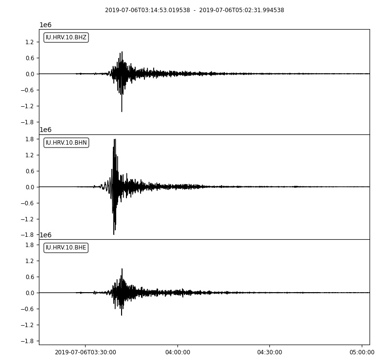
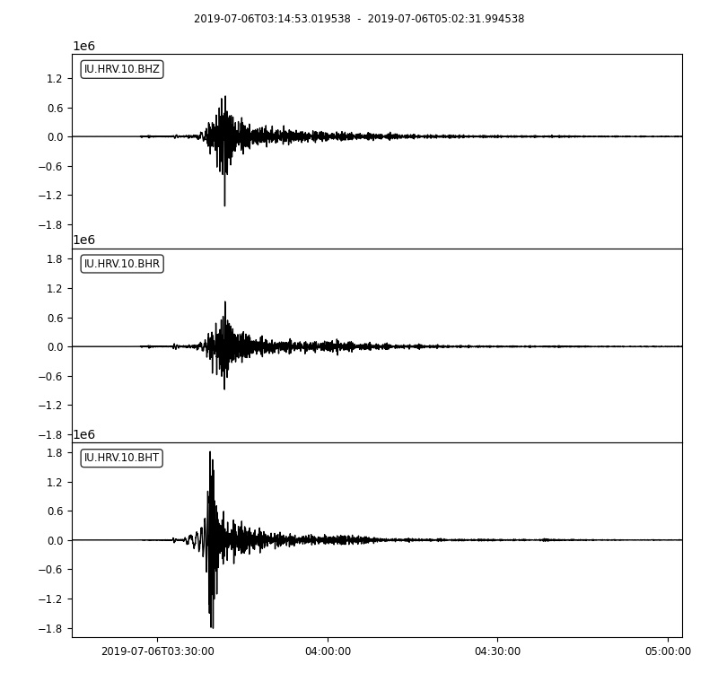
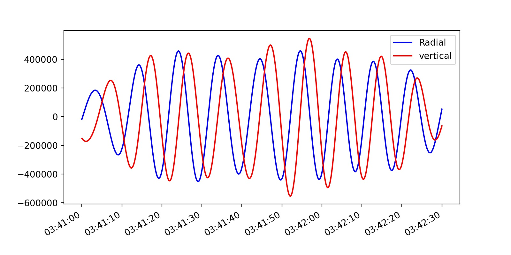
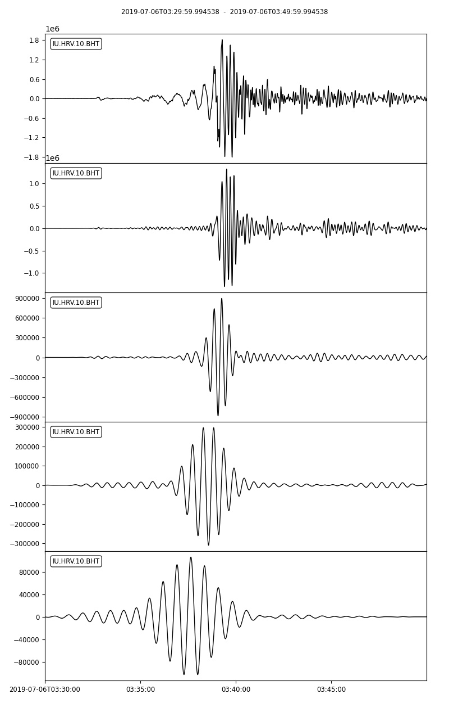
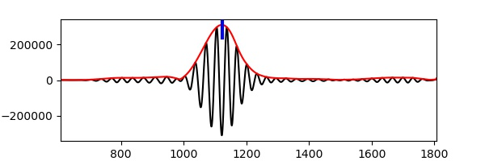
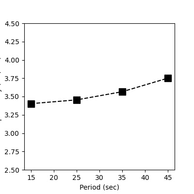

Surface Wave Tomography
=======================

Introduction to surface waves
-----------------------------

Unlike body waves that travel through the earth's interior, surface waves propagate along the earth's surface. They could be generated from earthquakes and travel more slowly that body waves, but correspond to lower-frequency and higher amplitude in the seismogram. There are two most common types of surface waves in Seismology - Rayleigh waves and Love waves, which are named after their discoverers Lord Rayleigh and August Love. 

**Rayleigh waves** (or so called ground roll) move both longitudinally and horizontally and result in elliptical movement, similar to the rolling water waves but against the direction of propagation. 

.. image:: https://upload.wikimedia.org/wikipedia/commons/1/1e/Rayleigh_wave.jpg
   :width: 90%

**Love waves** move horizontally and at the right angles to the direction of propagation, but cannot propagate in water like S-waves. The shear movement of the ground caused by Love waves is more damaging to the man-made structures. 

.. image:: https://upload.wikimedia.org/wikipedia/commons/thumb/2/29/Love_wave.svg/1920px-Love_wave.svg.png
   :width: 90%

Surface waves observations
--------------------------

Here we provide example waveforms showing the surface waves generated from ``2019 M7.1 Ridgecrest earthquake`` recorded by ``IU.HRV station located at Adam Dziewonski Observatory (Oak Ridge), Massachusetts, USA``. 

For later use, please first download the :download:`waveform data <2019-07-06-mw71-central-california-2.miniseed>` of miniSEED format into your local computer. Also make sure that ObsPy is also installed since it's used for reading and processing waveforms. 

**1. Import necessary modules or functions**

.. code::

 # from obspy modules import functions
 from obspy import read, UTCDateTime
 from obspy.geodetics.base import gps2dist_azimuth
 from obspy.core.stream import Stream
 # import matplotlib module
 import matplotlib.pyplot as plt

**2. Read the waveform data and only keep waveforms of location** ``10``

.. code::

 # read the downloaded waveforms into obspy stream object
 st = read('./2019-07-06-mw71-central-california-2.miniseed')
 # select traces whose location is '10'
 # use copy function to aviod processing original stream
 st_10 = st.select(location='10').copy()
 # from the IRIS webpage about this instrument
 # channel 'BH1' azimuth and dip are 0 and 0
 # channel 'BH2' azimuth and dip are 90 and 0
 # thus, we rename 'BH1' into 'BHN'
 # and rename 'BH2' into 'BHE'
 # this is useful for waveform rotation
 for tr in st_10:
     if tr.stats.channel == 'BH1':
         tr.stats.channel = 'BHN'
     if tr.stats.channel == 'BH2':
         tr.stats.channel = 'BHE'
 # quick check
 st_10.plot()

**3. Rotate waveforms from ZNE coordinate system into ZRT coordinate system**

.. code::

 # event info
 event_otime = UTCDateTime('2019-07-06 03:19:53')
 event_longitude = -117.599333
 event_latitude = 35.7695
 event_depth = 8 # kilometer
 event_magnitude = 7.1
 # station info
 station_longitude = -71.5583
 station_latitude = 42.5064
 station_elevation = 200.0 # meter
 station_depth = 0.0

Compute necessary geometric parameters.

.. code::

 # compute epicentral distance, azimuth, and back azimuth
 # for this earthquake-station pair
 dist_in_m, az, baz = gps2dist_azimuth(event_latitude, event_longitude, station_latitude, station_longitude)
 print('epicentral distance is: %.2f m'%dist_in_m)
 print('azimuth is: %.2f'%az)
 print('back azimuth is: %.2f'%baz)

epicentral distance is: 3999969.28 m

azimuth is: 64.89

back azimuth is: 274.97

.. code::

 # use the rotate function to rotate waveforms
 # from ZNE coordinate system to ZRT coordinate system
 st_10.rotate('NE->RT', back_azimuth=baz)
 # quick check
 # Note that Love wave in the transverse component
 # Rayleigh wave in the radial and vertical components
 st_10.plot()

Clearly, We can see that surface waves arrive after the body waves and have much larger amplitude. 

Phase shift of Rayleigh waves
-----------------------------

Because Rayleigh waves correspond to elliptical movement in a vertical plane pointed in the direction in which the waves are travelling, thus the ground motions in radial and vertical directions should have phase shift. 

Here we can apply a narrow bandpass filter to the waveforms and then plot them together to check the abovementioned phase shift phenomenon. 

.. code::

 # first select vertical and radial components for analysis
 st_BHRZ = st_10.select(component='[RZ]').copy()
 # remove mean, linear trend, and taper at both ends
 st_BHRZ.detrend('demean').detrend('linear').taper(0.05)
 # apply a narrow bandpass filter to the raw waveform
 # in this example: 8 s-12 s
 st_BHRZ.filter('bandpass', freqmin=1/12., freqmax=1/8., corners=2, zerophase=True)
 # further zoom into the Rayleigh wave part
 st_ray = st_BHRZ.slice(starttime=UTCDateTime('2019-07-06 03:41:00'), endtime=UTCDateTime('2019-07-06 03:42:30'))

.. note::

 **Exercise**: try to change starttime and endtime to see if phase delay exists in other time windows. 

.. code::

 # plot both traces together
 # can you observe the phase shift?
 fig = plt.figure(figsize=(8, 4), dpi=200)
 ax = fig.add_subplot(1, 1, 1)
 ax.plot(st_ray[0].times("matplotlib"), st_ray[0].data, "b-", label='Radial')
 ax.plot(st_ray[1].times("matplotlib"), st_ray[1].data, "r-", label='vertical')
 ax.xaxis_date()
 fig.autofmt_xdate()
 plt.legend(loc='upper right')
 plt.show()

Dispersion of surface waves
---------------------------

Since longer period surface waves would penetrate deeper into higher speed layer, they will travel faster. As a result, velocities at a number of periods are different, this is so called surface wave dispersion. 

For the sake of simplicity, here we only show the dispersion analysis of Love wave by applying few bandpass filters and measure the corresponding group velocity dispersion curve. 

**1. select transverse component waveform and set several period bands**

.. code::

 # now only select transverse component for further analysis
 tr = st_10.select(component='T')[0]
 # now choose a set of period bands
 # and their units are in second
 period_bands = [[10, 20], 
                 [20, 30], 
                 [30, 40], 
                 [40, 50]]

**2. save raw waveform into a stram and append filtered waveforms**

.. code::
 
 # first create an empty stream
 st_BHT = Stream()
 # the first trace is raw waveform without filtering
 st_BHT += tr
 # similar to the above loop except the last plot line is changed
 for period_band in period_bands:
     freq_high, freq_low = 1./period_band[0], 1./period_band[1]
     tr_copy = tr.copy()
     tr_copy.detrend('demean').detrend('linear').taper(0.05)
     tr_copy.filter('bandpass', freqmin=freq_low, freqmax=freq_high, corners=2, zerophase=True)
     st_BHT += tr_copy
 # then let's zoom-in
 st_BHT.trim(starttime=UTCDateTime('2019-07-06 03:30:00'), endtime=UTCDateTime('2019-07-06 03:50:00'))
 # quick plot with some newly arguments specified to make sure all traces share the same x-axis
 st_BHT.plot(equal_scale=False, automerge=False)

**3. measure group velocities at these periods**

.. code::
 
 # 1. take 30 s to 40 s bandpass filtered waveform as an example
 data3040 = st_BHT[3].data.copy()
 # ensure event original time corresponds to 0 s
 time3040 = st_BHT[3].times() + (st_BHT[3].stats.starttime - event_otime)
 # 2. perform Hilbert transform to get envelope (unnecessary to know details)
 envelope = np.abs(hilbert(data3040))
 # 3. "measure the time where largest amplitude observed" - here for simplicity of analysis
 indexmax = np.argmax(envelope)
 travtime = time3040[indexmax]
 # 4. compute group velocity by dividing distance by travel time
 velocity = dist_in_m * 0.001 / travtime
 # 5. print results
 print('The distance is %.4f km, and travel time is %.2f s'%(dist_in_m * 0.001, travtime))
 print('Thus, the corresponding group velocity is %.4f km/s'%velocity)
 # simple plot using pyplot
 plt.figure(figsize=(6, 2), dpi=100)
 plt.plot(time3040, data3040, 'k-')
 plt.plot(time3040, envelope, 'r-')
 plt.axvline(travtime, 0.85, 1, color='b', lw=3)
 plt.xlim(time3040[0], time3040[-1])
 plt.xlabel('Time (s)')
 plt.ylabel('Amplitude')
 plt.show();

The distance is 3999.9693 km, and travel time is 1121.84 s

Thus, the corresponding group velocity is 3.5655 km/s

**4. repeat the above process for other period bands**

After changing to different period bands and re-run the step 3, we can get the following results:

======  ==========  ==========
period  traveltime  velocity
======  ==========  ==========
10-20s   1175.52s   3.4027km/s
20-30s   1157.97s   3.4543km/s
30-40s   1121.84s   3.5655km/s
40-50s   1066.54s   3.7504km/s
======  ==========  ==========

**5. plot the results**

.. code::

 # Now if we let each center period represent the period band
 center_periods = [15, 25, 35, 45]
 group_velocities = [3.4027, 3.4543, 3.5655, 3.7504]
 # then show the period-velocity curve (i.e., dispersion curve)
 plt.figure(figsize=(4, 4), dpi=100)
 plt.plot(center_periods, group_velocities, 'ks--', markersize=10)
 plt.xlabel('Period (sec)')
 plt.ylabel('Group velocity (km/sec)')
 plt.ylim(2.5, 4.5)
 plt.show();

Above all, this tutorial only gives a simple introduction to the ideas of surface waves and their dispersion, through which you may have a better understanding of surface waves. 

.. note::

 **Exercise**: Search a teleseismic earthquake that can generate clear surface waves (http://ds.iris.edu/wilber3/find_event) and finish the following tasks

 1. Make a map view plot to show the position of the earthquake and the seismic station you chose. (refer to the GMT tutorial). 

 2. Request the seismograms at the station by Obspy (refer to the ObsPy tutorial).

 3. Perform phase delay and dispersion analysis on the requested waveforms.

Compute theoretical dispersion curve
------------------------------------

Invert observed dispersion curve for 1D velocity
------------------------------------------------

