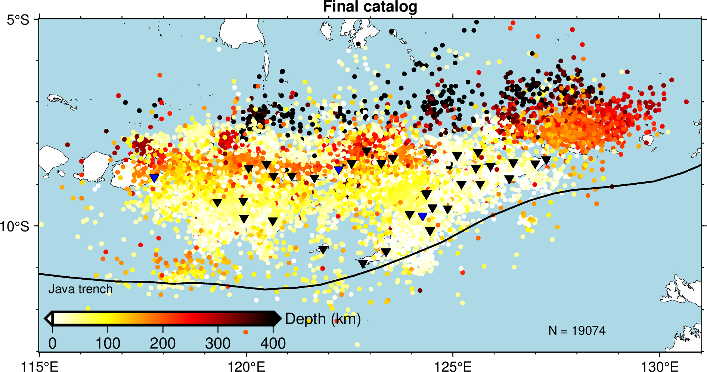
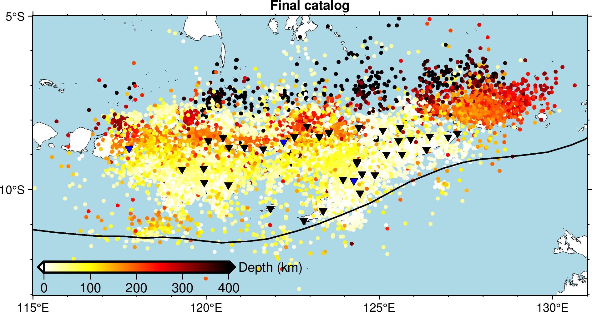

Generic Mapping Tools - Seismic Data
====================================

Plotting earthquake catalog
---------------------------

Preview
*******

The figure below is modified from Figure 2 in `this paper <https://doi.org/10.1785/0320210041>`_.

It is generated using the following commands:

.. code:: 

 #!/bin/sh
 gmt begin catalog png
 # the frame
 gmt basemap -JM15c -R115/131/-13/-5 -Bxa5f1 -Bya5f1 -BWeSn+t"Final catalog" --MAP_FRAME_TYPE=plain --FONT_TITLE=10p --MAP_TITLE_OFFSET=-8p
 # plotting coastline with specify land and sea colours
 gmt coast -Gwhite -Slightblue -W0.1p,black -Da
 # creating customized colormaps
 gmt makecpt -Chot -T0/400/10 -D -Z -Ic -H > depth.cpt
 awk '{print $9,$8,$10}' banda_arc_catalog.txt > catalog.xyz

 # plotting the earthquake data
 gmt plot catalog.xyz -Sc0.1c -Cdepth.cpt
 # plotting the trench
 gmt plot java_trench.txt -W1p,black
 # extracting station data and plot them
 awk 'NR>1 {print $5,$6}' GE_3_stations.txt |gmt psxy -Si7p -W0.01p,black -Gblue
 awk -F"|" 'NR>3 {print $6,$5}' YS_30_stations.txt |gmt psxy -Si7p -W0.01p,black -Gblack
 # creating a colorbar
 gmt colorbar -DjBL+h+o0.3c/0.6c+jBL+w5c/0.3c+e -By+l"Depth (km)" -Bxa100 -Cdepth.cpt
 # plotting text
 echo "128 -12.5 N = 19074" | gmt text -F+f8p,black
 echo "116 -11.5 Java trench" | gmt text -F+f8p,black
 gmt end
 
 
To reproduce it by yourself, you may first download or save :download:`banda_arc_catalog.txt <./banda_arc_catalog.txt>`, :download:`java_trench.txt <./java_trench.txt>`, :download:`GE_3_stations.txt <./GE_3_stations.txt>`, :download:`YS_30_stations.txt <./YS_30_stations.txt>`, and then move these files into your working directory. Try to copy the above commands and run them on your own computer to see if you can generate the same figure without warning or error.

Step-by-Step explanation
************************

| **1. gmt basemap -JM15c -R115/131/-13/-5 -Bxa5f1 -Bya5f1 -BWeSn+t"Final catalog" --MAP_FRAME_TYPE=plain --FONT_TITLE=10p --MAP_TITLE_OFFSET=-8p** to plot base maps and frames

``-JM15c`` specifies the map projection type to be `Mercator projection <https://docs.generic-mapping-tools.org/latest/cookbook/map-projections.html#jm>`_. The width of map is 15c (15 centimeters).

``-R115/131/-13/-5`` specifies the map range, minimum and maximum longitudes are 115 and 131, minimum and maximum latitudes are -13 -5. 

``-Bxa5f1`` specifies that x axes have ticklabels with interval of 5 and ticks with interval of 1.

``-Bya5f1`` specifies that y axes have ticklabels with interval of 5 and ticks with interval of 1.

``-BWeSn+t"Final catalog"`` specifies that the left and bottom ticklabels are visible, which the right and top ticklabels are invisible, where the :file:`+t"Final catalog"` indicates plotting the title "Final catalog"

``--MAP_FRAME_TYPE=plain --FONT_TITLE=10p --MAP_TITLE_OFFSET=-8p`` are the gmt settings. :file:`--MAP_FRAME_TYPE=plain` specifies the frame type as plain(i.e., simple line); :file:`--FONT_TITLE=10p` specifies the font of title to be 10p; :file:`--MAP_TITLE_OFFSET=-8p` specifies the distance between the title with the frame to be -8p.

.. image:: catalog01.png
   :width: 80%

| **2. gmt coast -Gwhite -Slightblue -W0.1p,black -Da** to plot coastline and specify land and sea colours

``-Gwhite`` specifies fill the dry/land area with white.

``-Slightblue`` specifies fill the wet/sea/lake area with lightblue.

``--W0.1p,black`` specifies the line with a witdh of 0.1p and line color of black.

``-Da`` specifies automatically selects the appropriate data precision based on the size of the current drawing area

.. image:: catalog02.png
   :width: 80%

| **3. gmt makecpt -Chot -T0/400/10 -D -Z -Ic -H > depth.cpt** to make color palette tables

``-Chot`` specifies the input cpt used is `hot <http://soliton.vm.bytemark.co.uk/pub/cpt-city/gmt/GMT_hot.png>`_

``-D`` selects the back- and foreground colors for the colorbar

``-Z`` creates a continuous cpt file

``-Ic`` reverse the CPT

| **4. awk '{print $9,$8,$10}' banda_arc_catalog.txt > catalog.xyz**

| **5. gmt plot catalog.xyz -Sc0.1c -Cdepth.cpt** to plot earthquake data

``catalog.xyz`` contains three columns of data. longitude, latitude, and depth. The value of depth column will be used for coloring points based on CPT file.

.. image:: catalog03.png
   :width: 80%

| **6. gmt plot java_trench.txt -W1p,black** to plot the trench line. 

| **7. awk 'NR>1 {print $5,$6}' GE_3_stations.txt |gmt psxy -Si7p -W0.01p,black -Gblue** to extract station data and plot them

| **8. awk -F"|" 'NR>3 {print $6,$5}' YS_30_stations.txt |gmt psxy  -Si7p -W0.01p,black -Gblack** to extract station data and plot them

.. image:: catalog04.png
   :width: 80%

| **9. gmt colorbar  -DjBL+h+o0.3c/0.6c+jBL+w5c/0.3c+e -By+l"Depth (km)" -Bxa100 -Cdepth.cpt** to plot a colorbar

``-DjBL+h+o0.3c/0.6c+jBL+w5c/0.3c+e`` specifices the paramter of colorbar. :file:`-DjBL` means plot color at the Bottom Left; :file:`+h` means
draw horizontal color scale; :file:`+o0.3c/0.6c` means plot move the colorbar 0.3 cm in X direction and 0.6 cm in Y Direction; :file:`+w5c/0.3c` means plot a colorbar with a length of 5 cm and a width of 0.3 cm; :file:`+e` means add a triangle to the foreground and background colors in the colorbar.

| **10. echo "128 -12.5 N = 19074" | gmt text  -F+f8p,black** to plot text

| **11. echo "116 -11.5 Java trench" | gmt text  -F+f8p,black** to plot text

``-F+f8p,black`` specifices the font size of 8p and color of black

Plotting cross sections
-----------------------

Preview
*******

The figure below is modified from Figure 3 in `this paper <https://doi.org/10.1785/0320210041>`_.

.. image:: section.png
   :width: 80%

It is generated using the following commands:

.. code:: 

 #!/bin/sh
 # extract data ignoring header, in order : lon, lat, depth, residual
 awk 'NR>1 {print $9,$8,$10,$7}' banda_arc_catalog.txt > extracted.txt
 
 gmt begin section png
 gmt makecpt -Cseis -T0/3/0.1 -D -Z -H > res.cpt
 
 gmt subplot begin 3x2 -Fs14c/7c -A
 gmt subplot set 0 # transect along lon = 118
 # project the data within 0.5 degree onto plane
 # output file in order: latitude , depth , residual
 gmt project extracted.txt -C118/-12 -E118/-6 -Lw -W-0.5/0.5 -Fyz > projected_input.txt
 gmt plot projected_input.txt -JX14c/-7c -R-12/-6/0/650 -BWesn -Bya200f40+l"Depth (km)" -Bxa2f0.5 -Sc4p -W0.5p -Cres.cpt # ploting
 echo "lon = 118" | gmt text -F+cBL+f12p,4,black -Dj1c/1c # adding text
 
 gmt subplot set 1 # transect along lon = 120
 # project the data within 0.5 degree onto plane
 # output file in order: latitude , depth , residual
 gmt project extracted.txt -C120/-12 -E120/-6 -Lw -W-0.5/0.5 -Fyz > projected_input.txt
 gmt plot projected_input.txt -JX14c/-7c -R-12/-6/0/650 -BwEsn -Bya200f40 -Bxa2f0.5 -Sc4p -W0.5p -Cres.cpt # ploting
 echo "lon = 120" | gmt text -F+cBL+f12p,4,black -Dj1c/1c # adding text
 
 gmt subplot set 2 # transect along lon = 122.5
 # project the data within 0.5 degree onto plane
 # output file in order: latitude , depth , residual
 gmt project extracted.txt -C122.5/-12 -E122.5/-6 -Lw -W-0.5/0.5 -Fyz > projected_input.txt
 gmt plot projected_input.txt -JX14c/-7c -R-12/-6/0/650 -BWesn -Bya200f40+l"Depth (km)" -Bxa2f0.5 -Sc4p -W0.5p -Cres.cpt # ploting
 echo "lon = 122.5" | gmt text -F+cBL+f12p,4,black -Dj1c/1c # adding text
 
 gmt subplot set 3 # transect along lon = 124.0
 # project the data within 0.5 degree onto plane
 # output file in order: latitude , depth , residual
 gmt project extracted.txt -C124.0/-12 -E124.0/-6 -Lw -W-0.5/0.5 -Fyz > projected_input.txt
 gmt plot projected_input.txt -JX14c/-7c -R-12/-6/0/650 -BwEsn -Bya200f40 -Bxa2f0.5 -Sc4p -W0.5p -Cres.cpt # ploting
 echo "lon = 124.0" | gmt text -F+cBL+f12p,4,black -Dj1c/1c # adding text
 
 gmt subplot set 4 # transect along lon = 125.5
 # project the data within 0.5 degree onto plane
 # output file in order: latitude , depth , residual
 gmt project extracted.txt -C125.5/-12 -E125.5/-6 -Lw -W-0.5/0.5 -Fyz > projected_input.txt
 gmt plot projected_input.txt -JX14c/-7c -R-12/-6/0/650 -BWeSn -Bya200f40+l"Depth (km)" -Bxa2f0.5 -Sc4p -W0.5p -Cres.cpt # ploting
 echo "lon = 125.5" | gmt text -F+cBL+f12p,4,black -Dj1c/1c # adding text
 
 gmt subplot set 5 # transect along lon = 128.0
 # project the data within 0.5 degree onto plane
 # output file in order: latitude , depth , residual
 gmt project extracted.txt -C128.0/-12 -E128.0/-6 -Lw -W-0.5/0.5 -Fyz > projected_input.txt
 gmt plot projected_input.txt -JX14c/-7c -R-12/-6/0/650 -BwESn -Bya200f40 -Bxa2f0.5 -Sc4p -W0.5p -Cres.cpt # ploting
 echo "lon = 128.0" | gmt text -F+cBL+f12p,4,black -Dj1c/1c # adding text
 
 gmt subplot end
 
 gmt colorbar -DJBC+e+w8c+o1c -Cres.cpt -Bxa1+L"RMS residuals (s)"
 gmt end
 
 
To reproduce it by yourself, you may first download or save :download:`banda_arc_catalog.txt <./banda_arc_catalog.txt>` and then move this files into your working directory. Try to copy the above commands and run them on your own computer to see if you can generate the same figure without warning or error.

**You may go to the** `official tutorial website of GMT v6.3 <https://docs.generic-mapping-tools.org/6.3/index.html>`_ **for more exploring**

Excercises
----------

Reproduce figure 1 in the paper
*******************************

    1. include the base map and other samples (including the station, plate boundary, subduct direction arrows, and so on)

    2. plot the station name, filled the station samples by yellow, and the station list in Unix command by red.

    3. add a scale to the figure.

    4. plot the map view cross-section, mark two ends of it with "A" and "A'". The cross-section should cross through the "MMRI" station, and with a length of 300 km, strike 30 degrees west of north

Plot a cross-section plot based on the catalog generated in the Unix command tutorial
*************************************************************************************

    1. project the earthquake within 30 km to the cross-section.  

    2. Scale the circles by earthquake magnitude and filled the circle according to their depth.

    3. marked "A" and "A'" in the figure.

Plot the magnitude variation figure. Refer to Figure 4b in the paper
********************************************************************

    1. used stars to represent 10 maximum magnitude earthquakes. and label the magnitude of the largest one.

    2. filled the circle according to their depth.

