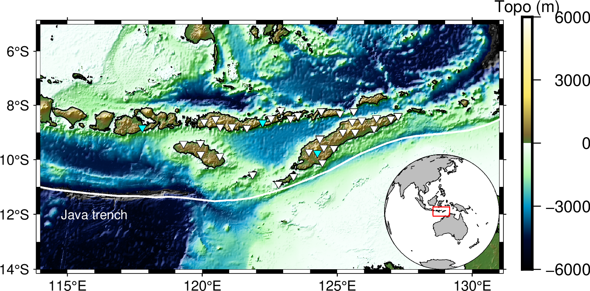
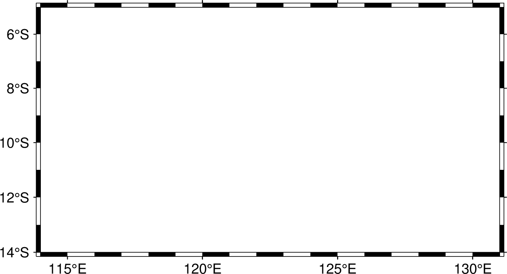
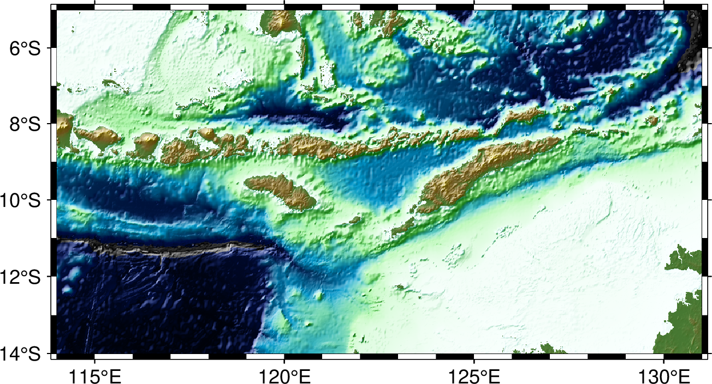
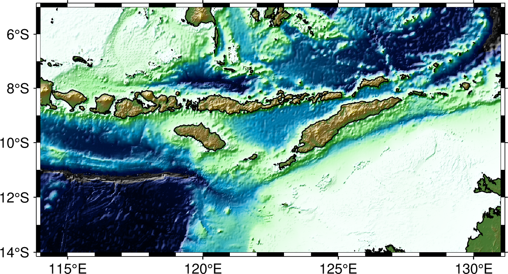
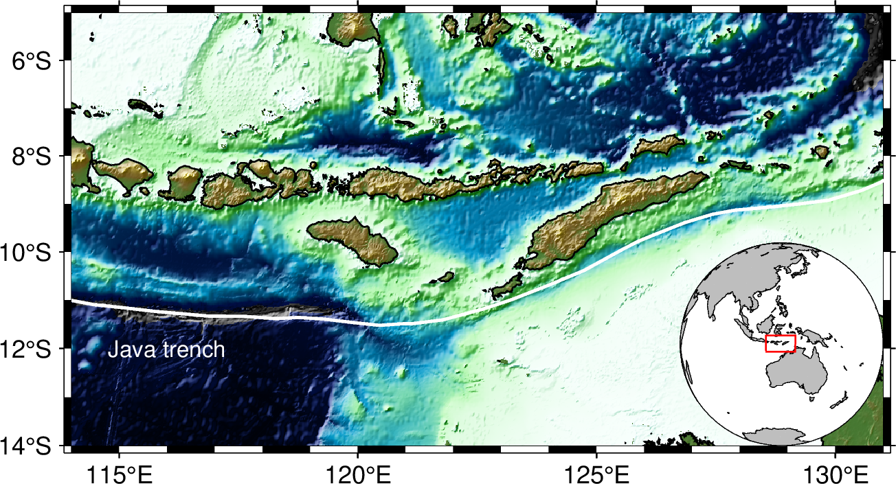
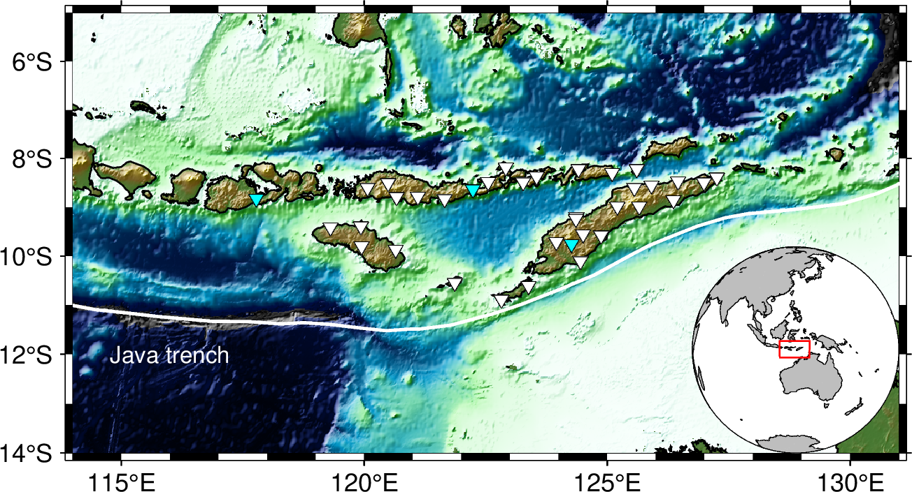
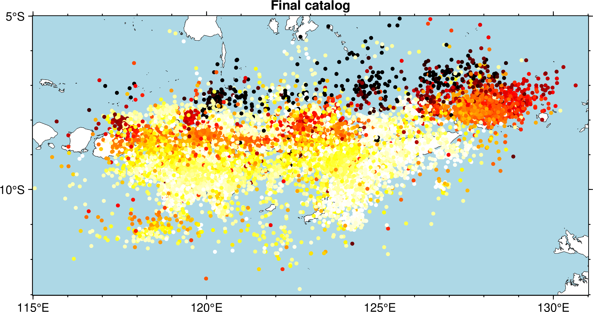
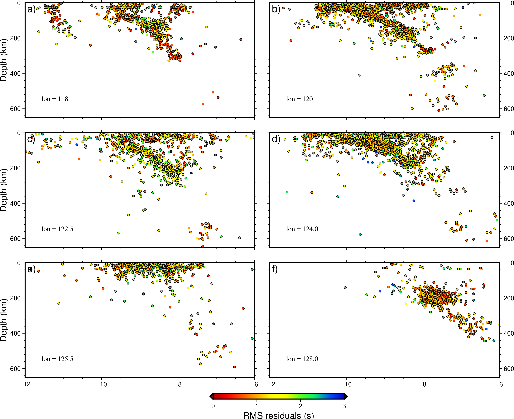

Generic Mapping Tools
=====================

Brief introduction
------------------

What is GMT?
************

#. The Generic Mapping Tools (GMT) is one of the most popular mapping softwares in the world;
#. It is widely used across the Earth, Ocean, and Planetary sciences and beyond;
#. It is a free, open source software licensed under the `GNU LGPL <https://en.wikipedia.org/wiki/GNU_Lesser_General_Public_License>`_ license.

.. image:: https://www.generic-mapping-tools.org/_static/gmt-logo.png
   :width: 50%

--------------------

What can GMT do?
****************

| 1. **Process data of different format.** For example, time series (seismograph), xy data (fault trace), xyz data(geographic data), and so on. 
| 2. **Generate publication-quality illustrations.** Here is an example: 

.. image:: https://docs.generic-mapping-tools.org/6.3/_images/ex07.png
   :width: 50%

| 3. **Automate workflows.** If script is provided and GMT is installed, one figure can be plotted by one command. 
| 4. **Make animations.** For example, this is an `animation <https://www.youtube.com/watch?v=H0RyjHRhJ3g>`_ showing Pacific Earthquakes in 2018 made by GMT. 

---------------------

How to install GMT?
*******************

.. note::

 | There are lots of ways to install GMT on your computer. 
 | Here we strongly suggest beginners to install it by `conda <https://docs.conda.io/en/latest/>`_. 

The following steps have been tested successfully for Linux, macOS, and window subsystem for linux.

| 1. **Install** `**miniconda** <https://docs.conda.io/en/latest/miniconda.html>`_
| 2. **Open a terminal and run these commands sequentially**

.. warning:: 

   Exclude $ and start without whitespace!

.. code:: 

 $ conda create --name gmt-env python=3.8
 $ conda activate  gmt-env
 $ conda install gmt -c conda-forge

| 3. **Check if it has been successfully installed**

.. code:: 

 $ gmt --version
 6.3.0

-------------

Start with three simple examples
********************************

| 1. Run this single command and look what will happen

.. code:: 

 $ gmt coast -Rg -JH15c -Gpurple -Baf -B+t"My First Plot" -pdf,png GlobalMap1

| 2. Run the following commands step-by-step and compare the difference

.. code:: 

 $ gmt begin GlobalMap2 png,pdf
 $ gmt coast -Rg -JH15c -Gpurple -Baf -B+t"My Second Plot"
 $ gmt end show

| 3. Run the same commands using Shell script and compare the difference

.. code:: 

 $ cat GlobalMap3.sh
 #!/bin/sh
 gmt begin GlobalMap3 png,pdf
 gmt coast -Rg -JH15c -Gpurple -Baf -B+t"My Third Plot"
 gmt end show
 $ sh GlobalMap3.sh

.. centered:: No difference found! And do you think which way is better, especially for very complex figures? There is no doubt that the third way, (i..e., based on script), is better. Since we can simply modify the script and re-run the script to refine the figure. 

---------

Basic structure of GMT script
*****************************

**Now let's take a further look at the third example in the previous part**

| 1. ``#!/bin/sh`` specifies **sh** as the command language interpreter.

.. tip:: 

 | $ which sh
 | If the output is /dir/to/sh, then replace ``#!/bin/sh`` by ``#!/dir/to/sh``

| 2. ``gmt begin GlobalMap3 png,pdf`` initiates a new GMT session. The output figure name is ``GlobalMap3``. The output figure format are ``png`` and ``pdf``.

.. note::

 | The sequence is important
 | That is: gmt begin <figure name> <format1,format2,...,formatN>

| 3. ``gmt coast -Rg -JH15c -Gpurple -Baf -B+t"My Third Plot"`` adds the first layer. If it's followed by other commands, as shown in later parts, this layer will be overlaid by new layers. 

.. note::

 | The general structure of these "adding-layer" commands is:
 | gmt <command> -<option1> -<option2> ..\. -<optionN>

| 4. ``gmt end show`` terminates the GMT session. If ``show`` exists, the produced figure of the first format will be opened by default viewer.

.. centered:: There are a lot of GMT commands and much much much more options. Here, this tutorial aims to give GMT beginners very quick training. Therefore, we will show readers how to generate figures from public seismic data using some commonly used commands. More specificlly, It includes: 1. Plotting topographic map 2. Plotting earthquake catalog 3. Plotting cross sections.

----------

Plotting topographic map
------------------------

Preview
*******

**After learning this part, you will be able to create the figure below or similar ones.** 

The figure below is modified from Figure 1 in `this paper <https://doi.org/10.1785/0320210041>`_.

It is generated using the following commands:

.. code:: 

 #!/bin/sh

 gmt begin Banda_Arc_Region png

 # constructing the frame
 gmt basemap -JM10c -R114/131/-14/-5 -BWeSn -Bxa5f1 -Bya2f1
 # creating a colormap with customized boundaries
 gmt makecpt -Crelief -T-6000/6000/200 -D -Z -H > elevation.cpt
 # plotting the topography data, which can be remotely obtained from gmt database using the @earth_relief_??? option
 gmt grdimage @earth_relief_01m -Celevation.cpt -I+
 # plotting the coastline data
 gmt coast -W0.5p,black -Da
 # inset a global figure with the specify boundary
 gmt inset begin -Dn1/0+jBR+w2.5c
 gmt coast -Rg -JG123/-10/90/? -B -Swhite -A5000 -Ggray -W0.2p,black -Da --MAP_FRAME_PEN=0.2p
 echo -e "\n114 -14\n131 -14\n131 -5\n114 -5\n114 -14" | gmt plot -W0.5p,red
 gmt inset end
 # plotting the trench data using given data file
 gmt plot java_trench.txt -W1p,white
 # inserting text
 echo '116 -12 Java trench' | gmt text -F+f8p,white
 # extracting stations locations from data files
 awk 'NR>1 {print $5,$6}' GE_3_stations.txt | gmt plot -Si6p -W0.1p,black -Gcyan
 awk -F"|" 'NR>3 {print $6,$5}' YS_30_stations.txt | gmt plot -Si6p -W0.1p,black -Gwhite
 # creating colorbar legend
 gmt colorbar -Dn1/0+o0.5c/0c+jBL+w5.5c -Bxa3000 -By+l"Topo (m)" -Celevation.cpt

 gmt end show

 rm elevation.cpt

To reproduce it by yourself, you may first download or save :download:`java_trench.txt <./java_trench.txt>`, :download:`GE_3_stations.txt <./GE_3_stations.txt>`, :download:`YS_30_stations.txt <./YS_30_stations.txt>`, and then move these files into your working directory. Try to copy the above commands and run them on your own computer to see if you can generate the same figure without warning or error.

Step-by-Step explanation
************************

| **1. gmt basemap -JM10c -R114/131/-14/-5 -BWeSn -Bxa5f1 -Bya2f1** to plot base maps and frames

``-JM10c`` specifies the map projection type to be `Mercator projection <https://docs.generic-mapping-tools.org/latest/cookbook/map-projections.html#jm>`_. The width of map is 10c (10 centimeters).

``-R114/131/-14/-5`` specifies the map range, minimum and maximum longitudes are 114 and 131, minimum and maximum latitudes are -14 -5. 

``-BWeSn`` specifies that the left and bottom ticklabels are visible, which the right and top ticklabels are invisible.

``-Bxa5f1`` specifies that x axes have ticklabels with interval of 5 and ticks with interval of 1.

``-Bya2f1`` specifies that y axes have ticklabels with interval of 2 and ticks with interval of 1.

| **2. gmt makecpt -Crelief -T-6000/6000/200 -D -Z -H > elevation.cpt** to make color palette tables

``-Crelief`` specifies the input cpt to be `relief <http://soliton.vm.bytemark.co.uk/pub/cpt-city/gmt/GMT_relief.png>`_, click to see a full list of `built-in cpt <https://docs.generic-mapping-tools.org/latest/cookbook/cpts.html#of-colors-and-color-legends>`_

``-T-6000/6000/200`` defines the range of the new CPT by giving the lowest and highest z-values as -6000 and 6000, the increment is 200.

``-D`` selects the back- and foreground colors to match the colors for lowest and highest z-values in the output CPT. 

``-Z`` forces a continuous CPT when building from a list of colors and a list of z-values [discrete].

``-H`` is required for modern mode. 

``> elevation.cpt`` save the output CPT into a file named elevation.cpt

| **3. gmt grdimage @earth_relief_01m -Celevation.cpt -I+** to read a 2-D grid file and produce a colored map

``@earth_relief_01m`` will download global relief grids (the resolution is 1 minute, it depends on the map range) from the GMT server. Click to view a full list of provided `Global Relief Datasets <https://docs.generic-mapping-tools.org/latest/grdimage-classic.html?highlight=grdimage#global-relief-datasets>`_

``-Celevation.cpt`` specifies which CPT to use.

``-I+`` selects the default arguments to apply intensity. 

| **4. gmt coast -W0.5p,black -Da** to add shorelines

``-W0.5p,black`` specifies the line width to be 0.5p (0.5 point) and line color to be black.

``-Da`` means that selecting the resolution of shorelines automaticly. 

| **5. gmt inset begin -Dn1/0+jBR+w2.5c** to initiate an inset plotting

``-Dn1/0+jBR+w2.5c`` gives the location and size of the inset. Now the anchor point is relative to both main and inset map. In the main map, both x and y axes are normalzied with range to be 0-1. So here ``n1/0`` means the right most and lower most point, i.e., the bottom right point of the main map. In the inset map, the location of this anchor point is also at bottom right (BR). And the width of the inset map is 2.5c. 

| **6. gmt coast -Rg -JG123/-10/90/? -B -Swhite -A5000 -Ggray -W0.2p,black -Da --MAP_FRAME_PEN=0.2p** to plot continents and shorelines

``-Rg`` specifies the global domain.

``-JG123/-10/90/?`` specifies the projection type to be `orthographic azimuthal projection <https://docs.generic-mapping-tools.org/latest/cookbook/map-projections.html#jg>`_ and the center longitude and latitude to be 123 and -10. The horizon is 90 degree (<=90). The width is same as the inset map, thus use ?.

``-B`` means no ticks and gridlines.

``-Swhite`` specifies the color of wet areas to be white.

``-A5000`` means that an area smaller than 5000 km^2 will not be plotted. 

``-Ggray`` specifies the color of dry areas to be gray.

``--MAP_FRAME_PEN=0.2p`` sets the map's frame width to be 0.2p.

| **7. gmt inset end** to terminate the inset plotting

.. image:: Banda_Arc_Region04.png
   :width: 80%

| **8. gmt plot java_trench.txt -W1p,white** to plot trench locations

:download:`java_trench.txt <./java_trench.txt>` contains two columns of data, the first column is longitude and the second column is latitude. Each row means a sample point along the trench line. 

``-W1p,white`` specifies the line width and color to be 1p and white. 

| **9. echo '116 -12 Java trench' | gmt text -F+f8p,white** to add text

``116 -12`` specifies the location.

``Java trench`` is the text being added.

``-F+f8p,white`` specfies the fontsize and color of text. 

| **10. awk 'NR>1 {print $5,$6}' GE_3_stations.txt | gmt plot -Si6p -W0.1p,black -Gcyan** to plot seismic stations

``Si6p`` specifies the symbols to be inverted triangles (i) and their size is 6p.

``-Gcyan`` specifies fill color of the symbols.

``-W0.1p,black`` specifies the outline properties of symbols.

| **11. awk -F"|" 'NR>3 {print $6,$5}' YS_30_stations.txt | gmt plot -Si6p -W0.1p,black -Gwhite** to plot more seismic stations

| **12. gmt colorbar -Dn1/0+o0.5c/0c+jBL+w5.5c -Bxa3000 -By+l"Topo (m)" -Celevation.cpt** to add a color bar

``+o0.5c/0c`` means the anchor point in the main figure is further moved for 0.5c along the x direction.

``-By+l"Topo (m)"`` adds a label along the y axis.

Plotting earthquake catalog
---------------------------

Preview
*******

The figure below is modified from Figure 2 in `this paper <https://doi.org/10.1785/0320210041>`_.

.. image:: catalog.png
   :width: 80%

It is generated using the following commands:

.. code:: 

 #!/bin/sh
 gmt begin catalog png
 # the frame
 gmt basemap -JM15c -R115/131/-13/-5 -Bxa5f1 -Bya5f1 -BWeSn+t"Final catalog" --MAP_FRAME_TYPE=plain --FONT_TITLE=10p --MAP_TITLE_OFFSET=-8p
 # plotting coastline with specify land and sea colours
 gmt coast -Gwhite -Slightblue -W0.1p,black -Da
 # creating customized colormaps
 gmt makecpt -Chot -T0/400/10 -D -Z -Ic -H > depth.cpt
 awk '{print $9,$8,$10}' banda_arc_catalog.txt > catalog.xyz

 # plotting the earthquake data
 gmt plot catalog.xyz -Sc0.1c -Cdepth.cpt
 # plotting the trench
 gmt plot java_trench.txt -W1p,black
 # extracting station data and plot them
 awk 'NR>1 {print $5,$6}' GE_3_stations.txt |gmt psxy -Si7p -W0.01p,black -Gblue
 awk -F"|" 'NR>3 {print $6,$5}' YS_30_stations.txt |gmt psxy -Si7p -W0.01p,black -Gblack
 # creating a colorbar
 gmt colorbar -DjBL+h+o0.3c/0.6c+jBL+w5c/0.3c+e -By+l"Depth (km)" -Bxa100 -Cdepth.cpt
 # plotting text
 echo "128 -12.5 N = 19074" | gmt text -F+f8p,black
 echo "116 -11.5 Java trench" | gmt text -F+f8p,black
 gmt end
 
 
To reproduce it by yourself, you may first download or save :download:`banda_arc_catalog.txt <./banda_arc_catalog.txt>`, :download:`java_trench.txt <./java_trench.txt>`, :download:`GE_3_stations.txt <./GE_3_stations.txt>`, :download:`YS_30_stations.txt <./YS_30_stations.txt>`, and then move these files into your working directory. Try to copy the above commands and run them on your own computer to see if you can generate the same figure without warning or error.

Step-by-Step explanation
************************

| **1. gmt basemap -JM15c -R115/131/-13/-5 -Bxa5f1 -Bya5f1 -BWeSn+t"Final catalog" --MAP_FRAME_TYPE=plain --FONT_TITLE=10p --MAP_TITLE_OFFSET=-8p** to plot base maps and frames

``-JM15c`` specifies the map projection type to be `Mercator projection <https://docs.generic-mapping-tools.org/latest/cookbook/map-projections.html#jm>`_. The width of map is 15c (15 centimeters).

``-R115/131/-13/-5`` specifies the map range, minimum and maximum longitudes are 115 and 131, minimum and maximum latitudes are -13 -5. 

``-Bxa5f1`` specifies that x axes have ticklabels with interval of 5 and ticks with interval of 1.

``-Bya5f1`` specifies that y axes have ticklabels with interval of 5 and ticks with interval of 1.

``-BWeSn+t"Final catalog"`` specifies that the left and bottom ticklabels are visible, which the right and top ticklabels are invisible, where the :file:`+t"Final catalog"` indicates plotting the title "Final catalog"

``--MAP_FRAME_TYPE=plain --FONT_TITLE=10p --MAP_TITLE_OFFSET=-8p`` are the gmt settings. :file:`--MAP_FRAME_TYPE=plain` specifies the frame type as plain(i.e., simple line); :file:`--FONT_TITLE=10p` specifies the font of title to be 10p; :file:`--MAP_TITLE_OFFSET=-8p` specifies the distance between the title with the frame to be -8p.

.. image:: catalog01.png
   :width: 80%

| **2. gmt coast -Gwhite -Slightblue -W0.1p,black -Da** to plot coastline and specify land and sea colours

``-Gwhite`` specifies fill the dry/land area with white.

``-Slightblue`` specifies fill the wet/sea/lake area with lightblue.

``--W0.1p,black`` specifies the line with a witdh of 0.1p and line color of black.

``-Da`` specifies automatically selects the appropriate data precision based on the size of the current drawing area

.. image:: catalog02.png
   :width: 80%

| **3. gmt makecpt -Chot -T0/400/10 -D -Z -Ic -H > depth.cpt** to make color palette tables

``-Chot`` specifies the input cpt used is `hot <http://soliton.vm.bytemark.co.uk/pub/cpt-city/gmt/GMT_hot.png>`_

``-Ic`` reverse the CPT

| **4. awk '{print $9,$8,$10}' banda_arc_catalog.txt > catalog.xyz**

| **5. gmt plot catalog.xyz -Sc0.1c -Cdepth.cpt** to plot earthquake data

``catalog.xyz`` contains three columns of data. longitude, latitude, and depth. The value of depth column will be used for coloring points based on CPT file.

| **6. gmt plot java_trench.txt -W1p,black** to plot the trench line. 

| **7. awk 'NR>1 {print $5,$6}' GE_3_stations.txt |gmt psxy -Si7p -W0.01p,black -Gblue** to extract station data and plot them

| **8. awk -F"|" 'NR>3 {print $6,$5}' YS_30_stations.txt |gmt psxy  -Si7p -W0.01p,black -Gblack** to extract station data and plot them

.. image:: catalog04.png
   :width: 80%

| **9. gmt colorbar  -DjBL+h+o0.3c/0.6c+jBL+w5c/0.3c+e -By+l"Depth (km)" -Bxa100 -Cdepth.cpt** to plot a colorbar

``-DjBL+h+o0.3c/0.6c+jBL+w5c/0.3c+e`` specifices the paramter of colorbar. :file:`-DjBL` means plot color at the Bottom Left; :file:`+h` means
draw horizontal color scale; :file:`+o0.3c/0.6c` means plot move the colorbar 0.3 cm in X direction and 0.6 cm in Y Direction; :file:`+w5c/0.3c` means plot a colorbar with a length of 5 cm and a width of 0.3 cm; :file:`+e` means add a triangle to the foreground and background colors in the colorbar.

.. image:: catalog05.png
   :width: 80%

| **10. echo "128 -12.5 N = 19074" | gmt text  -F+f8p,black** to plot text

| **11. echo "116 -11.5 Java trench" | gmt text  -F+f8p,black** to plot text

``-F+f8p,black`` specifices the font size of 8p and color of black

.. image:: catalog.png
   :width: 80%

Plotting cross sections
-----------------------

Preview
*******

The figure below is modified from Figure 3 in `this paper <https://doi.org/10.1785/0320210041>`_.

It is generated using the following commands:

.. code:: 

 #!/bin/sh
 # extract data ignoring header, in order : lon, lat, depth, residual
 awk 'NR>1 {print $9,$8,$10,$7}' banda_arc_catalog.txt > extracted.txt
 
 gmt begin section png
 gmt makecpt -Cseis -T0/3/0.1 -D -Z -H > res.cpt
 
 gmt subplot begin 3x2 -Fs14c/7c -A
 gmt subplot set 0 # transect along lon = 118
 # project the data within 0.5 degree onto plane
 # output file in order: latitude , depth , residual
 gmt project extracted.txt -C118/-12 -E118/-6 -Lw -W-0.5/0.5 -Fyz > projected_input.txt
 gmt plot projected_input.txt -JX14c/-7c -R-12/-6/0/650 -BWesn -Bya200f40+l"Depth (km)" -Bxa2f0.5 -Sc4p -W0.5p -Cres.cpt # ploting
 echo "lon = 118" | gmt text -F+cBL+f12p,4,black -Dj1c/1c # adding text
 
 gmt subplot set 1 # transect along lon = 120
 # project the data within 0.5 degree onto plane
 # output file in order: latitude , depth , residual
 gmt project extracted.txt -C120/-12 -E120/-6 -Lw -W-0.5/0.5 -Fyz > projected_input.txt
 gmt plot projected_input.txt -JX14c/-7c -R-12/-6/0/650 -BwEsn -Bya200f40 -Bxa2f0.5 -Sc4p -W0.5p -Cres.cpt # ploting
 echo "lon = 120" | gmt text -F+cBL+f12p,4,black -Dj1c/1c # adding text
 
 gmt subplot set 2 # transect along lon = 122.5
 # project the data within 0.5 degree onto plane
 # output file in order: latitude , depth , residual
 gmt project extracted.txt -C122.5/-12 -E122.5/-6 -Lw -W-0.5/0.5 -Fyz > projected_input.txt
 gmt plot projected_input.txt -JX14c/-7c -R-12/-6/0/650 -BWesn -Bya200f40+l"Depth (km)" -Bxa2f0.5 -Sc4p -W0.5p -Cres.cpt # ploting
 echo "lon = 122.5" | gmt text -F+cBL+f12p,4,black -Dj1c/1c # adding text
 
 gmt subplot set 3 # transect along lon = 124.0
 # project the data within 0.5 degree onto plane
 # output file in order: latitude , depth , residual
 gmt project extracted.txt -C124.0/-12 -E124.0/-6 -Lw -W-0.5/0.5 -Fyz > projected_input.txt
 gmt plot projected_input.txt -JX14c/-7c -R-12/-6/0/650 -BwEsn -Bya200f40 -Bxa2f0.5 -Sc4p -W0.5p -Cres.cpt # ploting
 echo "lon = 124.0" | gmt text -F+cBL+f12p,4,black -Dj1c/1c # adding text
 
 gmt subplot set 4 # transect along lon = 125.5
 # project the data within 0.5 degree onto plane
 # output file in order: latitude , depth , residual
 gmt project extracted.txt -C125.5/-12 -E125.5/-6 -Lw -W-0.5/0.5 -Fyz > projected_input.txt
 gmt plot projected_input.txt -JX14c/-7c -R-12/-6/0/650 -BWeSn -Bya200f40+l"Depth (km)" -Bxa2f0.5 -Sc4p -W0.5p -Cres.cpt # ploting
 echo "lon = 125.5" | gmt text -F+cBL+f12p,4,black -Dj1c/1c # adding text
 
 gmt subplot set 5 # transect along lon = 128.0
 # project the data within 0.5 degree onto plane
 # output file in order: latitude , depth , residual
 gmt project extracted.txt -C128.0/-12 -E128.0/-6 -Lw -W-0.5/0.5 -Fyz > projected_input.txt
 gmt plot projected_input.txt -JX14c/-7c -R-12/-6/0/650 -BwESn -Bya200f40 -Bxa2f0.5 -Sc4p -W0.5p -Cres.cpt # ploting
 echo "lon = 128.0" | gmt text -F+cBL+f12p,4,black -Dj1c/1c # adding text
 
 gmt subplot end
 
 gmt colorbar -DJBC+e+w8c+o1c -Cres.cpt -Bxa1+L"RMS residuals (s)"
 gmt end
 
 
To reproduce it by yourself, you may first download or save :download:`banda_arc_catalog.txt <./banda_arc_catalog.txt>` and then move this files into your working directory. Try to copy the above commands and run them on your own computer to see if you can generate the same figure without warning or error.

**You may go to the** `official tutorial website of GMT v6.3 <https://docs.generic-mapping-tools.org/6.3/index.html>`_ **for more exploring**

Excercises
----------

Reproduce figure 1 in the paper
*******************************

    1. include the base map and other samples (including the station, plate boundary, subduct direction arrows, and so on)

    2. plot the station name, filled the station samples by yellow, and the station list in Unix command by red.

    3. add a scale to the figure.

    4. plot the map view cross-section, mark two ends of it with "A" and "A'". The cross-section should cross through the "MMRI" station, and with a length of 300 km, strike 30 degrees west of north

Plot a cross-section plot based on the catalog generated in the Unix command tutorial
*************************************************************************************

    1. project the earthquake within 30 km to the cross-section.  

    2. Scale the circles by earthquake magnitude and filled the circle according to their depth.

    3. marked "A" and "A'" in the figure.

Plot the magnitude variation figure. Refer to Figure 4b in the paper
********************************************************************

    1. used stars to represent 10 maximum magnitude earthquakes. and label the magnitude of the largest one.

    2. filled the circle according to their depth.

