Earthquake Absolute Location
=============

Introduction
--------------
The earthquake detection process finds the arrival times of P&S wave on different stations for each event. The next step is to get the earthquake location (**longitude(x),latitude(y),depth(z)**) and origin time (**t**). The central idea is to invert the data by the equations governing the relationship between arrival data and hypocenter location. However, due to heterogenities in real earth setting, a solution that fits all data rarely exists. 

The most widely used methods are based on least-square algorithm. That is, the earthquake location is determined by the minimum misfit with observations. One least-square method is the grid search method. In this method, the possible space is splited into 3D grids, and then the misfit of each grid as the earthquake location is calculated one by one. The earthquake is then considered to be occurred inside the grid with minimum misfit. The grid size controls the earthquake location resolution, a larger grid size will lead to a larger uncertainty (the range where the true earthquake location might be). However, a smaller grid size will lead to heavy calculation load due to dramtically increased grid quantity. Therefore, there is a trade-off between resolution and calculation efficiency in this method.

Another least-square earthquake location method is the iterative absolute earthquake location method, which can achieve high-resolution location with ideal calculation efficiency and is widely used. In this session, we introduce the details of this method. We start from simple one-layer model for practice and then run into real data processing using the popular ``HYPOINVERSE`` program, which is developed based on the iterative absolute earthquake location method.

Theory Background
******************
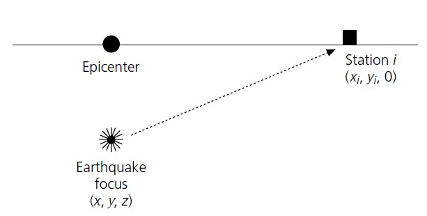

The arrival time recorded by one station could be presented as:

.. math::
   T_i^k = O_k+\int_{s}^{r}udS

where :math:`T_i^k` is the arrival time of event :math:`k` on station :math:`i`. In the right side of equation, there are two components: 1) The origin time of event :math:`k` :math:`O_k`; 2) The event travel time. It is the integral over the ray path. The :math:`s` denotes the source location, :math:`r` represents the receiver (station) location, :math:`u` is the reciprocal of velocity named slowness.

Assume the event with true source parameters :math:`\mathbf{m_{true}}=(x_{true},y_{true},z_{true},o_{true})^T` is recorded by :math:`n` stations,
we use :math:`\mathbf{d_obs}` to denote the arrival times of stations, then :math:`\mathbf{m_{true}}` should satisfy:

.. math::

   \mathbf{Fm_{true}=d_obs}

The relationship between :math:`\mathbf{m}` and :math:`\mathbf{d}` is non-linear because integral is involved as shown in previous equation.
For earthquake parameters that are close to :math:`\mathbf{m_{true}}`, we present them as :math:`\mathbf{m=m_{true}+\Delta{m}}`, the :math:`\mathbf{\Delta m}` will lead to variation in :math:`\mathbf{d_{obs}+\Delta d}`

According to `Taylor Expansion theorem <https://en.wikipedia.org/wiki/Taylor_series>`_, we have:

.. math::
   \mathbf{F(m+\Delta m) = Fm + F'\Delta m + ...,}

Neglect the items after the first-order partial derivative, we then have :math:`\mathbf{\Delta d = F'\Delta m}`.

Given the initial location and origin time :math:`\mathbf{m_0}=(x_0,y_0,z_0,t_0)`, we can calculate the corresponding arrival time at each station :math:`\mathbf{d_cal}` and the :math:`\mathbf{\Delta d}`.
Using the :math:`\mathbf{\Delta d}` we can estimate the :math:`\mathbf{\Delta m}`. By updating the :math:`\mathbf{\Delta m}`, an absolute location of hypocenter can be derived.

Contents of this tutorial
**************************

We will introduce how to derive and analyze absolute locations of hypocenters in pyhon which has been devided into listed parts:

#. Gird search method
#. Iteration method
#. Error analyze

**Authors**: ZI Jinping & SONG Zilin, Earth Science System Program, CUHK. 

**Testers**: XIA Zhuoxuan & SUN Zhangyu, Earth Science System Program, CUHK. 

Python Environment and model Setup
-----------------------------------

We'll first generate synthetic arrival times on stations from one earthquake location, which is called **Forward Modelling**. We'll then try to re-generate hypocentral location using these known station arrival times, which is called **Inversion**. In this tutorial, we use one-layer model to avoid complicated ray-tracing (``Snell's law``)

.. note::
 | The purpose is that, by comparing the difference between **inverted location** and **true location**, we can: 1. see whether the location process runs properly; 2. conduct error analysis.

Python environment
*******************

.. code::

    import numpy as np
    import matplotlib.pyplot as plt
    import time
    from matplotlib.patches import Ellipse
    from mpl_toolkits.mplot3d import Axes3D

.. note::
 | Define functions that will be used later.
                  
.. code:: 
            
    def matrix_show(*args,**kwargs):
        """
        Show matrix values in grids shape
        Parameters:cmap="cool",gridsize=0.6,fmt='.2f',label_data=True
        """
        ws = []
        H = 0
        str_count = 0
        ndarr_count = 0
        new_args = []
        for arg in args:
            if isinstance(arg,str):
                new_args.append(arg)
                continue
            if isinstance(arg,list):
                arg = np.array(arg)
            if len(arg.shape)>2:
                raise Exception("Only accept 2D array")
            if len(arg.shape) == 1:
                n = arg.shape[0]
                tmp = np.zeros((n,1))
                tmp[:,0] = arg.ravel()
                arg = tmp
            h,w = arg.shape
            if h>H:
                H=h
            ws.append(w)
            new_args.append(arg)
            ndarr_count += 1
        W = np.sum(ws)+len(ws)    # text+matrix+text+...+matrix+text
        if W<0:
            raise Exception("No matrix provided!")
            
        fmt = '.2f'
        grid_size = 0.6
        cmap = 'cool'
        label_data = True
        for arg in kwargs:
            if arg == "fmt":
                fmt = kwargs[arg]
            if arg == 'grid_size':
                grid_size = kwargs[arg]
            if arg == 'cmap':
                cmap = kwargs[arg]
            if arg == 'label_data':
                label_data = kwargs[arg]
        fig = plt.figure(figsize=(W*grid_size,H*grid_size))
        gs = fig.add_gridspec(nrows=H,ncols=W)
        
        wloop = 0
        matrix_id = 0
        for arg in new_args:
            if isinstance(arg,str):
                ax = fig.add_subplot(gs[0:H,wloop-1:wloop])
                ax.axis("off")
                ax.set_xlim(0,1)
                ax.set_ylim(0,H)
                ax.text(0.5,H/2,arg,horizontalalignment='center',verticalalignment='center')
            if isinstance(arg,np.ndarray):
                h,w = arg.shape
                hlow = int(np.round((H-h+0.01)/2))        # Find the height grid range
                hhigh = hlow+h
                wlow = wloop
                whigh = wlow+w
    #            print("H: ",H,hlow,hhigh,"; W ",W,wlow,whigh)
                ax = fig.add_subplot(gs[hlow:hhigh,wlow:whigh])
                
                plt.pcolormesh(arg,cmap=cmap)
                for i in range(1,w):
                    plt.axvline(i,color='k',linewidth=0.5)
                for j in range(1,h):
                    plt.axhline(j,color='k',linewidth=0.5)
                if label_data:
                    for i in range(h):
                        for j in range(w):
                            plt.text(j+0.5,i+0.5,format(arg[i,j],fmt),
                                     horizontalalignment='center',
                                     verticalalignment='center')
                plt.xlim(0,w)
                plt.ylim([h,0])
                plt.xticks([])
                plt.yticks([])
                wloop+=w+1
                matrix_id+=1
        plt.show()

Model setup
*************

Define basic parameters:

#. Station locations (stats)
#. True hypocenter location (hyc_true)
#. Velocity (Vp)

.. code::

    stas_set1 = np.array([[-45,16,0],
                         [-44,10,0],
                         [-12,50,0],
                         [-11,-25,0],
                         [-1,-11,0],
                         [5,-19,0],
                         [20,11,0],
                         [23,-39,0],
                         [35,9,0],
                         [42,-27,0]])
    stas = stas_set1
    nsta = stas.shape[0]

.. code::

    hyc_true = np.array([0.5,0.5,9.45,0])     # The true hypocenter value(x,y,z,t)
    Vp = 5

.. code::

    plt.plot(stas[:,0],stas[:,1],'^',label="Station")
    plt.plot(hyc_true[0],hyc_true[1],'r*',label='True hypocenter')
    plt.xlabel("X (km)")
    plt.ylabel("Y (km)")
    plt.gca().set_aspect("equal")
    plt.legend();

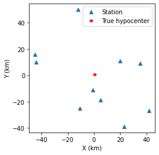

Generate synthetic arrival times

.. code::

    dobs = np.zeros((nsta,1))
    for i in range(dobs.shape[0]):
        dx = stas[i,0]-hyc_true[0]
        dy = stas[i,1]-hyc_true[1]
        dz = stas[i,2]-hyc_true[2]
        dobs[i,0] = np.sqrt(dx**2+dy**2+dz**2)/Vp+hyc_true[3]
    nobs = dobs.shape[0]

The Grid-Search Method
--------------------------

The grid search method separates the possible earthquake location zone into 3-D grids, trying each grid as earthquake center and calculating the residual. The grid where earthquake is located should has the lowest residual.

1. Set up grids
****************

.. code::

    dx = 1
    dy = 1
    dz = 1
    xs = np.arange(-40,41,dx)
    ys = np.arange(-40,41,dy)
    zs = np.arange(0,20,dz)
    nx = len(xs)
    ny = len(ys)
    nz = len(zs)
    print("Total number of nodes are: ",)  # For students, fill in the blank
    fig = plt.figure(figsize=(6,6))
    ax = plt.axes(projection='3d')
    nodes = []
    for x in xs[:-1]:
        for y in ys[:-1]:
            for z in zs[:-1]:
                nodes.append([x,y,z])
    nodes = np.array(nodes)
    ax.scatter3D(nodes[:,0],nodes[:,1],nodes[:,2],c=nodes[:,2],s=0.1)
    ax.set_xlabel("X (km)")
    ax.set_ylabel("Y (km)")
    ax.set_zlabel("Dep (km)")
    ax.set_zlim([20,0])
    plt.show()

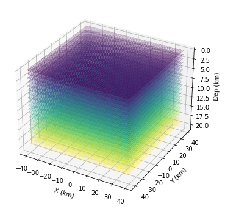

2. Try each grid and calculate error
************************************

.. code::

    V = Vp
    sq_errs = np.zeros((nx,ny,nz))    
    ta = time.time()                         # The time before calculation
    for i in range(len(xs)):
        for j in range(len(ys)):
            for k in range(len(zs)):
                dcal = np.zeros((nsta,1))
                x = xs[i];y=ys[j];z=zs[k]
                for m in range(nsta):
                    sta_x = stas[m,0]
                    sta_y = stas[m,1]
                    sta_z = stas[m,2]
                    dist = np.sqrt((sta_x-x)**2+(sta_y-y)**2+(sta_z-z)**2)
                    dcal[m,0] = dist/V
                sq_err = np.linalg.norm(dobs-dcal)**2
                sq_errs[i,j,k] = sq_err
    tb = time.time()                         # The time after calculation
    print("Time for location process: ",format(tb-ta,'.3f'),'s')

3. Find the minimum misfit grid
********************************

.. code::

    sq_err_min = np.min(sq_errs)              # Get the min value
    sq_err_max = np.max(sq_errs)
    kk = np.where(sq_errs==sq_err_min)        # Get the value indexs
    idx = kk[0][0]
    idy = kk[1][0]
    idz = kk[2][0]
    print(f"Minimum occurred in x={xs[idx]}, y={ys[idy]}, z={zs[idz]}")

.. parsed-literal::

    Minimum occurred in x=1, y=1, z=9

.. code::

    ncol = 4
    if nz%ncol==0:
        nrow = int(nz/ncol)
    else:
        nrow = int(nz/ncol)+1
    xs_mesh,ys_mesh = np.meshgrid(xs,ys)
    fig, axs = plt.subplots(nrow,ncol,figsize=(2.5*ncol,2*nrow),sharex=True,sharey=True)
    axs = axs.ravel()
    for i in range(nz):
        axs[i].pcolormesh(xs_mesh,ys_mesh,sq_errs[:,:,i],
                      shading='auto',cmap='jet',vmin=sq_err_min,vmax=sq_err_max)
        plt.sca(axs[i])        # set current active axis
        plt.colorbar(pm)
        tmp_sq_err_min = np.min(sq_errs[:,:,i])
        _tmp_sq_err_min = format(tmp_sq_err_min,'6.3f')
        tmp_kk = np.where(sq_errs[:,:,i]==tmp_sq_err_min)
        idx = tmp_kk[0][0]
        idy = tmp_kk[1][0]
        _Z = str(zs[i]).zfill(2)
        if tmp_sq_err_min == sq_err_min:
            print(f"Z={_Z},min_sq_error={_tmp_sq_err_min}, x={xs[idx]}, y={ys[idy]},global minimum")
            axs[i].plot(xs[idx],ys[idx],'wx',ms=10)
        else:
            print(f"Z={_Z},min_sq_error={_tmp_sq_err_min}, x={xs[idx]}, y={ys[idy]}")
        axs[i].set_aspect('equal')
        axs[i].set_title(f"Depth={zs[i]} km")
    
    # adjust plot    
    plt.tight_layout()

.. parsed-literal::

    Z=00,min_sq_error= 0.915, x=0, y=2
    Z=01,min_sq_error= 0.898, x=0, y=2
    Z=02,min_sq_error= 0.845, x=0, y=1
    Z=03,min_sq_error= 0.743, x=0, y=1
    Z=04,min_sq_error= 0.613, x=0, y=1
    Z=05,min_sq_error= 0.469, x=0, y=1
    Z=06,min_sq_error= 0.326, x=0, y=1
    Z=07,min_sq_error= 0.203, x=0, y=1
    Z=08,min_sq_error= 0.119, x=0, y=1
    Z=09,min_sq_error= 0.072, x=1, y=1,global minimum
    Z=10,min_sq_error= 0.073, x=0, y=0
    Z=11,min_sq_error= 0.147, x=1, y=0
    Z=12,min_sq_error= 0.323, x=1, y=0
    Z=13,min_sq_error= 0.641, x=1, y=0
    Z=14,min_sq_error= 1.124, x=1, y=0
    Z=15,min_sq_error= 1.757, x=1, y=-1
    Z=16,min_sq_error= 2.562, x=1, y=-1
    Z=17,min_sq_error= 3.594, x=1, y=-1
    Z=18,min_sq_error= 4.874, x=1, y=-1
    Z=19,min_sq_error= 6.422, x=1, y=-1
    Z=20,min_sq_error= 8.226, x=1, y=-2

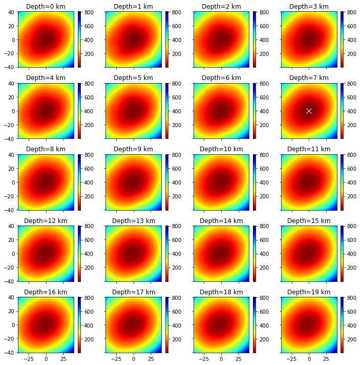

Exercise
************
Modify V=4.9 and redo the grid search, what do you find?

Iterative Method
-------------------

The arrival time recorded by one station could be presented as:

.. math::  T_i^k = O_k+\int_{s}^{r}uds 

where :math:`T_i^k` is the arrival time of event k on station i, *s* is source, *r* is receiver, *u* is slowness. In the right side of equation, there are two components:

   1. The origin time :math: `O_k`; 
   2. The travel time. It is the integral over the ray path. 

It could be presented as below:

.. math::  \mathbf{Fm_{true}=d_{obs}} 

Note the equation above is non-linear. Using Taylor Expansion, we have:

.. math::  \mathbf{F(m+\Delta m) = Fm + \frac{\partial F}{\partial m}\Delta m + ...,} 

where :math:`\mathbf{m} = (x,y,z,t)`. Ingoring high-order component:

.. math::  \mathbf{\Delta d = \frac{\partial F}{\partial m}\Delta m}

It means the misfit of data is related to the misfit of earthquake location, the relationship is presented as:

.. math:: F_i^k = T_i^k = O_k+\int_{s}^{r}uds

.. math::

   \frac{\partial \mathbf{F}}{\partial \mathbf{m}}=
   \frac{\partial T}{\partial x}\Delta x+
   \frac{\partial T}{\partial y}\Delta y+
   \frac{\partial T}{\partial z}\Delta z+
   \frac{\partial T}{\partial t}\Delta t

More in detail:

.. math::

   \begin{cases}
   \frac{\partial T}{\partial x}=dx/ds\cdot u\\
   \frac{\partial T}{\partial y}=dy/ds\cdot u\\
   \frac{\partial T}{\partial z}=dz/ds\cdot u\\
   \frac{\partial T}{\partial t}=1
   \end{cases}

where :math:`ds=\sqrt{(dx)^2+(dy)^2+(dz)^2}`

For one-layer model, :math:`T_i^k=o_t +\sqrt{x^2+y^2+z^2}/v`, where
:math:`x,y,z` denotes distance between the source (earthquake location)
and receiver(station), :math:`v` is velocity. Partial derivatives of one-layer model are:

.. math:: \frac{\partial T_i^k}{\partial x} = \frac{x}{\sqrt{x^2+y^2+z^2}v}

.. math:: \frac{\partial T_i^k}{\partial y} = \frac{y}{\sqrt{x^2+y^2+z^2}v}

.. math:: \frac{\partial T_i^k}{\partial y} = \frac{z}{\sqrt{x^2+y^2+z^2}v}

.. math:: \frac{\partial T_i^k}{\partial o_t} = 1

.. math::

   \begin{bmatrix}
   \frac{\partial T_1}{\partial x}&\frac{\partial T_1}{\partial y}&\frac{\partial T_1}{\partial z}&1\\
   \frac{\partial T_2}{\partial x}&\frac{\partial T_2}{\partial y}&\frac{\partial T_2}{\partial z}&1\\
   \vdots&\vdots&\vdots&\vdots\\
   \frac{\partial T_i}{\partial x}&\frac{\partial T_i}{\partial y}&\frac{\partial T_i}{\partial z}&1\\
   \end{bmatrix}
   \begin{bmatrix}
   \Delta x\\\Delta y \\\Delta z \\\Delta t
   \end{bmatrix}=
   \begin{bmatrix}
   d_1^{obs} - d_1^{cal}\\d_2^{obs} - d_2^{cal}\\\vdots\\d_i^{obs} - d_i^{cal}\\
   \end{bmatrix}

After solve this equation, we can update the earthquake location:

.. math:: \mathbf{m=m+\Delta m}

This process generally will not finish in one iteration, more iterations are needed to update the locations until no apparent change of misfit.

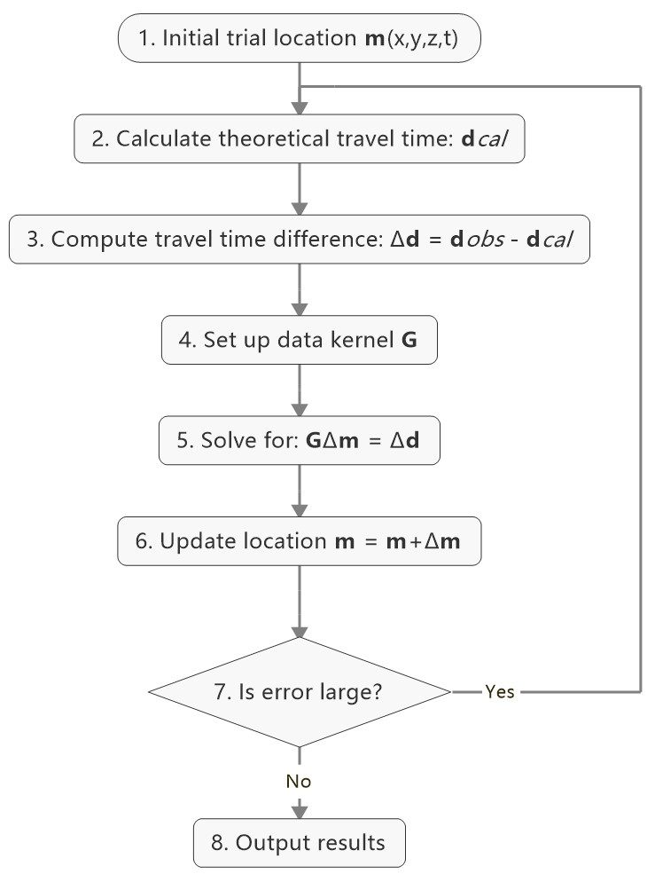

1. Give an initial source parameters
*************************************

The station which records the earliest arrival is the cloest to the hypocenter, so it is reasonable to be set as initial location:

1. The same x and y with the closest station; 
2. Initial depth at 5 km; 
3. Initial origin time 1 sec before the earliest arrival;

.. code::

    idx = np.argmin(dobs)        # The index of station
    dmin = np.min(dobs)          # The minimum arrival time
    
    hyc_init = np.zeros(4);      # Init array
    hyc_init[:2] = stas[idx,:2]; # Set the same x,y with station
    hyc_init[2] = 5;             # Set initial depth 5 km
    hyc_init[3] = dmin-1;        # Set initial event time 1s earlier than arrival
    hyc_loop = hyc_init.copy()

2. Calculate the arrival times based on input location
******************************************************

.. code::

    dcal = np.zeros((nsta,1))
    for i in range(dobs.shape[0]):
        dx = stas[i,0]-hyc_loop[0]
        dy = stas[i,1]-hyc_loop[1]
        dz = stas[i,2]-hyc_loop[2]
        dcal[i,0] = np.sqrt(dx**2+dy**2+dz**2)/Vp+hyc_loop[3]

3. Measure the misfit between the :math:`d_{obs}` and the :math:`d_{cal}`
*****************************************************************************

.. code::

    delta_d = dobs - dcal
    e2 = 0 
    for i in range(delta_d.shape[0]):
        e2 += delta_d[i,0]**2
    print(f"The square error: ",format(e2,'5.6f'))

.. parsed-literal::

    The square error:  49.466691

4. Calculate Partial Derivatives
**********************************

.. code::

    G = np.zeros((nsta,4))
    for i in range(nsta):
        for j in range(3):
            denomiter = np.sqrt((hyc_loop[0]-stas[i,0])**2+(hyc_loop[1]-stas[i,1])**2+(hyc_loop[2]-stas[i,2])**2)
            G[i,j]=(hyc_loop[j]-stas[i,j])/denomiter/Vp
    G[:,3]=1

5. Estimation of :math:`\Delta m`, generalized inversion problem
********************************************************************

Define :math:`\Delta m = (\Delta x, \Delta y, \Delta z,\Delta t)`, the
relationship between :math:`\Delta m` and :math:`\Delta d` is:

.. math:: G\Delta m =\Delta d

:math:`G` is not a square matrix, :math:`G^TG` is a square matrix, we
then have:

.. math:: G^TG\Delta m=G^T\Delta d

If the inverse of :math:`G^TG` exists (the determinnant != 0, in here we
have 10 observations to solve for 4 parameters), then:

.. math:: \Delta m = (G^TG)^{-1}G^T\Delta d

.. code::

    GTG = np.matmul(G.T,G)
    matrix_show(G.T,"*",G,"=",GTG)

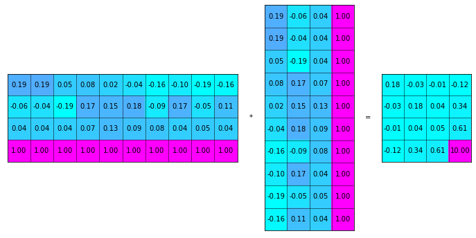

.. code::

    GTG_inv = np.linalg.inv(GTG)
    GTG_inv_GT = np.matmul(GTG_inv,G.T)
    delta_m = np.matmul(GTG_inv_GT,delta_d)
    print("delta m: ",delta_m.ravel())

.. parsed-literal::

    delta m:  [ 1.27106047 10.82922813  9.25013738 -1.91360853]

6. Update hypocenter
*********************

.. code::

    hyc_loop = np.add(hyc_loop,delta_m.ravel())
    print("After this run, results (x,y,z,t) are:",hyc_loop)
    print("True location parameters(x,y,z,t) are:",hyc_true)

.. parsed-literal::

    After this run, results (x,y,z,t) are: [ 0.27106047 -0.17077187 14.25013738  0.07839748]
    True location parameters(x,y,z,t) are: [0.5  0.5  9.45 0.  ]

7. Start new iteration
*************************

Move back to step two

8. Integrated Solution
************************

Summarize previous steps into a loop function

.. code::

    k = 0
    niter = 10
    hyc_loop = hyc_init.copy()
    
    dcal = np.zeros((10,1))
    for i in range(dobs.shape[0]):
        dx = stas[i,0]-hyc_loop[0]
        dy = stas[i,1]-hyc_loop[1]
        dz = stas[i,2]-hyc_loop[2]
        dcal[i,0] = np.sqrt(dx**2+dy**2+dz**2)/Vp+hyc_loop[3]
    delta_d = dobs - dcal
    
    while k < niter:
        # >>>>> Build G matrix >>>>>>
        G = np.zeros((10,4))
        G[:,3]=1
        for i in range(10):
            for j in range(3):
                denomiter = np.sqrt((hyc_loop[0]-stas[i,0])**2+(hyc_loop[1]-stas[i,1])**2+(hyc_loop[2]-stas[i,2])**2)
                G[i,j]=(hyc_loop[j]-stas[i,j])/denomiter/Vp
        
        # >>>>> Invert the m value >>>>        
        GTG = np.matmul(G.T,G)
        GTG_inv = np.linalg.inv(GTG)
        GTG_inv_GT = np.matmul(GTG_inv,G.T)
        delta_m = np.matmul(GTG_inv_GT,delta_d)
        
        # >>>>> Update the hypocenter loop >>>>>
        hyc_loop = np.add(hyc_loop,delta_m.ravel())
        k = k+1
        dcal = np.zeros((10,1))
        for i in range(dobs.shape[0]):
            dx = stas[i,0]-hyc_loop[0]
            dy = stas[i,1]-hyc_loop[1]
            dz = stas[i,2]-hyc_loop[2]
            dcal[i,0] = np.sqrt(dx**2+dy**2+dz**2)/Vp+hyc_loop[3]
        delta_d = dobs - dcal
        e2 = 0 
        for i in range(delta_d.shape[0]):
            e2 += delta_d[i,0]**2
        print(f"Iteration {k} square error: ",format(e2,'10.8f'))
        
        # >>>>> add codes to end the loop if error is small >>>>>

    hyc_estimate = hyc_loop
    print(hyc_estimate)

.. parsed-literal::

    Iteration 1 square error:   1.85
    Iteration 2 square error:   0.03
    Iteration 3 square error:   0.00
    Iteration 4 square error:   0.00
    [5.00000001e-01 5.00000005e-01 9.45000023e+00 7.74200567e-09]

Exercise (10 min)
******************

1. Calculate the time used for the iterative location. Compare it with the grid search method.

2. It is a common practice that if the square error lower than a threshold, finish the iteration in advance. Add one criterion in above codes: if square error lows than 0.0000001, break the iteration.

3. It is common to set up an indicator parameter “istop” to show the stop reason of iteration, if iteration stops due to run over all the iterations, then istop = 0; if the iteration stops due to error
   threshold achieved, then istop = 1.

4. Try to change parameters, e.g. Vp, hyc_true, what’s the maximum iterations needed to converge?

More Practical Case
--------------------

In the iterative earthquake case, we first generate the arrival times and then invert for the earthquake location, we find that it is very efficient, fast, and accurate to do so. The error decreases to nearly 0 in around 3 iterations. However, in real cases, it is rare to have error decreased to nearly 0 due to series of factors: 

1. Phase picking error; 
2. Time - error of stations; 
3. Others.

Phase-Picking Error
*******************

Could you find the P arrival in below waveforms?

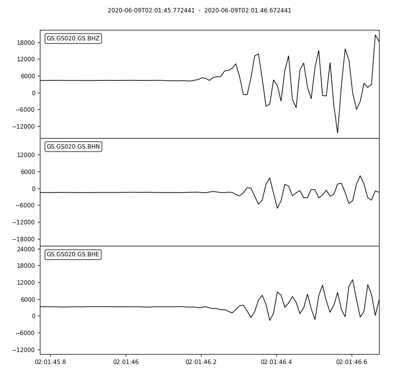
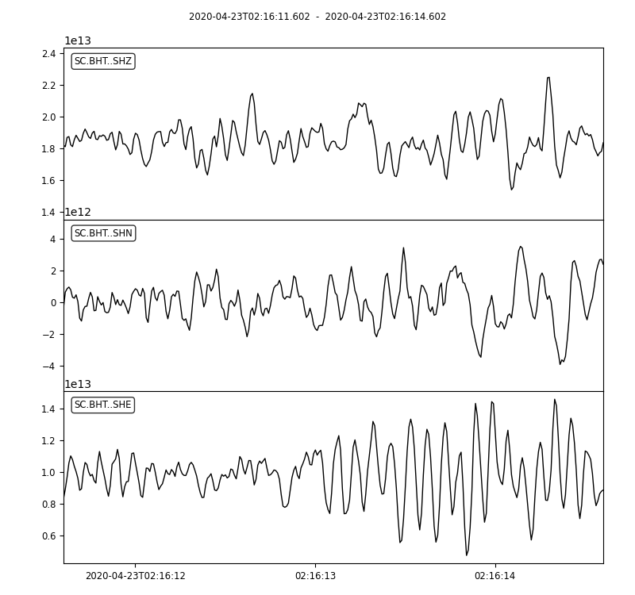

.. note::   
 | The most advanced machine learning phase-pick method has a standard error of ~0.08s in picking P phases.

It is reasonable to assume the picking errors follow the `Gaussian Distribution`, the probability we pick the phase arrival close to the true arrival is high and the probability that picked phase is far offset the true arrival is weak.

.. math:: \sigma^2=\frac{1}{K}\sum_{i=1}^{K}(d_i-\bar{d})^2

.. math:: f(x;\mu,\sigma)=\frac{1}{\sigma\sqrt{2\pi}}exp\bigl(-\frac{(x-\mu)^2}{2\sigma^2}\bigr)

.. image:: error_distribution.png
   :width: 60%

Credit: Wikipedia

1. Generate random normal distribution error in python

.. code::

    mu = 0
    sigma = 0.1
    errors = np.random.normal(mu,sigma,size=(100000,1))
    bins = np.arange(mu-3*sigma,mu+3*sigma,0.01)
    plt.hist(errors,bins=bins);
    plt.xlabel("Error")
    plt.ylabel("Quantity")

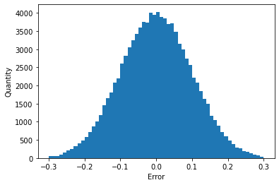

2. Generate repeatable random normal distribution noise

.. code::

    print("Below ten sets of random data:")
    for i in range(10):
        errors = np.random.normal(mu,sigma,size=(5,1))
        print(errors.ravel())
    
    print("Below ten sets of repeatable random data:")
    for i in range(10):
        seed = 5
        np.random.seed(seed)
        errors = np.random.normal(mu,sigma,size=(5,1))
        print(errors.ravel())

.. parsed-literal::

    Below ten sets of random data:
    [ 0.14576948 -0.03545659  0.01865004  0.06909433  0.10035061]
    [-0.11188185 -0.00634874  0.12890032 -0.1214119  -0.07929655]
    [-0.08868027  0.07272929 -0.04400131  0.03902781 -0.05310638]
    [-0.19492339  0.05280531  0.01207171 -0.02196256  0.03234145]
    [ 0.03812467  0.19008607  0.0689304  -0.06495476 -0.03542378]
    [-0.16057787  0.00484336 -0.00963628 -0.09241747 -0.10234195]
    [-0.0997116   0.07139755 -0.03709032  0.07398414 -0.04919343]
    [ 0.04309643  0.01775167  0.11226868 -0.03265422  0.29264822]
    [-0.10930484  0.03639013  0.08391139  0.0606412  -0.07792868]
    [-0.00797514 -0.08165227  0.04543699  0.0669631  -0.16680696]
    Below ten sets of repeatable random data:
    [ 0.04412275 -0.03308702  0.24307712 -0.02520921  0.01096098]
    [ 0.04412275 -0.03308702  0.24307712 -0.02520921  0.01096098]
    [ 0.04412275 -0.03308702  0.24307712 -0.02520921  0.01096098]
    [ 0.04412275 -0.03308702  0.24307712 -0.02520921  0.01096098]
    [ 0.04412275 -0.03308702  0.24307712 -0.02520921  0.01096098]
    [ 0.04412275 -0.03308702  0.24307712 -0.02520921  0.01096098]
    [ 0.04412275 -0.03308702  0.24307712 -0.02520921  0.01096098]
    [ 0.04412275 -0.03308702  0.24307712 -0.02520921  0.01096098]
    [ 0.04412275 -0.03308702  0.24307712 -0.02520921  0.01096098]
    [ 0.04412275 -0.03308702  0.24307712 -0.02520921  0.01096098]

3. Update the observed data by adding noise

.. code::

    mu = 0        # mean of error
    sigma = 0.1   # standard deviation of error
    np.random.seed(100)
    errors = np.random.normal(mu,sigma,size=(nsta,1))
    dobs_noise = dobs+errors

4. Re-run the inversion

.. code::

    Vp = 5
    k = 0
    niter = 10
    hyc_loop = hyc_init.copy()
    while k < niter:
        dcal = np.zeros((10,1))
        for i in range(dobs_noise.shape[0]):
            dx = stas[i,0]-hyc_loop[0]
            dy = stas[i,1]-hyc_loop[1]
            dz = stas[i,2]-hyc_loop[2]
            dcal[i,0] = np.sqrt(dx**2+dy**2+dz**2)/Vp+hyc_loop[3]
        delta_d = dobs_noise - dcal
        e2 = 0 
        for i in range(delta_d.shape[0]):
            e2 += delta_d[i,0]**2
        print(f"Iteration {k} square error: ",format(e2,'5.2f'))
        
        # >>>>> Build G matrix >>>>>>
        G = np.zeros((10,4))
        G[:,3]=1
        for i in range(10):
            for j in range(3):
                denomiter = np.sqrt((hyc_loop[0]-stas[i,0])**2+(hyc_loop[1]-stas[i,1])**2+(hyc_loop[2]-stas[i,2])**2)
                G[i,j]=(hyc_loop[j]-stas[i,j])/denomiter/Vp
        
        # >>>>> Invert the m value >>>>        
        GTG = np.matmul(G.T,G)
        GTG_inv = np.linalg.inv(GTG)
        GTG_inv_GT = np.matmul(GTG_inv,G.T)
        delta_m = np.matmul(GTG_inv_GT,delta_d)
        if np.array_equal(delta_m.ravel(),[0,0,0,0]):
            print("Here")
        
        # >>>>> Update the hypocenter loop >>>>>
        hyc_loop = np.add(hyc_loop,delta_m.ravel())
        k = k+1
    
        # >>>>> End the loop if error is small >>>>>
        if e2<0.000001:
            break
    hyc_estimate = hyc_loop
    print(hyc_estimate)

.. parsed-literal::

    Iteration 0 square error:  49.76
    Iteration 1 square error:   1.84
    Iteration 2 square error:   0.09
    Iteration 3 square error:   0.07
    Iteration 4 square error:   0.07
    Iteration 5 square error:   0.07
    Iteration 6 square error:   0.07
    Iteration 7 square error:   0.07
    Iteration 8 square error:   0.07
    Iteration 9 square error:   0.07
    [ 0.66712215  0.30531256  9.67044461 -0.03328683]

**Exercise (2 min)**

1. What do you find from the inversion? compare the results with the previous run.

2. Change the sigma value and check the variation of the inversion results.

Error analysis
***************

The error in observed data will definitely lead to uncertainties in the estimation of earthquake location parameters. Their relationship could be described as:

.. math:: \sigma_m^2=\sigma_d^2(G^TG)^{-1}

For two parameters, the definition of covariance is:

.. math:: {\sigma_{xy}}^2 =  \frac{1}{K}\sum_{k=1}^{K}(x^k-\bar{x})(y^k-\bar{y})

.. note::
 | Wanna know how this relationship derived? Page 435 of **An Introduction to Seismology, Earthquakes, and Earth Structure (2003)**

.. code::

    sigma_d = np.std(delta_d)
    sigma_d2 = sigma_d**2
    sigma_m2 = sigma_d2 * GTG_inv

.. code::

    def present_loc_results(hyc,sig_square=None,std_fmt='.2f'):
        """
        Print earthquake location results
        """
        _x = format(np.round(hyc[0],4),format("6.2f"))
        _y = format(np.round(hyc[1],4),format("6.2f"))
        _z = format(np.round(hyc[2],4),format("6.2f"))
        _t = format(np.round(hyc[3],4),format("6.2f"))
        if not isinstance(sig_square,np.ndarray):
            print("x = ",_x," km")
            print("x = ",_y," km")
            print("z = ",_z," km")
            print("t = ",_t," s")
        else:
            stdx = sig_square[0,0]**0.5
            _stdx = format(np.round(stdx,4),std_fmt)
            stdy = sig_square[1,1]**0.5
            _stdy = format(np.round(stdy,4),std_fmt)
            stdz = sig_square[2,2]**0.5
            _stdz = format(np.round(stdz,4),std_fmt)
            stdt = sig_square[3,3]**0.5
            _stdt = format(np.round(stdt,4),std_fmt)
            print("x = ",_x,"±",_stdx," km")
            print("y = ",_y,"±",_stdy," km")
            print("z = ",_z,"±",_stdz," km")
            print("t = ",_t,"±",_stdt," s")

.. code::

    present_loc_results(hyc_estimate,sigma_m2)

.. parsed-literal::

    x =    0.67 ± 0.20  km
    y =    0.31 ± 0.22  km
    z =    9.67 ± 0.99  km
    t =   -0.03 ± 0.06  s

**Question (2 min)**

Test different parameters and see how standard error ($\sigma$) changes, which parameter has the largest standard error? which parameter has the minimum standard error? Why?
.. note::
| Check :math:`(G^TG)^{-1}`, :math:`(G^TG)` and :math:`G` values

Covariance Matrix

.. math::

   \sigma_m^2=\sigma_d^2(G^TG)^{-1}=\begin{bmatrix}
   \sigma_{xx}^2&\sigma_{xy}^2&\sigma_{xz}^2&\sigma_{xt}^2\\
   \sigma_{yx}^2&\sigma_{yy}^2&\sigma_{yz}^2&\sigma_{yt}^2\\
   \sigma_{zx}^2&\sigma_{zy}^2&\sigma_{zz}^2&\sigma_{zt}^2\\
   \sigma_{tx}^2&\sigma_{ty}^2&\sigma_{tz}^2&\sigma_{tt}^2\\
   \end{bmatrix}

From the covariance matrix, we can estiamte the uncertainty(:math:`\sigma`) of x,y,z,t using :math:`\sigma_x^2`,\ :math:`\sigma_y^2`,\ :math:`\sigma_z^2`,\ :math:`\sigma_t^2`

.. code::

    matrix_show(sigma_m2,fmt='.3f')

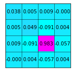

**Principle axes**

Note that off-diagonal elements of :math:`\sigma_m^2` is not zero. Using **xy plane** as an example, it is shape could be presented by the figure below generated. The principle axes are not along the same direction with **xy** axis.

.. code::

    angle = 30
    width = 0.5
    height = 0.8
    ellipse = Ellipse(xy=[0,0],width=0.5,height=0.8,angle=-angle)
    ellipse.set_facecolor('grey')
    ellipse.set_edgecolor('black')
    fig, ax = plt.subplots(subplot_kw={'aspect': 'equal'})
    ax.add_artist(ellipse)
    
    plt.xlabel("X (km)")
    plt.ylabel("Y (km)")
    plt.xlim([-1,1])
    plt.ylim([-1,1])
    plt.plot([-1,1],[0,0],'k')
    plt.plot([0,0],[-1,1],'k')
    plt.arrow(0,0,height/2*np.sin(np.deg2rad(angle))*0.85,height/2*np.cos(np.deg2rad(angle))*0.85,width=0.015,zorder=10)
    plt.arrow(0,0,-width/2*np.cos(np.deg2rad(angle))*0.80,width/2*np.sin(np.deg2rad(angle))*0.80,width=0.015,zorder=10)
    plt.plot(0.27,0,'o',color='blue',ms=8)
    plt.plot(0,0.34,'o',color='red',ms=8)
    plt.text(0.34,-0.1,'$\sigma_x$')
    plt.text(-0.12,0.38,'$\sigma_y$')
    plt.show()

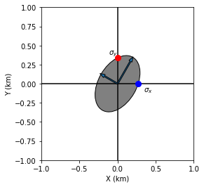

**Singular Value Decomposition (SVD)** could be used to find the principle axes and principle values.

.. math:: M=USV^T

:math:`S` is the ordered eigenvalues array. :math:`V` is the corresponding eigenvectors. Below demonstrate the decomposition of errors in xy-plane.

.. code::

    sigma_xy2 = sigma_m2[:2,:2]
    u,s,vt = np.linalg.svd(sigma_xy2)
    print("Maximum eigenvalue: ",format(s[0],'.5f')," corresponding eigenvector: ",vt[0,:])
    print("Minimum eigenvalue: ",format(s[-1],'.5f')," corresponding eigenvector: ",vt[-1,:])
    print("The maximum/minimum eigenvalue ratio: ",format(s[0]/s[1],'.2f'))

.. parsed-literal::

    Maximum eigenvalue:  0.05139  corresponding eigenvector:  [0.35995123 0.93297112]
    Minimum eigenvalue:  0.03604  corresponding eigenvector:  [ 0.93297112 -0.35995123]
    The maximum/minimum eigenvalue ratio:  1.43

Plot the error ellipse and stations

Note: the sigma values are small to be shown, here amplify the size by parameter **size_ratio**

.. code:: 

    angle = np.arctan(vt[0,0]/vt[0,1])/np.pi*180
    size_ratio = 100
    ellipse = Ellipse(xy=[hyc_estimate[0],hyc_estimate[1]],width=s[1]*size_ratio,height=s[0]*size_ratio,angle=-angle)
    ellipse.set_facecolor('red')
    ellipse.set_edgecolor('black')
    fig, ax = plt.subplots(subplot_kw={'aspect': 'equal'})
    ax.add_artist(ellipse)
    
    plt.plot(stas[:,0],stas[:,1],'^',label="Station")
    plt.xlabel("X (km)")
    plt.ylabel("Y (km)")
    plt.show()

.. image:: output_62_0.png

Summary
---------

One layer model
*****************

In the tutorial, we introduced the grid-search method and iterative location method using the one-layer velocity model. The advantage of one-layer is that the ray from the source to one station is a stright line, it is thus convenient to calculate the corresponding partial derivatives. In the real earth, however, the velocity varies due to material, pressure and other fators, the ray path is therefore a curved line, making things more complicated. 

.. image:: Ray.png

However, the key process in finding the earthquake locations remains the same.

The grid search method and the iteraive method
**********************************************

In this tutorial, using the **iterative method**, we can converge the minimum error location in limited iterations with the random initial location we set. However, in practical cases, due to the complexity of station coverage, velocity structure, and other factors, a random initiation might lead to local minimum rather than global minimum. 

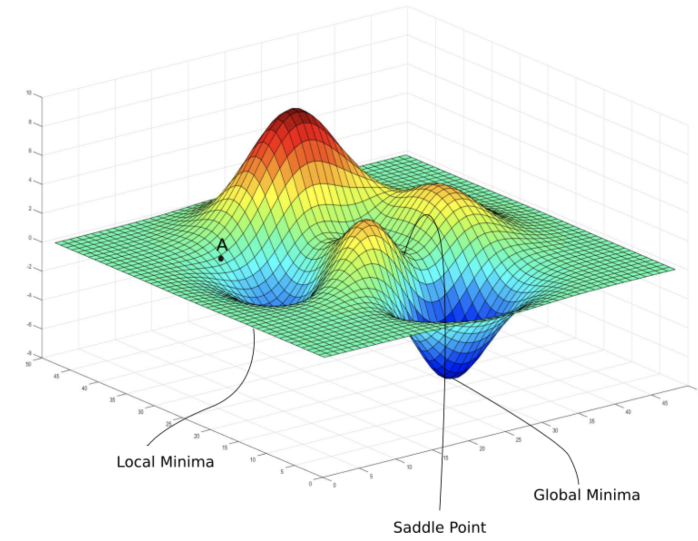

(Courtesy of https://medium.com/analytics-vidhya/journey-of-gradient-descent-from-local-to-global-c851eba3d367)
The general solution is to **conduct rough grid-search first**, which could **avoid local minimum** effectively. Then run the iterative method from the grid search minimum.

Convenient functions
*********************

.. code::

    def iter_loc(hyc_loop,stas,dobs,V,niter=10,show=True):
        """
        Do iterative earthquake location
        Parameters:
        | hyc_loop: hypoceter for iteration
        |     stas: array contains stations location
        |     dobs: observed travel time
        Return:
        | hyc_loop: earthquake location after iteration
        | sigma_m2: square sigma matrix
        |  sigma_d: root mean square residual
        """
        nobs = dobs.shape[0]
        k = 0
        while k < niter:
            dcal = np.zeros((nobs,1))
            for i in range(dobs.shape[0]):
                dx = stas[i,0]-hyc_loop[0]
                dy = stas[i,1]-hyc_loop[1]
                dz = stas[i,2]-hyc_loop[2]
                dcal[i,0] = np.sqrt(dx**2+dy**2+dz**2)/V+hyc_loop[3]
            delta_d = dobs - dcal
            e2 = 0 
            for i in range(nobs):
                e2 += delta_d[i,0]**2
            if show:
                print(f"Iteration {k} square error: ",format(e2,'5.2f'))
    
            # >>>>> Build G matrix >>>>>>
            G = np.zeros((nobs,4))
            G[:,3]=1
            for i in range(dobs.shape[0]):
                for j in range(3):
                    denomiter = np.sqrt((hyc_loop[0]-stas[i,0])**2+(hyc_loop[1]-stas[i,1])**2+(hyc_loop[2]-stas[i,2])**2)
                    G[i,j]=(hyc_loop[j]-stas[i,j])/denomiter/V
    
            # >>>>> Invert the m value >>>>        
            GTG = np.matmul(G.T,G)
            GTG_inv = np.linalg.inv(GTG)
            GTG_inv_GT = np.matmul(GTG_inv,G.T)
            delta_m = np.matmul(GTG_inv_GT,delta_d)
    
            # >>>>> Update the hypocenter loop >>>>>
            hyc_loop = np.add(hyc_loop,delta_m.ravel())
            k = k+1
    
            # >>>>> End the loop if error is small >>>>>
            if e2<0.0000001:
                break
        sigma_d = np.std(delta_d)
        sigma_d2 = sigma_d**2
        sigma_m2 = sigma_d2 * GTG_inv
        return hyc_loop, sigma_m2, sigma_d

    hyc_abs, sigma_m2, e2 = iter_loc(hyc_init,stas,dobs,Vp)

.. parsed-literal::

    Iteration 0 square error:  49.47
    Iteration 1 square error:   1.85
    Iteration 2 square error:   0.03
    Iteration 3 square error:   0.00
    Iteration 4 square error:   0.00

.. code::

def present_loc_results(hyc,sig_square=None,std_fmt='.2f'):
    """
    Print earthquake location results
    Parameters:
    |         hyc: hypocenter
    |sigma_square: squared sigma matrix
    |     std_fmt: format control of the output uncertainty
    """
    _x = format(np.round(hyc[0],4),format("6.2f"))
    _y = format(np.round(hyc[1],4),format("6.2f"))
    _z = format(np.round(hyc[2],4),format("6.2f"))
    _t = format(np.round(hyc[3],4),format("6.2f"))
    if not isinstance(sig_square,np.ndarray):
        print("x = ",_x," km")
        print("x = ",_y," km")
        print("z = ",_z," km")
        print("t = ",_t," s")
    else:
        stdx = sig_square[0,0]**0.5
        _stdx = format(np.round(stdx,4),std_fmt)
        stdy = sig_square[1,1]**0.5
        _stdy = format(np.round(stdy,4),std_fmt)
        stdz = sig_square[2,2]**0.5
        _stdz = format(np.round(stdz,4),std_fmt)
        stdt = sig_square[3,3]**0.5
        _stdt = format(np.round(stdt,4),std_fmt)
        print("x = ",_x,"±",_stdx," km")
        print("y = ",_y,"±",_stdy," km")
        print("z = ",_z,"±",_stdz," km")
        print("t = ",_t,"±",_stdt," s")

    present_loc_results(hyc_abs,sigma_m2,std_fmt='.4f')

.. parsed-literal::

    x =    0.50 ± 0.0000  km
    y =    0.50 ± 0.0000  km
    z =    9.45 ± 0.0000  km
    t =   -0.00 ± 0.0000  s

Play around new station dataset
********************************

.. code::

    stas_set2 = np.array([[-45,36,0],
                     [-44,30,0],
                     [-12,50,0],
                     [8,-40,0],
                     [-1,-11,0],
                     [20,-19,0],
                     [20,0,0],
                     [23,-39,0],
                     [35,-5,0],
                     [42,-27,0]])
    stas = stas_set2

Homework
--------

#. Using the second station dataset (stats_set2), run the inversion with noise parameters (seed=100, mu=0,sigma=0.1), plot the error ellipse and stations, could you conclude relationship between the error ellipse and the stations coverage? Show your codes and results(30 Points)

#. In order to enhance the Z constraint, you can change the location of one station in station dataset1, what's your plan and why? Show your codes and results (20 points)

#. In previous example, we calculate the :math:`\sigma_d^2=\frac{1}{nobs}\sum_{i=1}^{nobs}({d_i}-\bar{d})^2`, note it is the sum of square error divided by :math:`nobs` (number of observations). There are scientists proposed that the calculation should be :math:`\sigma_d^2=\frac{1}{nobs-k}\sum_{i=1}^{nobs}({d_i}-\bar{d})^2`, where :math:`nobs-k` is called **the number of degrees of freedom**, :math:`k` is the number of parameters determined by the data, in earthquake location process, :math:`k=4` for four paramters (x,y,z,t) are inverted. Try to run the inversion 100 times with random noise :math:`\sigma_{true}=0.1s`, calculate the data standard error using two methods, conclude which one is more consistent with the input noise level. Show your codes and results (30 points)

#. What's your comments and suggestions to this tutorial (10 points)

Tutorial source code
---------------------
Download :download:`here<./Absolute_Location.zip>`

HYPOINVERSE Tutorial
---------------------
Previous python tutorial gives intuitive familarities of the earthquake relocation process, here we further prepared a tutorial of widely used earthquake absolute location tool, the HYPOINVERSE.

Introduction of HYPOINVERSE
********************************
Hypoinverse is a computer program that processes files of seismic station data for an earthquake (like p wave arrival times and seismogram amplitudes and durations) into earthquake locations and magnitudes (Klein, 2002). It is a single event location method.

The Hypoinverse program requires the input of station locations, seismic velocity model, and the phase data. By assuming a trial origin time and hypocentral location for the earthquake, it improves them by iteratively minimizing the least square error of the travel time computed from the input information.

Environment and example
***********************
For MacOS user,  Xcode is needed to be installed, run ``xcode-select --install`` and wait for finishment.

:download:`HYPOINVERSE example <./Hypoinverse.zip>`

