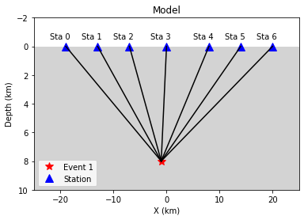
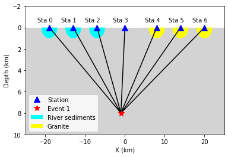
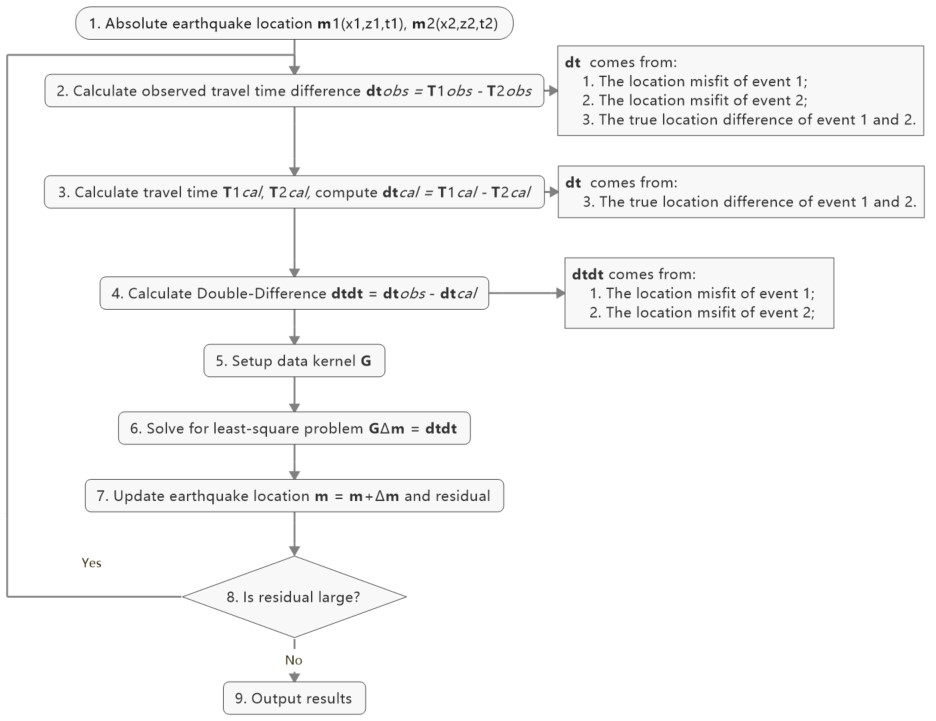
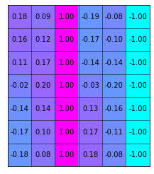
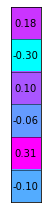
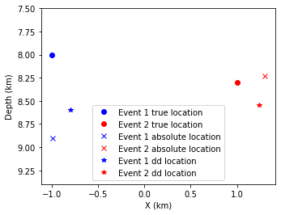
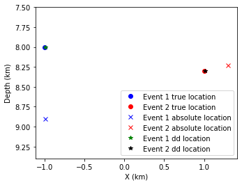

Double-Difference Earthquake Relocation
=============

Introduction
-------------

Double-difference earthquake relocation algorithm was developed to improve the location accuracy in the presence of measurement uncertainties when we locate earthquakes in the previous tutorial. It is based on the iterative least-square method, using the time difference between observed and predicted phase arrivals for event pairs recorded by a common station, some uncertainties can be canceled to derive high-accuracy hypocenter locations over large distance. Figure below shows a comparison of ~10,000 earthquake locations (left panel) and double-difference locations (right panel) during the 1997 seismic crisis in the Long Valley caldera (Waldhauser, 2001).

.. image:: example.png

In this tutorial, we'll go through the powerful earthquake double-difference location method. To better convey the key conception of the method, we simplify the model to avoid it runs too complicated to be understood. We'll use: 

#. one-layer homogeneous velocity model to get rid of complicated ray-tracing. 
#. 2-D X-Z plane rather than 3-D X-Y-Z to decrease complexity 
#. P arrivals only 

After this tutorial, besides the understanding of key concepts in Double-Difference location, you will also find that model expand from 2-D to 3-D, from one-layer to multi-layers, from P to P&S arrivals, the key processing remains the same.

.. note::
 | You are strongly encouraged to play around codes in this tutorial and introduce to others, you will find your understanding will be enhanced dramatically during the process.

Contents of this tutorial
**************************
#. Initiation process
#. Double difference method
#. Iterative double-difference method

**Authors**: ZI Jinping, SONG Zilin, Earth Science Sytem Program, CUHK.
**Testers**, XIA Zhuoxuan, Sun Zhangyu, Earth Science Sytem Program, CUHK.

Initiation
----------

Preparation for Environment
****************************

.. code::

    import numpy as np
    import time
    import matplotlib.pyplot as plt
    from matplotlib.patches import Polygon
    from scipy.sparse.linalg import lsqr
    from scipy.sparse import csc_matrix

.. note::
 | It is important to define functions below first.

.. code::

    def iter_loc(hyc_loop,stas,d,V,niter=10):
        """
        Iterative aboslute earthquake location using least-square method
        """
        k = 0
        while k <= niter:
            dcal = np.zeros((d.shape[0],1))
            for i in range(d.shape[0]):
                dx = stas[i,0]-hyc_loop[0]
                dz = stas[i,1]-hyc_loop[1]
                dcal[i,0] = np.sqrt(dx**2+dz**2)/V+hyc_loop[2]
            delta_d = d - dcal
            e2 = 0 
            for i in range(delta_d.shape[0]):
                e2 += delta_d[i,0]**2
            print(f"Iteration {format(k,'2d')} square error: ",format(e2,'13.8f'))
    
            # >>>>> Build G matrix >>>>>>
            G = np.zeros((d.shape[0],3))
            G[:,2]=1
            for i in range(d.shape[0]):
                for j in range(2):
                    denomiter = np.sqrt((hyc_loop[0]-stas[i,0])**2+(hyc_loop[1]-stas[i,1])**2)
                    G[i,j]=(hyc_loop[j]-stas[i,j])/denomiter/V
    
            # >>>>> Invert the m value >>>>        
            GTG = np.matmul(G.T,G)
            GTG_inv = np.linalg.inv(GTG)
            GTG_inv_GT = np.matmul(GTG_inv,G.T)
            delta_m = np.matmul(GTG_inv_GT,delta_d)
    
            # >>>>> Update the hypocenter loop >>>>>
            hyc_loop = np.add(hyc_loop,delta_m.ravel())
            k = k+1
               
            # >>>>> End the loop if error is small >>>>>
            if e2<0.00000001:
                break
        
        sigma_d = np.std(delta_d)
        var = sigma_d**2*(d.shape[0])/(d.shape[0]-4)
        sigma_m2 = var * GTG_inv
        return hyc_loop, sigma_m2
    
    def present_loc_results(hyc,sig_square=None,std_fmt='.2f'):
        """
        Print earthquake location results
        """
        _x = format(np.round(hyc[0],4),format("6.2f"))
        _z = format(np.round(hyc[1],4),format("6.2f"))
        _t = format(np.round(hyc[2],4),format("6.2f"))
        if not isinstance(sig_square,np.ndarray):
            print("x = ",_x," km")
            print("z = ",_z," km")
            print("t = ",_t," s")
        else:
            stdx = sig_square[0,0]**0.5
            _stdx = format(np.round(stdx,4),std_fmt)
            stdz = sig_square[1,1]**0.5
            _stdz = format(np.round(stdz,4),std_fmt)
            stdt = sig_square[2,2]**0.5
            _stdt = format(np.round(stdt,4),std_fmt)
            print("x = ",_x,"±",_stdx," km")
            print("z = ",_z,"±",_stdz," km")
            print("t = ",_t,"±",_stdt," s")
            
    def matrix_show(*args,**kwargs):
        """
        Show matrix values in grids shape
        Parameters:cmap="cool",gridsize=0.6,fmt='.2f',label_data=True
        """
        ws = []
        H = 0
        str_count = 0
        ndarr_count = 0
        new_args = []
        for arg in args:
            if isinstance(arg,str):
                new_args.append(arg)
                continue
            if isinstance(arg,list):
                arg = np.array(arg)
            if len(arg.shape)>2:
                raise Exception("Only accept 2D array")
            if len(arg.shape) == 1:
                n = arg.shape[0]
                tmp = np.zeros((n,1))
                tmp[:,0] = arg.ravel()
                arg = tmp
            h,w = arg.shape
            if h>H:
                H=h
            ws.append(w)
            new_args.append(arg)
            ndarr_count += 1
        W = np.sum(ws)+len(ws)    # text+matrix+text+...+matrix+text
        if W<0:
            raise Exception("No matrix provided!")
            
        fmt = '.2f'
        grid_size = 0.6
        cmap = 'cool'
        label_data = True
        for arg in kwargs:
            if arg == "fmt":
                fmt = kwargs[arg]
            if arg == 'grid_size':
                grid_size = kwargs[arg]
            if arg == 'cmap':
                cmap = kwargs[arg]
            if arg == 'label_data':
                label_data = kwargs[arg]
        fig = plt.figure(figsize=(W*grid_size,H*grid_size))
        gs = fig.add_gridspec(nrows=H,ncols=W)
        
        wloop = 0
        matrix_id = 0
        for arg in new_args:
            if isinstance(arg,str):
                ax = fig.add_subplot(gs[0:H,wloop-1:wloop])
                ax.axis("off")
                ax.set_xlim(0,1)
                ax.set_ylim(0,H)
                ax.text(0.5,H/2,arg,horizontalalignment='center',verticalalignment='center')
            if isinstance(arg,np.ndarray):
                h,w = arg.shape
                hlow = int(np.round((H-h+0.01)/2))        # Find the height grid range
                hhigh = hlow+h
                wlow = wloop
                whigh = wlow+w
    #            print("H: ",H,hlow,hhigh,"; W ",W,wlow,whigh)
                ax = fig.add_subplot(gs[hlow:hhigh,wlow:whigh])
                
                plt.pcolormesh(arg,cmap=cmap)
                for i in range(1,w):
                    plt.axvline(i,color='k',linewidth=0.5)
                for j in range(1,h):
                    plt.axhline(j,color='k',linewidth=0.5)
                if label_data:
                    for i in range(h):
                        for j in range(w):
                            plt.text(j+0.5,i+0.5,format(arg[i,j],fmt),
                                     horizontalalignment='center',
                                     verticalalignment='center')
                plt.xlim(0,w)
                plt.ylim([h,0])
                plt.xticks([])
                plt.yticks([])
                wloop+=w+1
                matrix_id+=1
        plt.show()

Basic parameters
*****************

Set up station array, earthquake true location, wave-velocity and generate synthetic arrival time.

.. code::

    stas =np.array([[-20,0],[-14,0],[-8,0],[0,0],[8,0],[14,0],[20,0]]) # Station 
    stas =np.array([[-19,0],[-13,0],[-7,0],[0,0],[8,0],[14,0],[20,0]]) # Station
    hyc1_true = np.array([-1,8,0])
    Vtrue = 5
    nsta = stas.shape[0]
    dobs1 = np.zeros((nsta,1))
    for i in range(dobs1.shape[0]):
        dx = stas[i,0]-hyc1_true[0]
        dz = stas[i,1]-hyc1_true[1]
        dobs1[i,0] = np.sqrt(dx**2+dz**2)/Vtrue+hyc1_true[2]

.. code::

    # Plot event, stations, and rays
    fig,ax= plt.subplots(1,1)
    plt.plot(hyc1_true[0],hyc1_true[1],'r*',ms=10,label='Event 1')
    plt.plot(stas[:,0],stas[:,1],'b^',ms=10,label="Station")
    for sta in stas:
        plt.plot([hyc1_true[0],sta[0]],[hyc1_true[1],sta[1]],'k-')
    
    # Add grey background
    nodes = [[-25,10],[25,10],[25,0],[-25,0]]
    p = Polygon(nodes,facecolor='lightgrey')
    for i in range(stas.shape[0]):
        sta = stas[i]
        plt.text(sta[0]-3,sta[1]-0.5,'Sta '+str(i))
    plt.gca().add_patch(p)
    
    # Set up plot elements
    plt.xlim([-25,25])
    plt.ylim([10,-2])
    plt.xlabel("X (km)")
    plt.ylabel("Depth (km)")
    plt.title("Model")
    plt.legend();

The station which records waveform earliest is cloest to the hypocenter, so it is reasonable to start iteration: 

1. The same x and y with the cloest station; 
2. Initial depth at 5 km; 
3. Initial origin time 1 sec before the earliest arrival;

.. code::

    idx = np.argmin(dobs1)       # The index of station
    dmin = np.min(dobs1)         # The minimum arrival time
    
    hyc1_init = np.zeros(3);      # Init array
    hyc1_init[0] = stas[idx,0];   # Set the same x,y with station
    hyc1_init[1] = 5;             # Set initial depth 5 km
    hyc1_init[2] = dmin-1;        # Set initial event time 1s earlier than arrival
    print("Initial trial parameters ","x: ",hyc1_init[0],"km; ","z: ",hyc1_init[1],"km; ","t: ", format(hyc1_init[2],'.4f')+" s")
    hyc1_loop = hyc1_init.copy()

.. parsed-literal::

    Initial trial parameters  x:  0.0 km;  z:  5.0 km;  t:  0.6125 s

.. code::

    def get_init_loc(dobs,stas,depth=5,gap_time=1):
        """
        Get initial earthquake location
        """
        dmin = np.min(dobs)         # The minimum arrival time
        idx = np.argmin(dobs)       # The index of observation
    
        hyc_init = np.zeros(3);      # Init array
        hyc_init[0] = stas[idx,0];   # Set the same x,y with station
        hyc_init[1] = depth;             # Set initial depth 5 km
        hyc_init[2] = dmin-gap_time;        # Set initial event time 1s earlier than arrival
        print("Initial trial parameters ","x: ",hyc_init[0],"km; ","z: ",hyc_init[1],"km; ","t: ", format(hyc_init[2],'.4f')+" s")
        return hyc_init

.. code::

    hyc1_init = get_init_loc(dobs1,stas)

.. parsed-literal::

    Initial trial parameters  x:  0.0 km;  z:  5.0 km;  t:  0.6125 s

.. code::

    hyc1_abs, sigma_m2 = iter_loc(hyc1_loop,stas,dobs1,Vtrue)
    present_loc_results(hyc1_abs,sigma_m2,std_fmt='.4f')

.. parsed-literal::

    Iteration  0 square error:     0.83833287
    Iteration  1 square error:     0.01411773
    Iteration  2 square error:     0.00000020
    Iteration  3 square error:     0.00000000
    x =   -1.00 ± 0.0000  km
    z =    8.00 ± 0.0000  km
    t =    0.00 ± 0.0000  s

Velocity Error
***************

In calculation above, we use the true velocity (**Vtrue**) to conduct the inversion. However, in reality, the velocity we measured more or less differs with the true velocity, thus lead to some bias.

.. note::
 | Try to use other velocity value to conduct inversion and check the results, what do features do you find?

.. code::

    Vp = 4.8
    hyc1_abs, sigma_m2 = iter_loc(hyc1_init,stas,dobs1,Vp)
    present_loc_results(hyc1_abs,sigma_m2,std_fmt='.4f')
    print("True location (hyc1_true) ","x: ",hyc1_true[0],"km; ","z: ",hyc1_true[1],"km; ","t: ", format(hyc1_true[2],'.4f')+" s")

.. parsed-literal::

    Iteration  0 square error:     1.44386729
    Iteration  1 square error:     0.03284725
    Iteration  2 square error:     0.00078154
    Iteration  3 square error:     0.00077835
    Iteration  4 square error:     0.00077835
    Iteration  5 square error:     0.00077835
    Iteration  6 square error:     0.00077835
    Iteration  7 square error:     0.00077835
    Iteration  8 square error:     0.00077835
    Iteration  9 square error:     0.00077835
    Iteration 10 square error:     0.00077835
    x =   -0.98 ± 0.0398  km
    z =    8.90 ± 0.1464  km
    t =   -0.24 ± 0.0204  s
    True location (hyc1_true)  x:  -1 km;  z:  8 km;  t:  0.0000 s

Station Delay
**************

In near surface, material velocity where stations located might varies and lead to influence on the travel time, we call it **Station delay**. The **River sediments** are generally soft,not fully consolidated mateirals, its velocity is low. A lower velocity will lead to longer travel time, thus the actual arrival time will be later than estimated, here we call it **Positive delay**.

The **Granite** is igenous rock, its density is high and velocity is fast. A higher velocity will lead to shorter travel time, thus the actual arrival time will be earlier than estimated, we call it
**Negative delay**.

In this tutorial, we set value of 0.05s for positive delay and -0.05s for negative delay.

.. code::

    semix = np.linspace(-1,1,101)
    semiy = np.sqrt(1-semix**2)
    semixy = np.zeros((101,2))
    semixy[:,0] = semix
    semixy[:,1] = semiy*0.5

.. code::

    for sta in stas:
        plt.plot([hyc1_true[0],sta[0]],[hyc1_true[1],sta[1]],'k')
    station, = plt.plot(stas[:,0],stas[:,1],'b^',ms=10,label="Station")
    event, = plt.plot(hyc1_true[0],hyc1_true[1],'r*',ms=10,label='Event 1')
    nodes = [[-25,10],[25,10],[25,0],[-25,0]]
    p = Polygon(nodes,facecolor='lightgrey')
    plt.gca().add_patch(p)
    for sta in stas[:3]:
        p_pos = Polygon(sta+semixy*2,facecolor='cyan')
        plt.gca().add_patch(p_pos)
    for sta in stas[4:]:
        p_neg = Polygon(sta+semixy*2,facecolor='yellow')
        plt.gca().add_patch(p_neg)
    for i in range(stas.shape[0]):
        sta = stas[i]
        plt.text(sta[0]-3,sta[1]-0.5,'Sta '+str(i))
    
    plt.xlabel("X (km)")
    plt.ylabel("Depth (km)")
    plt.xlim([-25,25])
    plt.ylim([10,-2])
    plt.legend([station,event,p_pos,p_neg],["Station","Event 1","River sediments","Granite"]);

.. code::

    stas_delay = np.zeros((nsta,1))
    stas_delay[:,0]= [0.05,0.05,0.05,0,-0.05,-0.05,-0.05]

Conduct inversion with delayed data
*************************************

.. code::

    dobs1_delay = dobs1 + stas_delay
    hyc1_abs_delay, sigma_m2 = iter_loc(hyc1_init,stas,dobs1_delay,Vp)
    present_loc_results(hyc1_abs_delay,sigma_m2)
    print("True location (hyc1_true) ","x: ",hyc1_true[0],"km; ","z: ",hyc1_true[1],"km; ","t: ", format(hyc1_true[2],'.4f')+" s")

.. parsed-literal::

    Iteration  0 square error:     1.36803100
    Iteration  1 square error:     0.03083627
    Iteration  2 square error:     0.00074298
    Iteration  3 square error:     0.00073813
    Iteration  4 square error:     0.00073813
    Iteration  5 square error:     0.00073813
    Iteration  6 square error:     0.00073813
    Iteration  7 square error:     0.00073813
    Iteration  8 square error:     0.00073813
    Iteration  9 square error:     0.00073813
    Iteration 10 square error:     0.00073813
    x =   -0.69 ± 0.04  km
    z =    8.96 ± 0.14  km
    t =   -0.24 ± 0.02  s
    True location (hyc1_true)  x:  -1 km;  z:  8 km;  t:  0.0000 s

The second event
*****************

Now we consider another event occurred other same time with event one
but location a little different

.. code::

    hyc2_true = [1,8.3,1]
    # Plot event, stations, and rays
    fig,ax= plt.subplots(1,1)
    
    # Add grey background
    nodes = [[-25,10],[25,10],[25,0],[-25,0]]
    p = Polygon(nodes,facecolor='lightgrey')
    plt.gca().add_patch(p)
    
    # Plot events
    plt.plot(hyc1_true[0],hyc1_true[1],'r*',ms=10,label='Event 1')
    plt.plot(hyc2_true[0],hyc2_true[1],'g*',ms=10, label="Event 2")
    
    
    # Plot stations and rays
    plt.plot(stas[:,0],stas[:,1],'b^',ms=10,label="Station")
    for i in range(stas.shape[0]):
        sta = stas[i]
        plt.text(sta[0]-2,sta[1]-0.5,'Sta '+str(i))
        plt.plot([hyc1_true[0],sta[0]],[hyc1_true[1],sta[1]],'k-')
        plt.plot([hyc2_true[0],sta[0]],[hyc2_true[1],sta[1]],'w-')
        if i<3:
            p_pos = Polygon(sta+semixy*2,facecolor='cyan')
            plt.gca().add_patch(p_pos)
        if i>3:
            p_neg = Polygon(sta+semixy*2,facecolor='yellow')
            plt.gca().add_patch(p_neg)
    
    # Set up plot elements
    plt.xlim([-25,25])
    plt.ylim([10,-2])
    plt.xlabel("X (km)")
    plt.ylabel("Depth (km)")
    plt.title("Model")
    plt.legend();

.. image:: output_21_0.png

.. code::

    dobs2 = np.zeros((nsta,1))
    for i in range(dobs2.shape[0]):
        dx = stas[i,0]-hyc2_true[0]
        dz = stas[i,1]-hyc2_true[1]
        dobs2[i,0] = np.sqrt(dx**2+dz**2)/Vtrue+hyc2_true[2]

.. code::

    hyc2_init = get_init_loc(dobs2,stas)

.. parsed-literal::

    Initial trial parameters  x:  0.0 km;  z:  5.0 km;  t:  1.6720 s

.. code::

    dobs2_delay = dobs2 + stas_delay
    hyc2_abs, sigma_m2 = iter_loc(hyc2_init,stas,dobs2_delay,Vtrue)
    present_loc_results(hyc2_abs,sigma_m2)
    print("True location (hyc2_true) ","x: ",hyc2_true[0],"km; ","z: ",hyc2_true[1],"km; ","t: ", format(hyc2_true[2],'.4f')+" s")

.. parsed-literal::

    Iteration  0 square error:     1.12489413
    Iteration  1 square error:     0.01976384
    Iteration  2 square error:     0.00025005
    Iteration  3 square error:     0.00024981
    Iteration  4 square error:     0.00024981
    Iteration  5 square error:     0.00024981
    Iteration  6 square error:     0.00024981
    Iteration  7 square error:     0.00024981
    Iteration  8 square error:     0.00024981
    Iteration  9 square error:     0.00024981
    Iteration 10 square error:     0.00024981
    x =    1.30 ± 0.02  km
    z =    8.23 ± 0.08  km
    t =    1.01 ± 0.01  s
    True location (hyc2_true)  x:  1 km;  z:  8.3 km;  t:  1.0000 s

Add Picking Noise
******************

.. code::

    mu = 0
    sigma = 0.1
    np.random.seed(252)
    errors = np.random.normal(mu,sigma,size=(nsta,1))
    dobs1_delay_noise = dobs1_delay+errors
    np.random.seed(101)
    errors = np.random.normal(mu,sigma,size=(nsta,1))
    dobs2_delay_noise = dobs2_delay+errors

Double Difference Method
--------------------------

The travel-time residual of event :math:`i` at station :math:`k`:

:math:`r_k^i=(T_k^i)^{obs}-(T_k^i)^{cal}` comes from: 

1. Earthquake location mistfit; 
2. Earthquake origin time misfit;
3. Along ray-path velocity variation; 
4. Station delay.

could be presented via below equation:

.. math::

   r_k^i=\sum_{l=1}^2\frac{\partial T_k^i}{\partial x_l^i}\Delta x_l^i +\Delta\tau^i+\int_{s_i}^{r_k}\Delta uds+S_k

:math:`T`: travel time

:math:`\tau`: event origin time

:math:`s,r`: source and receiver location

:math:`u=\frac{1}{V}`: slowness

:math:`S_k`: station delay 

### Event :math:`j`, station :math:`k` 

The travel-time residual of event :math:`j` at station :math:`k`:

..math::

   `r_k^j=\(T_k^j)^{obs}-(T_k^j)^{cal}`=\sum_{l=1}^2\frac{\partial T_k^j}{\partial x_l^j}\Delta x_l^j +\Delta\tau^j+\int_{s_j}^{r_k}\Delta uds+S_k

Make difference
******************

.. math::

   r_k^i-r_k^j=\sum_{l=1}^2\frac{\partial T_k^i}{\partial x_l^i}\Delta x_l^i +\Delta\tau^i+\int_{s_i}^{r_k}\Delta uds-
   \sum_{l=1}^2\frac{\partial T_k^j}{\partial x_l^j}\Delta x_l^j -\Delta\tau^j-\int_{s_j}^{r_k}\Delta uds

Noted that station delay :math:`S` is removed.

.. math::  r_k^i-r_k^j = \{(T_k^i)^{obs}-(T_k^i)^{cal}\}-\{(T_k^j)^{obs}-(T_k^j)^{cal}\}

Reorganize lead to

.. math:: r_k^i - r_k^j=(T_k^i-T_k^j)^{obs}-(T_k^i-T_k^j)^{cal}

This is the so-called **double-difference**.

If **two events are close** to each other, then they have similar ray
paths, that is:

.. math:: \int_{s_i}^{r_k}\Delta uds = \int_{s_j}^{r_k}\Delta uds

The velocity anomaly along the ray path is the same for two events. Then we get

.. math::

   r_k^i-r_k^j=\sum_{l=1}^2\frac{\partial T_k^i}{\partial x_l^i}\Delta x_l^i+\Delta\tau^i-
   \sum_{l=1}^2\frac{\partial T_k^j}{\partial x_l^j}\Delta x_l^j -\Delta\tau^j

The travel time residual
:math:`r_k^i=(T_k^i)^{obs}-(T_k^i)^{cal}`, the travel time residual
:math:`r_k^j=(T_k^j)^{obs}-(T_k^j)^{cal}`, their difference is related to: 

1. Earthquake location misfit 
2. Origin time misfit 

While regardless of: 
1. Station delay 
2. Velocity variation along ray-path 

An inversion equation could be set up:

.. math:: G\Delta m=\Delta d

Detailed expression is, note the negative signs in the last 3 columns of data kernel :math:`\mathbf{G}`:

.. math::

   \begin{bmatrix}
   \frac{\partial T_1^1}{\partial x}&\frac{\partial T_1^1}{\partial z}&1&-\frac{\partial T_1^2}{\partial x}&-\frac{\partial T_1^2}{\partial z}&-1\\
   \frac{\partial T_2^1}{\partial x}&\frac{\partial T_2^1}{\partial z}&1&-\frac{\partial T_2^2}{\partial x}&-\frac{\partial T_2^2}{\partial z}&-1\\
   \vdots&\vdots&\vdots&\vdots&\vdots&\vdots&\\
   \frac{\partial T_k^1}{\partial x}&\frac{\partial T_k^1}{\partial z}&1&-\frac{\partial T_k^2}{\partial x}&-\frac{\partial T_k^2}{\partial z}&-1\\
   \end{bmatrix}
   \begin{bmatrix}
   \Delta x_1\\\Delta z_1 \\\Delta t_1 \\\Delta x_2 \\\Delta z_2 \\\Delta t_2
   \end{bmatrix}=
   \begin{bmatrix}
   r_1^1 - r_1^2\\r_2^1 - r_2^2\\\vdots\\r_k^1 - r_k^2\\
   \end{bmatrix}

**Workflow**

.. code::

    hyc1_dd = hyc1_abs.copy()
    hyc2_dd = hyc2_abs.copy()

1. Observed Travel Time Difference
----------------------------------

.. code::

    obs_trav_t1 = dobs1_delay - hyc1_dd[2] # Travel time = arrival_time - origin_time 
    obs_trav_t2 = dobs2_delay - hyc2_dd[2]
    obs_dt = obs_trav_t1 - obs_trav_t2      

.. code::

    matrix_show(obs_dt)

.. image:: output_34_0.png

2. Calculated Travel Time Difference
------------------------------------

.. code::

    dcal1 = np.zeros((nsta,1))
    for i in range(dobs1.shape[0]):
        dx = stas[i,0]-hyc1_dd[0]
        dz = stas[i,1]-hyc1_dd[1]
        dcal1[i,0] = np.sqrt(dx**2+dz**2)/Vtrue+hyc1_dd[2]
    dcal2 = np.zeros((nsta,1))
    for i in range(dobs1.shape[0]):
        dx = stas[i,0]-hyc2_dd[0]
        dz = stas[i,1]-hyc2_dd[1]
        dcal2[i,0] = np.sqrt(dx**2+dz**2)/Vtrue+hyc2_dd[2]
    cal_trav_t1 = dcal1 - hyc1_dd[2] # Travel time = calculated_time - origin_time 
    cal_trav_t2 = dcal2 - hyc2_dd[2]
    cal_dt = cal_trav_t1 - cal_trav_t2

3. Calculate Double-Difference
------------------------------

.. code::

    dtdt = obs_dt - cal_dt
    matrix_show(dtdt)

.. image:: output_38_0.png

4. Build Up Data Kernel - G
---------------------------

.. code::

    ncol = 3 * 2           # Two event, each has 3 parameter (delta x, delta z, delta t)
    G = np.zeros((nsta,ncol))
    G[:,2]=1; G[:,5] = -1   # Partial derivative of origin column is 1
    for i in range(nsta):
        for j in range(2):
            denomiter1 = np.sqrt((hyc1_dd[0]-stas[i,0])**2+(hyc1_dd[1]-stas[i,1])**2)
            G[i,j]=(hyc1_dd[j]-stas[i,j])/denomiter1/Vtrue
            denomiter2 = np.sqrt((hyc2_dd[0]-stas[i,0])**2+(hyc2_dd[1]-stas[i,1])**2)
            G[i,j+3]=-(hyc2_dd[j]-stas[i,j])/denomiter2/Vtrue

.. code::

    matrix_show(G)

5. Check GTG Inverse Exists
---------------------------

.. math:: G\Delta m =\Delta d

:math:`G` is not a square matrix, :math:`G^TG` is a squared matrix, we
then have:

.. math:: G^TG\Delta m=G^T\Delta d

If the inverse of :math:`G^TG` exists (the determinnant != 0, in here we
have 10 observations to solve for 4 parameters), then:

.. math:: \Delta m = (G^TG)^{-1}G^T\Delta d

.. code::

    GTG = np.matmul(G.T,G)
    det = np.linalg.det(GTG)  # Calculate matrix determinant
    if det == 0:
        print("Error! The determinant is ZERO!!!")

.. parsed-literal::

    Error! The determinant is ZERO!!!

6. Add Damp to Matrix
---------------------

Determinant equals zero means there is no unique solution to the inverse problem, that is, the constraints in data kernel G is not enough to get a result, more constraints is needed. The common method is to add damp to the data kernel. 

### Damping the kernel Before damping:

.. math:: \begin{bmatrix}G\end{bmatrix}\begin{bmatrix}m\end{bmatrix}=\begin{bmatrix}d\end{bmatrix}

After damping:

.. math:: \begin{bmatrix}G\\\lambda I\end{bmatrix}\begin{bmatrix}m\end{bmatrix}=\begin{bmatrix}d\\O\end{bmatrix}

:math:`I` is identity matrix, in this case, it should have columns with G, so its dimension is :math:`6\times6`, here:

.. math::

   I=\begin{bmatrix}
   \lambda&0&0&0&0&0\\
   0&\lambda&0&0&0&0\\
   0&0&\lambda&0&0&0\\
   0&0&0&\lambda&0&0\\
   0&0&0&0&\lambda&0\\
   0&0&0&0&0&\lambda\\
   \end{bmatrix}

### Mathematical Meaning Write new constraints in equation, that is:

.. math::

   \begin{align}
   \lambda\Delta x_1 &= 0\\ \lambda\Delta z_1 &= 0\\ \lambda\Delta t_1 &= 0\\ \lambda\Delta x_2 &= 0\\ \lambda\Delta z_2 &= 0\\ \lambda\Delta t_2 &= 0
   \end{align}

What does this mean? It means that the solution **SHOULD** be zero. As least square problem solution is a trade-off among constraints(equations), The true meaning is that these value **SHOULD**
be small. :math:`\lambda` controls the weight(importance) of damping. A large damp will lead to solution more close to zero.

.. code::

    G_dp = np.zeros((nsta+ncol,ncol))
    G_dp[:nsta,:] = G
    damp = 0.1
    G_dp[nsta:,:] = np.diag([1,1,1,1,1,1])*damp
    dtdt_damp = np.zeros((nsta+ncol,1))
    dtdt_damp[:nsta,0] = dtdt.ravel()

.. code::

    matrix_show(G_dp)

.. image:: output_46_0.png

7. Solve Damped Problem
-----------------------

Step 1:

.. math:: \begin{bmatrix}G\\\lambda I\end{bmatrix}\begin{bmatrix}m\end{bmatrix}=\begin{bmatrix}d\\O\end{bmatrix}

Step 2:

.. math::

   \begin{bmatrix}G^T\lambda I\end{bmatrix}
   \begin{bmatrix}G\\\lambda I\end{bmatrix}
   \begin{bmatrix}m\end{bmatrix}
   =
   \begin{bmatrix}G^T\lambda I\end{bmatrix}
   \begin{bmatrix}d\\O\end{bmatrix}

Step 3:

.. math::

   \begin{bmatrix}G^TG+\lambda^2 I\end{bmatrix}
   \begin{bmatrix}m\end{bmatrix}
   =
   \begin{bmatrix}G^Td\end{bmatrix}

Step 4:

.. math::

   m=(G^TG+\lambda^2 I)^{-1}G^Td

.. code::

    G_dpTG_dp = np.matmul(G_dp.T,G_dp)
    G_dpTG_dp_inv = np.linalg.inv(G_dpTG_dp)
    G_dpTG_dp_inv_G_dpT = np.matmul(G_dpTG_dp_inv,G_dp.T)
    m = np.matmul(G_dpTG_dp_inv_G_dpT,dtdt_damp)

.. code::

    matrix_show(m)

8. Update Location
------------------

.. math:: x_1 = x_1+\Delta x_1

.. math:: z_1 = z_1+\Delta z_1

.. math:: t_1 = t_1+\Delta t_1

.. math:: x_2 = x_2+\Delta x_2

.. math:: z_2 = z_2+\Delta z_2

.. math:: t_2 = t_2+\Delta t_2

.. code::

    hyc1_dd = hyc1_dd+m.ravel()[:3]
    hyc2_dd = hyc2_dd+m.ravel()[3:]

.. code::

    xmin = min(hyc1_true[0],hyc1_abs[0],hyc1_dd[0])
    xmax = max(hyc1_true[0],hyc1_abs[0],hyc1_dd[0])
    ymin = min(hyc1_true[1],hyc1_abs[1],hyc1_dd[1])
    ymax = max(hyc1_true[1],hyc1_abs[1],hyc1_dd[1])
    plt.plot(hyc1_true[0],hyc1_true[1],"bo",label="Event 1 true location")
    plt.plot(hyc2_true[0],hyc2_true[1],"ro",label="Event 2 true location")
    plt.plot(hyc1_abs[0],hyc1_abs[1],'bx',label="Event 1 absolute location")
    plt.plot(hyc2_abs[0],hyc2_abs[1],'rx',label="Event 2 absolute location")
    plt.plot(hyc1_dd[0],hyc1_dd[1],'b*',label="Event 1 dd location")
    plt.plot(hyc2_dd[0],hyc2_dd[1],'r*',label="Event 2 dd location")
    plt.gca().set_aspect('equal')
    plt.legend()
    plt.ylim(ymax+0.5,ymin-0.5)
    plt.ylabel("Depth (km)")
    plt.xlabel("X (km)");

9. Error analysis
-----------------

The error in observed data will of couse lead to uncertainties in the earthquake location parameters estimation. Their relationship could be described as:

.. math:: \sigma_m^2=\sigma^2(G^TG+\lambda^2 I)^{-1}

(Wanna know how this relationship derived? Page 435 of **An Introduction
to Seismology, Earthquakes, and Earth Structure**)

.. code::

    mean_dtdt_damp = np.mean(dtdt_damp)
    e2 = 0
    for i in range(dtdt.shape[0]):
        e2 += (dtdt_damp[i,0] - mean_dtdt_damp)**2
    print(f"Square error: ",format(e2,'13.8f'))
    var = e2/(dtdt_damp.shape[0]-6)
    sigma_m2 = G_dpTG_dp_inv*var

.. parsed-literal::

    Square error:     0.04330659

.. code::

    present_loc_results(hyc1_dd,sigma_m2[:3,:3])
    present_loc_results(hyc2_dd,sigma_m2[3:,3:])

.. parsed-literal::

    x =   -0.80 ± 0.56  km
    z =    8.60 ± 0.64  km
    t =   -0.14 ± 0.56  s
    x =    1.24 ± 0.55  km
    z =    8.54 ± 0.63  km
    t =    0.90 ± 0.56  s

**Exercise (5 min)**

Try to modify the **damp** parameter and update the results, how it changes? What is the relationship between **damping factor**, **m**, and **Uncertainty**? Can you explain why? 

10. Condition Number
--------------------

We have realized that the damping factor controls the converge rate, a larger **damping factor** will lead to slow converge rate but small uncertainty; a smaller **damping factor** will lead to fast converge rate but large uncertainty. Then how to choose proper damping factor? 

A good indicator is the `conditon number <https://en.wikipedia.org/wiki/Condition_number>`__. Conditon number quantifies the relationship between solution error and data error. In earthquake double difference location, the condition number should be in the range 40-80.

.. code::

    cond = np.linalg.cond(G_dp)
    print("Condtion number is: ",format(cond,'.2f'))

.. parsed-literal::

    Condtion number is:  37.72

**Exercise: Start Another Iteration**

The error is still high, update the earthquake location and rerun the process to check the location variation.

Iterative Double-Difference Method
-----------------------------------

.. code::

    hyc1_loop = hyc1_abs
    hyc2_loop = hyc2_abs
    niter = 100
    k = 0
    event_number = 2
    event_parameters = 3 #(x,y,z)
    #----------Iteration starts----------------------
    while k <=niter:
        #----1. Update observed travel time difference------------------
        obs_trav_t1 = dobs1_delay - hyc1_dd[2]               # Travel time = arrival_time - origin_time 
        obs_trav_t2 = dobs2_delay - hyc2_dd[2]
        obs_dt = obs_trav_t1 - obs_trav_t2    
        #----2. Update calculated travel time difference------------------
        dcal1 = np.zeros((dobs1.shape[0],1))
        for i in range(dobs1.shape[0]):
            dx = stas[i,0]-hyc1_loop[0]
            dz = stas[i,1]-hyc1_loop[1]
            dcal1[i,0] = np.sqrt(dx**2+dz**2)/Vtrue+hyc1_loop[2]
        dcal2 = np.zeros((dobs2.shape[0],1))
        for i in range(dobs1.shape[0]):
            dx = stas[i,0]-hyc2_loop[0]
            dz = stas[i,1]-hyc2_loop[1]
            dcal2[i,0] = np.sqrt(dx**2+dz**2)/Vtrue+hyc2_loop[2]
        cal_trav_t1 = dcal1 - hyc1_dd[2] 
        cal_trav_t2 = dcal2 - hyc2_dd[2]
        cal_dt = cal_trav_t1 - cal_trav_t2
        #----3. Calculate double difference-------------------------------
        dtdt = obs_dt - cal_dt
        #----4. Set up G kernel-------------------------------------------
        ncol = event_number * event_parameters           
        G = np.zeros((nsta,ncol))
        G[:,2]=1; G[:,5] = -1   # Partial derivative of origin column is 1
        for i in range(nsta):
            for j in range(2):
                denomiter1 = np.sqrt((hyc1_loop[0]-stas[i,0])**2+(hyc1_loop[1]-stas[i,1])**2)
                G[i,j]=(hyc1_loop[j]-stas[i,j])/denomiter1/Vtrue
                denomiter2 = np.sqrt((hyc2_loop[0]-stas[i,0])**2+(hyc2_loop[1]-stas[i,1])**2)
                G[i,j+3]=-(hyc2_loop[j]-stas[i,j])/denomiter2/Vtrue
        #----5. Add damp--------------------------------------------------
        G_dp = np.zeros((nsta+ncol,ncol))
        G_dp[:nsta,:] = G
        damp = 0.1
        G_dp[nsta:,:] = np.diag([1,1,1,1,1,1])*damp
        dtdt_damp = np.zeros((nsta+ncol,1))
        dtdt_damp[:nsta,0] = dtdt.ravel()
        #----6. Solve for Solution-----------------------------------------
        G_dpTG_dp = np.matmul(G_dp.T,G_dp)
        G_dpTG_dp_inv = np.linalg.inv(G_dpTG_dp)
        G_dpTG_dp_inv_G_dpT = np.matmul(G_dpTG_dp_inv,G_dp.T)
        m = np.matmul(G_dpTG_dp_inv_G_dpT,dtdt_damp)
        #----7. Update location-----------------------------------------------
        hyc1_loop = hyc1_loop+m.ravel()[:3]
        hyc2_loop = hyc2_loop+m.ravel()[3:]
        #----8. Error Calculation------------------------------------------------
        mean_dtdt_damp = np.mean(dtdt_damp)
        e2 = 0
        for i in range(dtdt.shape[0]):
            e2 += (dtdt_damp[i,0] - mean_dtdt_damp)**2
        print(f"Iteration {format(k,'4d')} square error: ",format(e2,'13.8f'))
        if e2<0.0000000001:
            print("Itertion stopped for too small error!")
            break
        k = k+1
    #--------9. Variance analysis-------------------------------------------
    var = e2/(dtdt_damp.shape[0]-event_number * event_parameters)
    sigma_m2 = G_dpTG_dp_inv*var
    hyc1_dd = hyc1_loop
    hyc2_dd = hyc2_loop

.. parsed-literal::

    Iteration    0 square error:     0.04330659
    Iteration    1 square error:     0.00096939
    Iteration    2 square error:     0.00013074
    Iteration    3 square error:     0.00005316
    Iteration    4 square error:     0.00004521
    Iteration    5 square error:     0.00004369
    Iteration    6 square error:     0.00004278
    Iteration    7 square error:     0.00004195
    Iteration    8 square error:     0.00004113
    Iteration    9 square error:     0.00004032
    Iteration   10 square error:     0.00003954
    Iteration   11 square error:     0.00003877
    Iteration   12 square error:     0.00003801
    Iteration   13 square error:     0.00003727
    Iteration   14 square error:     0.00003654
    Iteration   15 square error:     0.00003583
    Iteration   16 square error:     0.00003513
    Iteration   17 square error:     0.00003445
    Iteration   18 square error:     0.00003378
    Iteration   19 square error:     0.00003312
    Iteration   20 square error:     0.00003247
    Iteration   21 square error:     0.00003184
    Iteration   22 square error:     0.00003122
    Iteration   23 square error:     0.00003061
    Iteration   24 square error:     0.00003001
    Iteration   25 square error:     0.00002943
    Iteration   26 square error:     0.00002885
    Iteration   27 square error:     0.00002829
    Iteration   28 square error:     0.00002774
    Iteration   29 square error:     0.00002720
    Iteration   30 square error:     0.00002667
    Iteration   31 square error:     0.00002615
    Iteration   32 square error:     0.00002564
    Iteration   33 square error:     0.00002514
    Iteration   34 square error:     0.00002465
    Iteration   35 square error:     0.00002417
    Iteration   36 square error:     0.00002370
    Iteration   37 square error:     0.00002324
    Iteration   38 square error:     0.00002279
    Iteration   39 square error:     0.00002235
    Iteration   40 square error:     0.00002191
    Iteration   41 square error:     0.00002149
    Iteration   42 square error:     0.00002107
    Iteration   43 square error:     0.00002066
    Iteration   44 square error:     0.00002026
    Iteration   45 square error:     0.00001986
    Iteration   46 square error:     0.00001948
    Iteration   47 square error:     0.00001910
    Iteration   48 square error:     0.00001873
    Iteration   49 square error:     0.00001837
    Iteration   50 square error:     0.00001801
    Iteration   51 square error:     0.00001766
    Iteration   52 square error:     0.00001732
    Iteration   53 square error:     0.00001699
    Iteration   54 square error:     0.00001666
    Iteration   55 square error:     0.00001633
    Iteration   56 square error:     0.00001602
    Iteration   57 square error:     0.00001571
    Iteration   58 square error:     0.00001541
    Iteration   59 square error:     0.00001511
    Iteration   60 square error:     0.00001482
    Iteration   61 square error:     0.00001453
    Iteration   62 square error:     0.00001425
    Iteration   63 square error:     0.00001398
    Iteration   64 square error:     0.00001371
    Iteration   65 square error:     0.00001344
    Iteration   66 square error:     0.00001318
    Iteration   67 square error:     0.00001293
    Iteration   68 square error:     0.00001268
    Iteration   69 square error:     0.00001244
    Iteration   70 square error:     0.00001220
    Iteration   71 square error:     0.00001197
    Iteration   72 square error:     0.00001174
    Iteration   73 square error:     0.00001151
    Iteration   74 square error:     0.00001129
    Iteration   75 square error:     0.00001107
    Iteration   76 square error:     0.00001086
    Iteration   77 square error:     0.00001065
    Iteration   78 square error:     0.00001045
    Iteration   79 square error:     0.00001025
    Iteration   80 square error:     0.00001006
    Iteration   81 square error:     0.00000986
    Iteration   82 square error:     0.00000968
    Iteration   83 square error:     0.00000949
    Iteration   84 square error:     0.00000931
    Iteration   85 square error:     0.00000913
    Iteration   86 square error:     0.00000896
    Iteration   87 square error:     0.00000879
    Iteration   88 square error:     0.00000862
    Iteration   89 square error:     0.00000846
    Iteration   90 square error:     0.00000830
    Iteration   91 square error:     0.00000814
    Iteration   92 square error:     0.00000799
    Iteration   93 square error:     0.00000784
    Iteration   94 square error:     0.00000769
    Iteration   95 square error:     0.00000754
    Iteration   96 square error:     0.00000740
    Iteration   97 square error:     0.00000726
    Iteration   98 square error:     0.00000713
    Iteration   99 square error:     0.00000699
    Iteration  100 square error:     0.00000686

.. code::

    present_loc_results(hyc1_dd,sigma_m2[:3,:3],std_fmt='.5f')
    present_loc_results(hyc2_dd,sigma_m2[3:,3:],std_fmt='.5f')

.. parsed-literal::

    x =   -0.87 ± 0.00700  km
    z =    8.16 ± 0.00790  km
    t =   -0.12 ± 0.00700  s
    x =    1.14 ± 0.00700  km
    z =    8.41 ± 0.00800  km
    t =    0.88 ± 0.00700  s

LSQR Algorithm
***************

Consider a double difference cluster with 1000 events, we do estimation of time consuming for one iteration. Note the :math:`G^TG` dimension is :math:`4000\times 4000`, it costs 16 seconds to calculate the inverse and singular value decomposition. What about 10 k events?

.. code::

    G = np.random.randn(4000,4000)

.. code::

    tmp1 = time.time()
    G_inv = np.linalg.inv(G)
    u,s,vt = np.linalg.svd(G_inv)
    tmp2 = time.time()
    print(tmp2-tmp1,' s')
    if (tmp2-tmp1)>5:
        print("Wow, it cost a lot of time of do the calculation")

.. parsed-literal::

    38.39115285873413  s
    Wow, it cost a lot of time of do the calculation

**Introduction to LSQR**

Least-Square QR decompositon (LSQR, `Paige, C.C and Saunders, M.A. (1982) <https://dl.acm.org/doi/pdf/10.1145/355984.355989>`__) method is developed for least-square solution for large dataset, its
performance in ill-conditioned problems is superior.

From problem :math:`\mathbf{Am=b}`, :math:`\mathbf{A}` maps the solution to the data space. :math:`\mathbf{A^T}` maps the data to the solution space. LSQR method eliminates residual iteratively with limited computation. 

.. image::space_mapping.png

To ensure the stability of method, each A column is required to be scaled up to be unit value. That is:

.. math::

   \begin{aligned}
   \mathbf{Am} &= \begin{bmatrix}A_1&A_2&\cdots&A_k\end{bmatrix}\begin{bmatrix}m_1\\m_2\\\vdots\\m_k\end{bmatrix}\\&=
   A_1m_1+A_2m_2+\cdots+A_km_k \\&= \frac{A_1}{\|A_1\|}(\|A_1\|m_1)+\frac{A_2}{\|A_2\|}(\|A_2\|m_2)+\cdots+\frac{A_k}{\|A_k\|}(\|A_k\|m_k)\\&=\mathbf{A'm'=b}
   \end{aligned}

After get the solution, a conversion between :math:`\mathbf{m'}` and :math:`\mathbf{m}` is needed by :math:`m_i=\frac{m'_i}{\|G_i\|}`

.. code::

    hyc1_loop = hyc1_abs
    hyc2_loop = hyc2_abs
    niter = 100
    k = 0
    event_number = 2
    event_parameters = 3 #(x,y,z)
    #----------Iteration starts----------------------
    while k <=niter:
        #----1. Update observed travel time difference------------------
        obs_trav_t1 = dobs1_delay - hyc1_dd[2]               # Travel time = arrival_time - origin_time 
        obs_trav_t2 = dobs2_delay - hyc2_dd[2]
        obs_dt = obs_trav_t1 - obs_trav_t2    
        #----2. Update calculated travel time difference------------------
        dcal1 = np.zeros((dobs1.shape[0],1))
        for i in range(dobs1.shape[0]):
            dx = stas[i,0]-hyc1_loop[0]
            dz = stas[i,1]-hyc1_loop[1]
            dcal1[i,0] = np.sqrt(dx**2+dz**2)/Vtrue+hyc1_loop[2]
        dcal2 = np.zeros((dobs2.shape[0],1))
        for i in range(dobs1.shape[0]):
            dx = stas[i,0]-hyc2_loop[0]
            dz = stas[i,1]-hyc2_loop[1]
            dcal2[i,0] = np.sqrt(dx**2+dz**2)/Vtrue+hyc2_loop[2]
        cal_trav_t1 = dcal1 - hyc1_dd[2] 
        cal_trav_t2 = dcal2 - hyc2_dd[2]
        cal_dt = cal_trav_t1 - cal_trav_t2
        #----3. Calculate double difference-------------------------------
        dtdt = obs_dt - cal_dt
        #----4. Set up G kernel-------------------------------------------
        ncol = event_number * event_parameters           
        G = np.zeros((nsta,ncol))
        G[:,2]=1; G[:,5] = -1   # Partial derivative of origin column is 1
        for i in range(nsta):
            for j in range(2):
                denomiter1 = np.sqrt((hyc1_loop[0]-stas[i,0])**2+(hyc1_loop[1]-stas[i,1])**2)
                G[i,j]=(hyc1_loop[j]-stas[i,j])/denomiter1/Vtrue
                denomiter2 = np.sqrt((hyc2_loop[0]-stas[i,0])**2+(hyc2_loop[1]-stas[i,1])**2)
                G[i,j+3]=-(hyc2_loop[j]-stas[i,j])/denomiter2/Vtrue
        #---- Scale up G columns to unit length--------------------------
        Gnorms = np.zeros(ncol)
        for i in range(ncol):
            norm = np.linalg.norm(G[:,i])
            Gnorms[i] = norm
            G[:,i] = G[:,i]/norm
        #----6. LSQR and rescale solution---------------------------------
        damp = 0.1
        A = csc_matrix(G, dtype=float)
        m,istop,itn,r1norm,r2norm,anorm,acond,arnorm,xnorm,var=lsqr(A,dtdt,damp=damp,calc_var=True)
        m = np.divide(m,Gnorms)
        var = np.divide(var,Gnorms**2)
        #----7. Update location-----------------------------------------------
        hyc1_loop = hyc1_loop+m.ravel()[:3]
        hyc2_loop = hyc2_loop+m.ravel()[3:]
        #----8. Error Calculation------------------------------------------------
        print(f"Iteration {format(k,'4d')} residual: ",format(r1norm,'13.8f'))
        if r1norm<0.0000000001:
            print("Itertion stopped for too small error!")
            break
        k = k+1
    #--------9. Variance analysis-------------------------------------------
    sigma_m2 = np.diag(var)**2*r2norm**2
    hyc1_dd = hyc1_loop
    hyc2_dd = hyc2_loop

.. parsed-literal::

    Iteration    0 residual:     0.01522528
    Iteration    1 residual:     0.00683196
    Iteration    2 residual:     0.00624882
    Iteration    3 residual:     0.00581534
    Iteration    4 residual:     0.00541587
    Iteration    5 residual:     0.00504727
    Iteration    6 residual:     0.00470742
    Iteration    7 residual:     0.00439429
    Iteration    8 residual:     0.00410597
    Iteration    9 residual:     0.00384061
    Iteration   10 residual:     0.00359645
    Iteration   11 residual:     0.00337184
    Iteration   12 residual:     0.00316522
    Iteration   13 residual:     0.00297513
    Iteration   14 residual:     0.00280020
    Iteration   15 residual:     0.00263915
    Iteration   16 residual:     0.00249079
    Iteration   17 residual:     0.00235401
    Iteration   18 residual:     0.00222780
    Iteration   19 residual:     0.00211121
    Iteration   20 residual:     0.00200338
    Iteration   21 residual:     0.00190352
    Iteration   22 residual:     0.00181090
    Iteration   23 residual:     0.00172485
    Iteration   24 residual:     0.00164479
    Iteration   25 residual:     0.00157015
    Iteration   26 residual:     0.00150046
    Iteration   27 residual:     0.00143525
    Iteration   28 residual:     0.00137413
    Iteration   29 residual:     0.00131673
    Iteration   30 residual:     0.00126274
    Iteration   31 residual:     0.00121184
    Iteration   32 residual:     0.00116378
    Iteration   33 residual:     0.00111833
    Iteration   34 residual:     0.00107527
    Iteration   35 residual:     0.00103441
    Iteration   36 residual:     0.00099558
    Iteration   37 residual:     0.00095863
    Iteration   38 residual:     0.00092342
    Iteration   39 residual:     0.00088982
    Iteration   40 residual:     0.00085773
    Iteration   41 residual:     0.00082704
    Iteration   42 residual:     0.00079766
    Iteration   43 residual:     0.00076951
    Iteration   44 residual:     0.00074252
    Iteration   45 residual:     0.00071662
    Iteration   46 residual:     0.00069174
    Iteration   47 residual:     0.00066784
    Iteration   48 residual:     0.00064486
    Iteration   49 residual:     0.00062274
    Iteration   50 residual:     0.00060146
    Iteration   51 residual:     0.00058096
    Iteration   52 residual:     0.00056122
    Iteration   53 residual:     0.00054219
    Iteration   54 residual:     0.00052385
    Iteration   55 residual:     0.00050616
    Iteration   56 residual:     0.00048911
    Iteration   57 residual:     0.00047265
    Iteration   58 residual:     0.00045676
    Iteration   59 residual:     0.00044144
    Iteration   60 residual:     0.00042664
    Iteration   61 residual:     0.00041235
    Iteration   62 residual:     0.00039855
    Iteration   63 residual:     0.00038523
    Iteration   64 residual:     0.00037236
    Iteration   65 residual:     0.00035993
    Iteration   66 residual:     0.00034792
    Iteration   67 residual:     0.00033632
    Iteration   68 residual:     0.00032511
    Iteration   69 residual:     0.00031428
    Iteration   70 residual:     0.00030382
    Iteration   71 residual:     0.00029370
    Iteration   72 residual:     0.00028393
    Iteration   73 residual:     0.00027448
    Iteration   74 residual:     0.00026535
    Iteration   75 residual:     0.00025653
    Iteration   76 residual:     0.00024800
    Iteration   77 residual:     0.00023976
    Iteration   78 residual:     0.00023179
    Iteration   79 residual:     0.00022408
    Iteration   80 residual:     0.00021664
    Iteration   81 residual:     0.00020944
    Iteration   82 residual:     0.00020248
    Iteration   83 residual:     0.00019576
    Iteration   84 residual:     0.00018926
    Iteration   85 residual:     0.00018297
    Iteration   86 residual:     0.00017689
    Iteration   87 residual:     0.00017102
    Iteration   88 residual:     0.00016534
    Iteration   89 residual:     0.00015985
    Iteration   90 residual:     0.00015454
    Iteration   91 residual:     0.00014941
    Iteration   92 residual:     0.00014445
    Iteration   93 residual:     0.00013966
    Iteration   94 residual:     0.00013502
    Iteration   95 residual:     0.00013054
    Iteration   96 residual:     0.00012620
    Iteration   97 residual:     0.00012201
    Iteration   98 residual:     0.00011796
    Iteration   99 residual:     0.00011405
    Iteration  100 residual:     0.00011026

.. code::

    xmin = min(hyc1_true[0],hyc1_abs[0],hyc1_dd[0])
    xmax = max(hyc1_true[0],hyc1_abs[0],hyc1_dd[0])
    ymin = min(hyc1_true[1],hyc1_abs[1],hyc1_dd[1])
    ymax = max(hyc1_true[1],hyc1_abs[1],hyc1_dd[1])
    plt.plot(hyc1_true[0],hyc1_true[1],"bo",label="Event 1 true location")
    plt.plot(hyc2_true[0],hyc2_true[1],"ro",label="Event 2 true location")
    plt.plot(hyc1_abs[0],hyc1_abs[1],'bx',label="Event 1 absolute location")
    plt.plot(hyc2_abs[0],hyc2_abs[1],'rx',label="Event 2 absolute location")
    plt.plot(hyc1_dd[0],hyc1_dd[1],'*',color='green',label="Event 1 dd location")
    plt.plot(hyc2_dd[0],hyc2_dd[1],'*',color='k',label="Event 2 dd location")
    plt.gca().set_aspect('equal')
    plt.legend()
    
    plt.ylim(ymax+0.5,ymin-0.5)
    plt.ylabel("Depth (km)")
    plt.xlabel("X (km)");

.. code::

    present_loc_results(hyc1_dd,sigma_m2[:3,:3],std_fmt='.8f')
    present_loc_results(hyc2_dd,sigma_m2[3:,3:],std_fmt='.8f')

.. parsed-literal::

    x =   -0.99 ± 0.03210000  km
    z =    8.00 ± 0.04610000  km
    t =   -0.12 ± 0.00000000  s
    x =    1.01 ± 0.03280000  km
    z =    8.30 ± 0.04760000  km
    t =    0.88 ± 0.00000000  s

Summary
--------

In this tutorial, we first demonstrated the influence of velocity misfit and **Station delay**\ ’s influence on earthquake location results.

We then introduce the double-difference method, which theoritical diminish the station delay and limit the influence of veloctity misfit. During processing, we: \* Set up the data kernel **G** and calculate the double difference array **dtdt** \* Add damping to the data kernel to make is stable (*determinant not be zero*) \* Use **conditon number** and use it to guide the selection of damping factor \* Comparison shows **double-difference** location lead to location with **better performance**

.. note::

 | we use one-layer velocity model for its convenience in find the ray partial derivatives.

Homework
*********

1. In the demo example, event origin time is not fully recovered? Could you explain why?(10 points)
2. Note we added negative symbol to partial derivatives of the event 2 in struct the data kernel, do you know why? (10 points)
3. In calculate the variance(**var**), it is written ``var = e2/(dtdt_damp.shape[0]-event_number * event_parameters)``, do you know why variance is different from square error here? (10 points)
4. Add one more event hyc_true3 = (0.2,8.1,1) (x,z,t) and prepare for inversion, set up suitable damping factor so that conditon number in the range 40-100.(80 points)
   -  Show the absolute location result of the newly added event and its uncertainty. (20 points)
   -  Show your data kernel G for Double-Difference inversion and its determinant. (20 points)
   -  Show your Double-Difference inversion result and its uncertainty, how many iterations you used? (20 points)
   -  Did your results closer to true earthquake locations? Make a plot and show (20 points) #### Hint The dimension of :math:`m` should be :math:`9 \times 1`

      .. math::

         m^T = \begin{bmatrix}
           \Delta x_1&\Delta z_1&\Delta t_1 &
           \Delta x_2&\Delta z_2&\Delta t_2 &
           \Delta x_3&\Delta z_3&\Delta t_3 
         \end{bmatrix}

      For the double-difference value of event_1 and event_2 recorded in station k, its corresponding row of data kernel G should be:

      .. math::

         \begin{bmatrix}
           \frac{\partial T^{1}_{k}}{\partial x}&\frac{\partial T^{1}_{k}}{\partial z}&\frac{\partial T^{1}_{k}}{\partial t}&
           -\frac{\partial T^{2}_{k}}{\partial x}&-\frac{\partial T^{2}_{k}}{\partial z}&-\frac{\partial T^{2}_{k}}{\partial t}&
           0&0&0
         \end{bmatrix}

      For the double-difference value of event_2 and event_3 recorded in station k, its corresponding row of data kernel G should be:

      .. math::

         \begin{bmatrix}
           0&0&0&
           \frac{\partial T^{2}_{k}}{\partial x}&\frac{\partial T^{2}_{k}}{\partial z}&\frac{\partial T^{2}_{k}}{\partial t}&
           -\frac{\partial T^{3}_{k}}{\partial x}&-\frac{\partial T^{3}_{k}}{\partial z}&-\frac{\partial T^{3}_{k}}{\partial t}
         \end{bmatrix}

Source code
*************
Download tutorial code :download:`here <Relative_Location.zip>`
