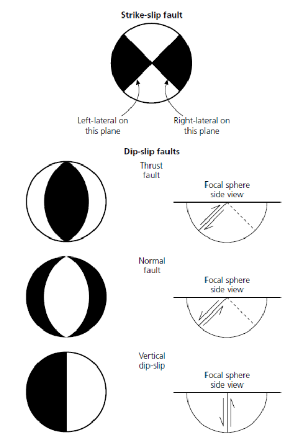
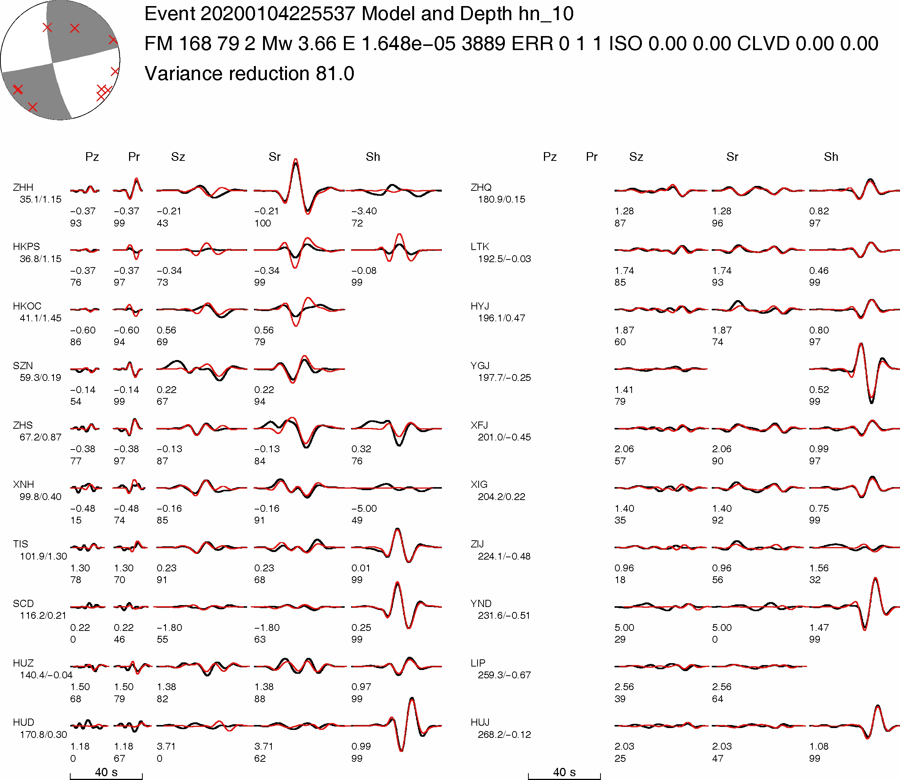
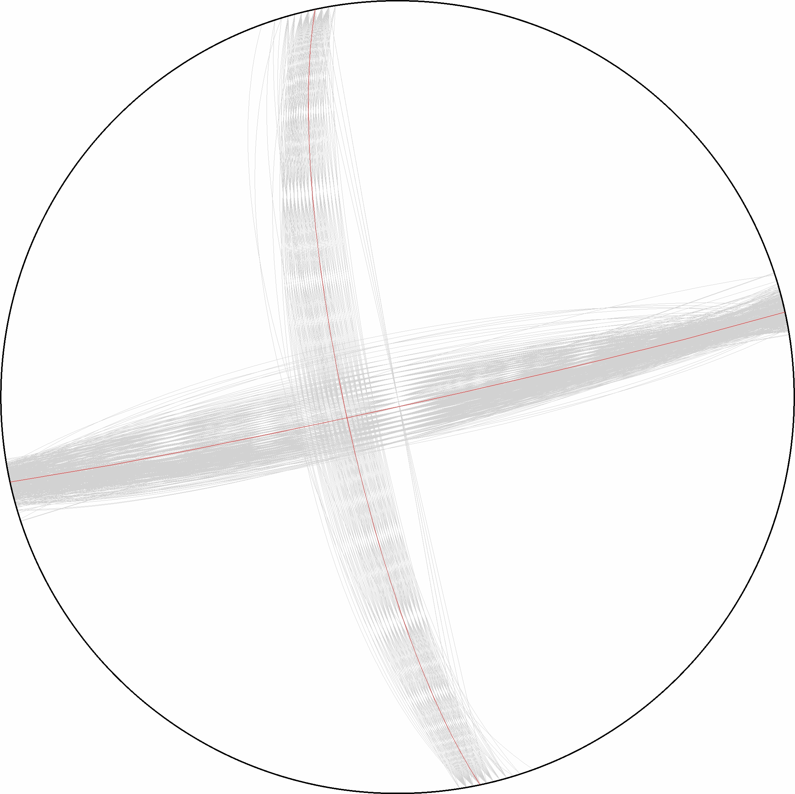

Focal mechanism
################

Waveforms recorded at a seismic station, W(t), compose of three components:

W(t) = S(t) * G(t) * I(t);            (1)

where S(t) represents the source, G(t) stands for the Green's functions, and I(t) is the instrument
response. Therefore, retrieving source parameters of one earthquake S(t) requires deconvolving
instrument response I(t) and Green's functions G(t) from the actual data W(t).
We generally remove instrument responses after obtaining the waveform data. Therefore, we
have the data in displacement or in velocity, u(t) = S(t) * G(t). The corresponding synthetic
displacement s(t) for a douple-couple source can be expressed as

s(t) = M0 ∑ Ai(ϕ -θ,β,λ)Gi(t);              (2)

where Gi are the Green's functions, Ai are the radiation coeffcients, and ϕ is the station azimuth,
M0 is scalar moment,θ,β, and λ are strike, dip, and rake, respectively. Then we perform a grid
search in all possible solutions of strike, dip, and rake to obtain the best fit by finding the minimal
residual between the data and synthetics. This procedure consists of the following three steps, (1)
computing Green's functions, (2) preparing data seismograms, and (3) deriving focal mechanism
solutions. This tutorial will mostly cover step (3).

Here we compute focal mechanism solutions using the \Cut and Paste" method (CAP) [Zhu
and Helmberger, 1996]. This method decomposes seismograms and uses amplitude information in
different time windows (e.g., Pnl/surface wave) to increase the stability and resolution of focal
mechanism solution. Please refer to [Zhu and Helmberger, 1996] for details of the CAP method.
The earthquake example used in the gCAP program is the 2008 Illinois Mw 5.2 earthquake. It is
a left-lateral strike-slip event based on focal mechanism solutions and aftershock locations [Yang
et al., 2009].

                                                                         -------- Prof. Hongfeng Yang

Developed by Han CHEN.

===============
1 Introduction
===============

1.1 What is focal mechanism
============================
To describe the geometry of a fault, Scientists assume that the fault is a planar surface across which slip occurred
during an earthquake. The focal mechanism describes the gault geometry of the seismogenic fault (e.g., strike(θ), dip(β)) and
the slip in the fault (e.g., rake(λ)). The beach ball were the lower-hemisphere stereographic projection of the fault geometry.

1.2 package required
=====================
* :file:`fk` package
* Seismic Analysis Code (:file:`SAC`) package
* :file:`gCAP3D` package

===============
2 Installiation
===============
-----------------------------------------------------------------------------------------------------------------------------------------------------------------

2.1 fk
============================
fk is a program written by Prof. Lupei ZHU(LINK) for calculating the synthetic Green's function based on a horizontally layered velocity model. The detailed installation of fk could be find on `here`_.

.. _here: https://seismo-learn.org/software/fk/install/

*1. Files download*

.. code-block::
    :linenos:
    
    ## Download
    $ wget http://www.eas.slu.edu/People/LZhu/downloads/fk3.3.tar
    ## Unzip
    $ tar -xvf fk3.3.tar
    ## make dir "~/Src" and move the fold to "~/Src"
    $ mkdir -p ~/src/
    $ mv fk ~/Src/

*2. File modification and compilation*

There are some error in the source code of fk. Please :download:`download <./fk/fk3.3-v2    90618.patch>` the file and put it into the :file:`~/Src/fk` for modifying the Make file.

.. code-block::
    :linenos:
    
    $ cd ~/Src/fk/
    ## modify the Make file
    $ patch < fk3.3-v2    90618.patch
    ## compilation
    $ make clean
    $ make
    ## Modify the environment variable and add the fk path to PATH
    $ echo 'export PATH=${HOME}/Src/fk/:${PATH}'>> ~/.bashrc
    $ source ~/.bashrc

*3. Run fk*

Type :file:`fk.pl` in the terminal, there will be help information if installation is succeeded

.. code-block::
    :linenos:
    
    $ fk.pl
    Usage: fk.pl -Mmodel/depth[/f_or_k] [-D] [-Hf1/f2] [-Nnt/dt/smth/dk/taper] [-Ppmin/pmax[/kmax]] [-Rrdep] [-SsrcType] [-Uupdn] [-Xcmd] distances ...
    ...

-----------------------------------------------------------------------------------------------------------------------------------------------------------------
    
2.2 Seismic Analysis Code (SAC)
===============================
SAC is one of the most widely used data analysis software packages in the field of natural seismology. The installation of SAC could be found at `the website`_.

.. _the website: https://seisman.github.io/SAC_Docs_zh/install/

Apply SAC source file
-----------------------

SAC package application address：http://ds.iris.edu/ds/nodes/dmc/forms/sac/

2.2.1 Installation for linux
-------------------------------
*1. Install dependent libraries*

> for Ubuntu/Debian:

.. code-block::
    :linenos:
    
    $ sudo apt update
    $ sudo apt install libc6 libsm6 libice6 libxpm4 libx11-6
    $ sudo apt install zlib1g libncurses5

> for CentOS/Fedora/RHEL:

.. code-block::
    :linenos:
    
    $ sudo yum install glibc libSM libICE libXpm libX11
    $ sudo yum install zlib ncurses-compat-libs

*2. Install binary packages*

.. code-block::
    :linenos:
    
    ## Unizp
    $ tar -xvf sac-102.0-linux_x86_64.tar.gz
    ## Move to installation position 
    $ sudo mv sac ~/opt

*3. Configuration variable*

Add the environment variables and SAC global variables in :file:`~/.bashrc`

.. code-block::
    :linenos:
    
    $ echo 'export SACHOME=~/opt/sac'>> ~/.bashrc
    $ echo 'export SACAUX=${SACHOME}/aux'>> ~/.bashrc
    $ echo 'export PATH=${SACHOME}/bin:${PATH}'>> ~/.bashrc
    $ echo 'export SAC_DISPLAY_COPYRIGHT=1'>> ~/.bashrc
    $ echo 'export SAC_PPK_LARGE_CROSSHAIRS=1'>> ~/.bashrc
    $ echo 'export SAC_USE_DATABASE=0'>> ~/.bashrc
    $ source ~/.bashrc

*4. Run sac*

Type :file:`sac` in the terminal, there will be version information if installation is succeeded

.. code-block::
    :linenos:
    
    $ sac
     SEISMIC ANALYSIS CODE [11/11/2    3 (Version 1    .6a)]
     Copyright 1995 Regents of the University of California
     
    SAC>

2.2.2 installation for MacOS
-------------------------------

*1. Preparation*

Install command line tools and X11 graphical interface related tools (XQuartzunder) MacOS

.. code-block::
    :linenos:
    
    $ xcode-select --install
    $ brew install --cask xquartz
    
*2. Install binary packages*

.. code-block::
    :linenos:
    
    ## Unizp
    $ tar -xvf sac-102.0-mac.tar.gz
    ## Move to installation position 
    $ sudo mv sac ~/opt

*3. Configuration variable*

Add the environment variables and SAC global variables in :file:`~/.zshrc`

.. code-block::
    :linenos:
    
    $ echo 'export SACHOME=~/opt/sac'>> ~/.zshrc
    $ echo 'export SACAUX=${SACHOME}/aux'>> ~/.zshrc
    $ echo 'export PATH=${SACHOME}/bin:${PATH}'>> ~/.zshrc
    $ echo 'export SAC_DISPLAY_COPYRIGHT=1'>> ~/.zshrc
    $ echo 'export SAC_PPK_LARGE_CROSSHAIRS=1'>> ~/.zshrc
    $ echo 'export SAC_USE_DATABASE=0'>> ~/.zshrc
    $ source ~/.zshrc

*4. Run sac*

Type :file:`sac` in the terminal, there will be version information if installation is succeeded

.. code-block::
    :linenos:
    
    $ sac
     SEISMIC ANALYSIS CODE [11/11/2    3 (Version 1    .6a)]
     Copyright 1995 Regents of the University of California
     
    SAC>

-----------------------------------------------------------------------------------------------------------------------------------------------------------------

2.3 gCAP3D
===============================

gCAP is a method for inversion of focal mechanism solutions developed by Prof. Lupei Zhu. The source code of gCAP could be found in His `Home page`_.

.. _Home page: http://www.eas.slu.edu/People/LZhu/downloads/

The code is now open source. The installation of gCAP could be found on `seisman website`_.

.. _seisman website: https://blog.seisman.info/gcap-install/

Here I integrated the file in the website and gave the modified package file for you :download:`download <./gcap/gCAP3D.1.0.Cuseistut.tar>`.

*1. Downlaod the file and Unzip*

.. code-block::
    :linenos:
    
    ## Download
    ## Unizp
    $ tar -xvf gCAP3D.1.0.Cuseistut.tar
    
*2. Install binary packages*    
    
.. code-block::
    :linenos:    
    
    ## Move to installation position 
    $ sudo mv sac ~/Src
    ## change dir to gCAP3D
    $ cd ~/Src/gCAP3D
    ## compilation
    $ make clean
    $ make

*3. Configuration variable*

Add the environment variables and SAC global variables in :file:`~/.bashrc`

.. code-block::
    :linenos:
    
    $ echo 'export PATH=~/Src/gcap:${PATH}'>> ~/.bashrc
    $ source ~/.bashrc

*4. Run gCAP3D*

Type :file:`gCAP3D.pl` in the terminal, there will be version information if installation is succeeded

.. code-block::
    :linenos:
    
    $ gCAP3D.pl
      ===== CAP seismic source tensor inversion using seismic waveforms ====
      Ref: Zhu and Helmberger, 1996, BSSA 86, 1645-1641.
      Zhu and Ben-Zion, 2    3, GJI, submitted.
      ...

=============================== 
3 Data processing
===============================

.. Tip::

    The steps of focal mechanism inversion by using gCAP3D

    1. Calculating the Green's function
    
    2. Remove the instrument response (PZ or RESP file) to get the real ground motion (requiring response files; find the details in `sac manual`_).

    .. _sac manual: https://seisman.github.io/SAC_Docs_zh/
    
    3. Rotate the NEZ components to RTZ direction (ps, remember to remove the original NEZ data in the event folder). An introduction to these two coordinate systems can be found at `this web`_

    .. _this web: http://seisman.info/coordinate-systems-in-seismology.html
    
    4. Transform the data into the unit of cm/s by multiplying 1x10-7(default unit in SAC data is mm), which is the default unit in CAP.
    
    5. Set the onset time of the event as the reference time (the zero point in the time series). Find the details in sac manual.
    
    6. Pick the p arrival time and write the time in t1 marker, (for the noisy data, band pass filter can be applied to pick the p arrival more    accurately.) Remember that the bandpass filtered data should NOT be saved in the folder. All the sac file in the folder will be used in    waveform inversion.
    
    7. Remember to remove the waveform data from the folder whose P arrival is too dim to be seen.
    
    8. Resample the data to Δ𝑡 that the same as the green's0 function
    
    9. Set up the “info.eve” file under each event folder. It is a five-column file, of which the format is: “o-marker evla evlo evdp mag”.
    
    10. To run CAP:
    
        (1) Input command: make ${event_name}/weight.dat; and then write the p arrival time – t1 into the eighth column of “weight.dat”;
        (2) Input command: make ${event_name}/mt.best to start the waveform inversion process.
        
    11. check the uncertainty

.. Note::
    Note that the unit of displacement data obtained by transferring the PZ file is :file:`m`; the default unit of SAC is  :file:`nm`, so it must be multiplied by  :file:`1.0e9` to convert to the default unit of SAC.

3.1 Green's function calculation
================================
The first step of runing gCAP is building a Grenn's function library by using fk package. An velocity model file (GD.vel) is need for the calculation. :download:`here <./fk/gCAP3D.1.0.Cuseistut.tar>` is the velocity model used in this tutorial. The default setting of :file:`gCAP` puts the Grenn's function library under :file:`~/data/models/Glib`

.. Tip::

    There are two types of velocity model that could be used in fk, with the third column is the Vs or the vp/vs ratio.   :file:`-Kmodel/depth/k`, should be used while the 3rd column is vp/vs ratio (vp). The -S parameter controls the source type. :file:`-S`: 0=explosion; 1=single force; 2=double couple (2).

.. code-block::
    :linenos:
    
    ## mkdir the Grenn's functio library directory
    $ mkdir ~/data
    $ mkdir ~/data/models
    $ mkdir ~/data/models/Glib
    ## move to the  Grenn's functio library directory
    $ cd ~/data/models/Glib
    ## build a directory for velocity model GD
    $ mkdir GD
    $ cd GD
    ## cp GD.vel to GD directoty, please replace the '/path/to/fk/GD.vel' to the real path in your system
    $ cp /path/to/fk/GD.vel .
    ## calculate the Grenn's functio library using fk
    $ fk.pl -MGD.vel/15/k -N512/0.2 -S2 05 10 15 20 25 30 35 40 45 50 55 60 65 70 75 80 85 90 95 100 105 110 115 120 125 130 135 140 145 150 155 160 165 170 175 180 185 190 195 200 205 210 215 220 225 230 235 240 245 250 255 260 265 270 275 280 285 290 295 300 305 310 315 320 325 330 335 340 345 350 355 360 365 370 375 380 385 390 395 400 405 410 415
    $ fk.pl -MGD.vel/15/k -N512/0.2 -S0 05 10 15 20 25 30 35 40 45 50 55 60 65 70 75 80 85 90 95 100 105 110 115 120 125 130 135 140 145 150 155 160 165 170 175 180 185 190 195 200 205 210 215 220 225 230 235 240 245 250 255 260 265 270 275 280 285 290 295 300 305 310 315 320 325 330 335 340 345 350 355 360 365 370 375 380 385 390 395 400 405 410 415

3.2 Sac file preparation
========================

The sac file preparation could be done by using :file:`SAC` software or other softwares, such as the :file:`Obspy`. Here we bridfly introduce the steps while using :file:`SAC`. The derails of commands used in this chapater could be found in the `sac manual`_.

.. _sac manual: https://seisman.github.io/SAC_Docs_zh/

*1. Remove the instrument response*

> Use PZ file:

.. code-block::
    :linenos:
    
    ## Merge PZ files of all stations into the same file
    $ cat SAC_PZs_* >> SAC.PZs
    ## remove the instrument response by command: tansfer
    $ sac
    SAC> r *.SAC
    ## When going to the instrument response, try to choose a wider frequency band
    SAC> trans from pol s SAC.PZs to none freq 0.004 0.007 40 45
    SAC> mul 1.0e9
    SAC> w over
    SAC> q

> Use RESP file:

.. code-block::
    :linenos:
    
    ## Merge RESP files of all stations into the same file
    $ cat RESP.*.*.*.* >> RESP.ALL
    ## remove the instrument response by command: tansfer
    $ sac
    SAC> r *.SAC
    ## When going to the instrument response, try to choose a wider frequency band
    SAC> trans from evalresp fname RESP.ALL to none freq 0.004 0.007 40 45
    SAC> w over
    SAC> q

*2. Rotate the NEZ components to RTZ direction*

.. code-block::
    :linenos:
    
    $ sac
    SAC> r ./example.n ./example.e
    SAC> lh cmpinc cmpaz
        FILE: ./example.n - 1
        --------------
        cmpinc = 9.000000e+    
        cmpaz = 0.000000e+00
        FILE: ./example.e - 2
        --------------
        cmpinc = 9.000000e+    
        cmpaz = 9.000000e+   
    ## Rotate to Great Circle Path        
    SAC> rotate to gcp
    SAC> lh cmpinc cmpaz
        FILE: ./example.n - 1
        --------------
        cmpinc = 9.000000e+    
        cmpaz = 2.440466e+    
        FILE: ./example.e - 2
        --------------
        cmpinc = 9.000000e+    
        cmpaz = 1.144047e+02
    ## Save as R component and T component
    SAC> w example.r example.t
    SAC> q

*3. Resampling the sac file*

.. code-block::
    :linenos:
    
    SAC> r example.SAC
    SAC> lh delta npts

        delta = 1.000000e-02
        npts = 1000
    ## change the sampling rate to 0.005
    SAC> interp delta 0.005         
    SAC> lh

        delta = 5.000000e-03
        npts = 1999
    SAC> q
    
*4. Mark the P and S arrivels*

The arrivels could be labeled by using SAC by using ppk command as well. please refer to the `sac manual`_).

    .. _sac manual: https://seisman.github.io/SAC_Docs_zh/

3.3 Focal mechanism inversion
=============================

After the sac files prepared, we could start to run the gCAP inversion. here we provided the SAC files of the 01/04/2020 Offshore Pearl River Delta earthquake [CHEN et.al., 2021] for you :download:`download <./gcap/01-04-2020-earthquake.rar>`. Please download it the unzip it and them change your current directory to :file:`01-04-2020-earthquake`.

.. code-block::
    :linenos:
    
    $ cd ./01-04-2020-earthquake

*1. Make weight.dat file*

.. code-block::
    :linenos:
    
    #### please copy the following command to a bash script and then run the bash file.

    #!/bin/bash
    
    dir=20200104225537
    cd $dir
    pwd
    rm temp
    for sac in *z
        do
        sta=$(echo $sac | awk -F "." '{print $1}')
        dist1=$(saclst dist f $sac | awk '{print $2}')
        dist_c=$(echo $dist1 | awk '{printf ("%d\n",$1/5+0.5)}')
        dist=$(echo ""$dist_c"*5" |bc)
        P=$(saclst a f $sac | awk '{print $2}')
        #echo $dist1 $dist
        printf "%-10s %03d %-1s %-1s %-1s %-1s %-1s %3.1f %-1s\n"  $sta $dist "1" "1" "1" "1" "1" $P "0" >> temp
    done
    cat temp | sort -n -k2 > weight.dat

The generated file as follows

.. code-block::
    :linenos:
    
    $ cat weight.dat
    $ HKPS       035 1 1 1 1 1 7.2 0
      ZHH        035 1 1 1 1 1 7.2 0
      HKOC       040 1 1 1 1 1 8.3 0
      SZN        060 1 1 1 1 1 10.3 0
      ZHS        065 1 1 1 1 1 11.8 0
      TIS        100 1 1 1 1 1 18.0 0
      XNH        100 1 1 1 1 1 17.1 0
      SCD        115 1 1 1 1 1 19.4 0
      HUZ        140 1 1 1 1 1 22.7 0
      HUD        170 1 1 1 1 1 26.8 0
      ZHQ        180 1 1 1 1 1 27.9 0
      HYJ        195 1 1 1 1 1 30.1 0
      LTK        195 1 1 1 1 1 29.6 0
      XFJ        200 1 1 1 1 1 29.8 0
      YGJ        200 1 1 1 1 1 30.0 0
      XIG        205 1 1 1 1 1 31.1 0
      ZIJ        225 1 1 1 1 1 32.9 0
      YND        230 1 1 1 1 1 33.5 0
      LIP        260 1 1 1 1 1 37.1 0
      HUJ        270 1 1 1 1 1 38.9 0
      SHG        310 1 1 1 1 1 42.9 0

.. Tip::

    The weight file controls the components of each station that will be used in the inversion. if the number is set as 0, the component will be excluded in the inversion.
    
    Station       Azimuth        Pz         Pr         Sz         Sr         Sh        P-arrival time    

*2. Run the inversion*

After generate the weight.dat file, please change your working direcroty to 01-04-2020-earthquake 

.. code-block::
    :linenos:
    
    $ cd ../

.. code-block::
    :linenos:
    
    #### please copy the following command to a bash script and then run the bash file.
    
    #!/bib/bash

    ## set the velocity model 
    model=hn
    ## set the target event
    event=20200104225537
    ## set the event magnitude
    mag=3.5
    
    ## loop the inversion for variou focal depth
    for h in 08 09 10 11 12 13 14 15 100
    do
        cap3D.pl -H0.01 -P180000 -S2/5/0 -T20/50 -D1/1/0.5 -C0.05/0.2/0.03/0.1 -W1 -J0/0.01/0/0.01 -X10 -M$model"_"$h  $event; 
    done

    ## obtained the inversion result and plot figure
    grep -h Event $event/$model_*.out > junk_$model.out
    ./depth.pl junk_$model.out $event > junk_$model.ps

.. Note::

    The key paramters of cap3D.pl are as following:
    
    -H the delta (1/samping rate) of the date 
    
    -S max. time shifts in sec for Pnl and surface waves (1/) and tie between SH shift and SV shift:
         tie=0          shift SV and SH independently,
         tie=0.5        force the same shift for SH and SV (0.5).
         
    -T max. time window lengths for Pnl and surface waves (35/70).
    
    -C filters for Pnl and surface waves, specified by the corner frequencies of the band-pass filter. (0.02/0.2/0.02/0.1).
    
    -W use displacement for inversion; 1=> data in velocity; 2=> data in disp (0).    

The inversion should be conducted multiple times with various parameters to achieve robust inversion result.

   
.. image:: ./gcap/inversion-depth.jpg
   :width: 50% 

  
3.3 Uncertainty analysis
=============================

The uncertainty of the CAP inversion result can be estimated using a bootstrapping inversion method (Tichelaar and Ruff, 1989), in which stations were randomly selected from the station pool (21 stations
in total), allowing multiple sampling.

.. code-block::
    :linenos:
    
    #### please copy the following command to a bash script and then run the bash file.
    
    #!/bib/bash

    model=hn
    event=20200104225537
    mag=3.5

    ##making bootstrapping inversiong weiht.dat file by randomly choose stations from original weight.dat file. Extra weight were added for repeated stations.

    ori=./weight1.dat

    for i in `seq 1 1000`
    do
    echo "---------------$i-----------------"
    cd 20200104225537
    out=weight_test.dat
    rm $out
    rm temp
    for j in `seq 1 21`
    do
        shuf -n1 $ori >> temp
    done
        cat temp |sort -n -k2 | uniq > temp2
        ## give weight for each station according to the times it was sampled
        for sta in `awk '{print $1}' temp2`
        do
            count=$(grep $sta temp | wc -l)
            grep $sta temp |awk 'NR==1 {print $1,$2,'$count'*$3,'$count'*$4,'$count'*$5,'$count'*$6,'$count'*$7,$8,$9}' >> $out

        done

        echo $out
        cd ..

        for h in 08 09 10 11 12 13 14 15;
        do 
            cap3D.pl -H0.01 -P180000  -S2/5/0 -T20/50 -D1/1/0.5 -C0.05/0.2/0.03/0.1 -W1 -X10 -M$model"_"$h -Zweight_test.dat -R0/360/0/90/-90/90 $event; 
    
        done

        grep -h Event $event/"$model"_*.out > junk_"$model"_"$i".out
        ./depth.pl junk_"$model"_"$i".out $event > junk_"$model"_"$i".ps
    
    done

> plot bootstrapping results:

.. code-block::
    :linenos:
    
    #### please copy the following command to a bash script and then run the bash file.

    #!/bin/bash

    out_ps=focal.ps
    file=hn_10.lst
	
	cat *.out > $file
    gmt psbasemap -JM18c -R0/18/0/18 -Bxa2f1 -Bya2f1 -K > $out_ps
    rm temp ./SDR.txt
    
    ## plot the inversion results of each bootstrapping inversion
    while read line
    do
        echo $line
        strike=$(echo $line |awk '{print $6}')
        dip=$(echo $line |awk '{print $7}')
        if [ $dip -eq 90 ]
        then
            dip=89.99
        else
            dip=$dip
        fi
        rake=$(echo $line |awk '{print $8}')
        echo $strike $dip $rake >> ./SDR.txt
        echo "9 9 10 $strike $dip $rake 5 0 0" > temp
        gmt psmeca temp -J -R -Sa17c -Fa/0.1c/s -Fered -Fgblue -T0/0.01p,gray -L0.01p,black -K -O >> $out_ps

    done < $file

    ## plot the initial inversion result
    echo "9 9 10 168 79 2 5 0 0" > temp
    gmt psmeca temp -J -R -Sa17c -Fa/0.1c/s -Fered -Fgblue -T0/0.01p,red -L0.01p,black -K -O >> $out_ps

> plot the histogram

.. code-block::
    :linenos:
    
    #### please copy the following command to a bash script and then run the bash file.

	#!bin/bash

	file=hn_10.lst
	ps=hist_srtike_dip_rake.ps
	cat $file |awk '{print $6}' |gmt pshistogram -R160/180/0/50 -JX5c/10c -Z1 -Bxa5f1+l"Strike(degree)" -Bya10f2+l"Frequency(%)" -BWSne -L0.1p -Ggray -W1+b -K > $ps
	cat $file |awk '{print $7}' |gmt pshistogram -R70/90/0/50 -JX5c/10c -Z1 -Bxa5f1+l"Dip(degree)" -Bya10f2+l"Frequency(%)" -BWSne -L0.1p -Ggray -W1+b -K -O -X7c>> $ps
	cat $file |awk '{print $8}' |gmt pshistogram -R-10/10/0/50 -JX5c/10c -Z1 -Bxa5f1+l"Rake(degree)" -Bya10f2+l"Frequency(%)" -BWSne -L0.1p -Ggray -W1+b -K -O -X7c>> $ps

	# plot sub-basemap

	gmt set FONT_ANNOT_PRIMARY +16p

	R=0/29.7/0/21
	J=x1/1
	B=a1g1
	#gmt set MAP_FRAME_TYPE=inside MAP_GRID_PEN_PRIMARY=0p,red,.
	#gmt psbasemap -R$R -J$J -B$B -BWSEN -K -O -Xf0c -Yf0c >> $ps

	echo "1.3 12.5 (a)" |gmt pstext -R$R -J$J -Xf0c -Yf0c -K -O >> $ps
	echo "8.3 12.5 (b)" |gmt pstext -R$R -J$J -Xf0c -Yf0c -K -O >> $ps
	echo "15.3 12.5 (c)" |gmt pstext -R$R -J$J -Xf0c -Yf0c -K -O >> $ps

	gmt ps2raster $ps -A -P -Tf

	rm gmt.conf gmt.history

.. image:: ./gcap/histogram.jpg
   :width: 50%      
    

> calculate the uncertaities:

.. code-block::
    :linenos:
    
    cat SDR.txt |awk '{print $1}' | awk '{x[NR]=$0; s+=$0; n++} END{a=s/n; for (i in x){ss += (x[i]-a)^2} sd = sqrt(ss/n); print "SD of strike = "sd}'

    cat SDR.txt |awk '{print $2}' | awk '{x[NR]=$0; s+=$0; n++} END{a=s/n; for (i in x){ss += (x[i]-a)^2} sd = sqrt(ss/n); print "SD of dip = "sd}'
    
    cat SDR.txt |awk '{print $3}' | awk '{x[NR]=$0; s+=$0; n++} END{a=s/n; for (i in x){ss += (x[i]-a)^2} sd = sqrt(ss/n); print "SD of rake = "sd}'
    

============
References
============
Zhu, L., & Ben-Zion, Y. (2013). Parametrization of general seismic potency and moment tensors for source inversion of seismic waveform data. Geophysical Journal International, 194(2), 839-843.

Yang, H., Zhu, L., & Chu, R. (2009). Fault-plane determination of the 18 April 2008 Mount Carmel, Illinois, earthquake by detecting and relocating aftershocks. Bulletin of the Seismological Society of America, 99(6), 3413-3420.

Chen, H., He, X., Yang, H., & Zhang, J. (2021). Fault‐plane determination of the 4 January 2020 offshore pearl river delta earthquake and its implication for seismic hazard assessment. Seismological Society of America, 92(3), 1913-1925.
