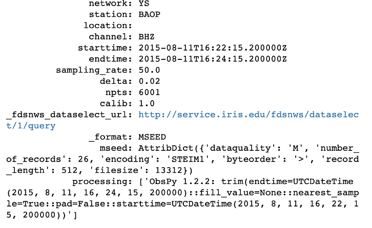
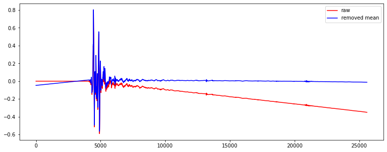
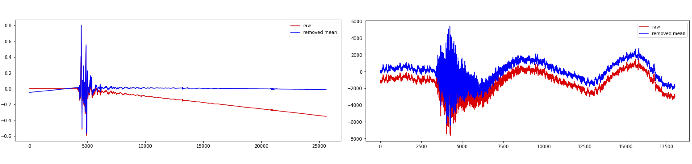
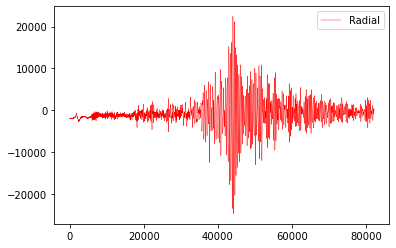

Python ObsPy Tutorial
=====================

Brief introduction
------------------

What is ObsPy?
**************

**ObsPy** is an open-source project dedicated to provide a **Python** framework for **processing seismological data**. It provides parsers for common file formats, clients to access data centers and seismological signal processing routines which allow the manipulation of seismological time series (copied from ObsPy Github page).

.. image:: ./obspy_logo.png
   :width: 50%

We assume that you already have some experience of using Python. If not, you are suggested to read this `small, incomplete introduction to the Python programming language <https://docs.obspy.org/tutorial/code_snippets/python_introduction.html>`_.

How to install ObsPy?
*********************

.. note::
 | It's strongly recommended to install ObsPy via conda.
 | We here assume you have already installed conda on your computer after finishing the previous GMT tutorial. 
 | If not, please first install it (suggest installation of `miniconda <https://docs.conda.io/en/latest/miniconda.html>`_). 

Open your terminal and run the following commands.

.. code:: 

 $ conda create --name obspy
 $ conda activate obspy
 $ conda install obspy=1.2

.. warning:: 

   Exclude $ sign and start without whitespace!

Contents of this tutorial
*************************

We will introduce how to request, read, visualize, and further process seismic data using a few basic ``functions`` in the ObsPy ``module``. it includes:

#. UTC DateTime
#. Basic Seismic Data Processing
#. Theoreotical Travel Time Calculation
#. Cross-section waveforms plot

--------

UTC Date Time
-------------

Now let's introduce the UTC DateTime format. 

The UTC DateTime is a Coordinated Universal Time. Usually we could see that HKT (UTC+8) or BJT (UTC+8), which means that Hong Kong or Beijing time is 8 hours earlier than UTC time. We usually use UTC Datetime to present the origin time of an earthquake. Seismic time-series data like digital seismograms also use UTC Datetime to present the time of each sample.

DateTime Initialization
***********************

First in the terminal, type ``python`` and then type ``enter``:

**Method 1**

.. code-block:: python

 >>>from obspy import UTCDateTime
 >>>year = 2022
 >>>month = 1
 >>>day = 7
 >>>hour = 17
 >>>minute = 45
 >>>second = 30.0
 >>>UTCDateTime(year, month, day, hour, minute, second)
 UTCDateTime(2022, 1, 7, 17, 45, 30)

**Method 2**

.. code::

 >>>UTCDateTime("2012-09-07T12:15:00")
 UTCDateTime(2012, 9, 7, 12, 15)

Description of some lines in the above example:

``from obspy import UTCDateTime`` imports the ``UTCDateTime`` function from ``obspy`` module.

``UTCDateTime`` makes the UTCDateTime object according to the arguments.

.. note::

 | There are many other ways to produce the UTCDateTime object.
 | Method 1 & 2 are two common examples. You can explore others `here <https://docs.obspy.org/packages/autogen/obspy.core.utcdatetime.UTCDateTime.html#obspy.core.utcdatetime.UTCDateTime>`_. 

DateTime Attribute Access
*************************

Now we can assign the UTCDateTime object to a variable "time".

.. code::

 >>>time = UTCDateTime("2012-09-07T12:15:00")
 >>>print(time)
 2012-09-07T12:15:00.000000Z
 >>>print(type(time))
 <class 'obspy.core.utcdatetime.UTCDateTime'>

Then, since it's a python class object, we can extract different time information by using UTCDateTime built-in functions/atttributes.

.. code::

 >>>print(time.year)
 2012
 >>>print(time.julday)
 251
 >>>print(time.timestamp)
 1347020100.0
 >>>print(UTCDateTime("1970-01-01").timestamp)
 0.0

Description of some lines in the above example:

``.year`` only output the year of "time".

``.julday`` output the Julian day of "time".

.. note::
  
  | Julian Day is a continuous count of days since the beginning of the year.
  | Simple example: What is the July of 1st Feb, 2022?
  | Ans: 32

``.timestamp`` output the UNIX timestamp format of "time".

.. note::
  
  | The UNIX timestamp formate means the number of seconds since the Epoch. 
  | Let's try with the following code and see the output. 
  | The reference time: "1970-01-01" 

Handling time differences
*************************

Calculate the time difference or add seconds into original "time"

.. code::

 >>>print(time - UTCDateTime("2012-09-07"))
 44100.0
 >>>time2 = time + 3600
 >>>print(time2)
 2012-09-07T13:15:00.000000Z
 
Clearly, we can see that "time2" is 1 hour (3600 seconds) later than "time".

------------

Basic Seismic Data Processing
-----------------------------

Flow chart
**********

.. image:: flowchart.png
   :width: 60%

2.1 Choose an event
*******************

You can select one event in the event list. 

.. note::
 | Here is the header information of the event list
 | indx year mon day time sec_relative_to_day res lat lon dep mag
 | 9393 2015 08 11 16:22:15.200000 58935.2000 1.403 -8.624 123.202 171.9 3.9

Input the origin time, coordinates and magnitude of the selected event.

.. code::
 
 origin_time = UTCDateTime("2015-08-11T16:22:15.200000")
 event_longitude = 123.202
 event_latitude = -8.624
 event_depth = 171.9
 event_magnitude = 3.9

2.2 Choose a station
********************

Choose one station from the station list.
Make sure the selected station is operating during the event. 

.. note::

 | Here is the header informatioin of the station list.
 | Network | Station | Location | Channel | Latitude | Longitude | Elevation | Depth | Azimuth | Dip |   SensorDescription | Scale | ScaleFreq |ScaleUnits | SampleRate | StartTime | EndTime

 | YS|BAOP||BHZ|-8.4882|123.2696|67.0|0.0|0.0|-90.0|Nanometrics Trillium 120 Sec Response/Taurus Stand|1.19642E9|0.3|m/s|50.0|2014-10-31T00:00:00|2016-12-31T23:59:59

2.3 Get waveforms
*****************

Import the web service providers and input station informations.

.. code::
 
 from obspy.clients.fdsn import Client

 # IRIS is one of those providers.
 client = Client('IRIS')

 # Input station informations
 # network
 net = 'YS'
 # station
 sta = 'BAOP'
 # location
 loc = ''
 # channel
 cha = 'BHZ'

 # starttime
 stt = origin_time
 # endtime
 edt = origin_time + 120

.. note::
  | FDSN web services for data access to different web service providers.
  | IRIS is one of the web service providers which is commonly used.

``Client()`` to initialize a client object. 

Get the waveforms from client

.. code::

 st = client.get_waveforms(net, sta, loc, cha, stt, edt)
 print(st)

``client.get_waveforms()`` to get the waveform by the corresponding argument from clients.

2.4 Meta data
*************

We can print the meta data inside the stream.

.. code::

 print(st[0].stats)

``.stats`` contains all header information of a Trace object. 

There are some default attributes. 

 | 1. ``sampling rate`` : Sampling rate in hertz.

 | 2. ``network`` : Network code

 | 3. ``station`` : Station code

 | 4. ``channel`` : Channel code

 | 5. ``starttime`` : UTCDateTime of the first data sample

 | 6. ``endtime`` : UTCDateTime of the last data sample

You can assign / print the corresponding attributes by calling them individually.

.. code::

 # Print the sampling rate
 print(st[0].stats.sampling_rate)

2.5 Plot the waveforms
**********************

Here we plot the waveforms without any preprocessing procedure.

.. code::

 st.plot();
 st.spectrogram();

.. image:: plot_raw.png
   :width: 80%

.. image:: spectrogram_raw.png
   :width: 80%

2.6 Detrend Data
****************

``detrend()`` to remove a trend from the trace. 

There are many methods listed for detrend function.

To better visualise and demonstrate the effect of detrend, we will provide you some examples.
Please download the following waveform data. 

**2.6.1 Remove Mean**

You can download the waveform file here. :download:`PA01.bhy <./PA01.bhy>`
We first read the downloaded waveform file.

.. code::

  from obspy import read
  rmean_raw = read('PA01.bhy')

``read`` Read waveform files into an ObsPy Stream object.

Plot the waveform without any processing and copy the stream.

.. code::

  rmean_raw.plot()
  rmean_processed = rmean_raw.copy()

``copy()`` Copy the stream

.. tip::

  | If you want to see the difference before and after the processing of data. It is better to copy the stream as the processing will overwrite the original waveforms. 

We detrend the waveforms and plot it again. 

.. code::

  rmean_processed.detrend("demean")
  rmean_processed.plot()

Compare the raw waveforms and processed waveforms. 

.. code::

  import matplotlib.pyplot as plt

  plt.figure(figsize=(13,5))
  for tr in rmean:
      data1 = tr.data
  plt.plot(data1,color='red',label='raw')

  for tr in rmean_test:
      data2 = tr.data
  plt.plot(data2,color='blue',label='removed mean')

  plt.legend()

Here is the result. 

.. image:: rmean.png
   :width: 80%

**2.6.2 Remove Linear trend**

You can download the waveform file here. :download:`LLT.E.Vel.BF.SAC <./LLT.E.Vel.BF.SAC>`
The procedures are the same with remove mean.

``.detrend("linear")`` Remove linear trend

**Summary of detrend**

We have introduced two methods of detrend. You can choose one of them in this tutorial. 

After detrend, you can plot the waveform plot and spectrogram again.
Compare the results with the previous plots. 

.. code::

 st.detrend("linear")
 st.plot()

2.7 Filter Data
***************

You can apply different filters to filter the data. For example, "bandpass", "highness" and "lowpass". 

We here used bandpass to filter the waveform. 

.. code::

 st.filter("bandpass", freqmin=1.0, freqmax=15.0)

2.8 Waveform rotation
*********************

We can rotate the North - East components of a seismogram to radial and transverse components.

Get the waveform of the North - East components

.. code::

  # Input station informations
  # network
  net = 'YS'
  # station
  sta = 'BAOP'
  # location
  loc = ''
  # channel
  cha = 'BH*'

  # starttime
  stt = origin_time
  # endtime
  edt = origin_time + 120
  st_N = client.get_waveforms(net, sta, loc, 'BH1', stt, edt)
  st_E = client.get_waveforms(net, sta, loc, 'BH2', stt, edt)

Get the data of the North - East components.

.. code::

  for tr1 in st_N:
    north = tr1.data
  for tr2 in st_E:
    east = tr2.data

Calculate the back azimuth.

.. code::

  from obspy.geodetics import gps2dist_azimuth
  # Receiver = station received the signals 
  sta_lat = -8.4882
  sta_lon = 123.2696

  # Input the information of the source(earthquake)
  eq_lat = -8.624
  eq_lon = 123.202
  eq_dep = 171.9

  back_azimuth_st2=gps2dist_azimuth(eq_lat, eq_lon,sta_lat, sta_lon, a=6378137.0, f=0.0033528106647474805)[2]

``gps2dist_azimuth`` calculate the back azimuth using the coordinates of the source and receiver

Rotate and Plot the radial and transverse components.

.. code::

  Radial, Transverse = rotate.rotate_ne_rt(north,east,back_azimuth_st2)
  plt.plot(Radial)
  plt.plot(Transverse)

``rotate.rotate_ne_rt`` rotate waveforms from North - East components to radial and transverse component

.. image:: rotate_transverse.png
   :width: 55%

2.9 Seismic Phases in seismogram
********************************

There are many seismic phases can be presented in the seismogram. For beginners, we can focus on P - and S waves. Here is the demonstration of picking P - and S waves in a teleseismic earthquakes. 

.. image:: Teleseismic_phase.png
   :width: 65%

We will introduce the picking method in next section!

