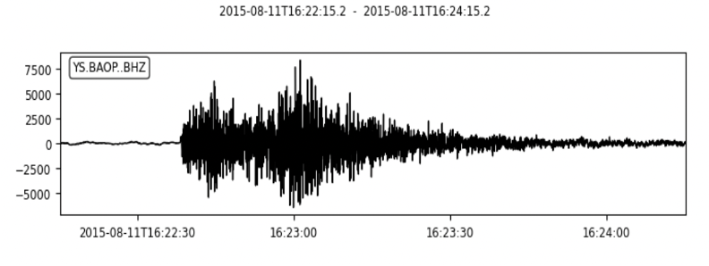
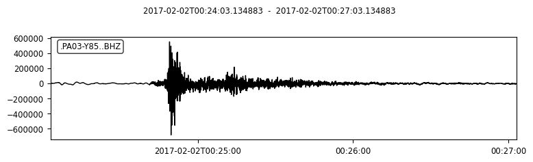
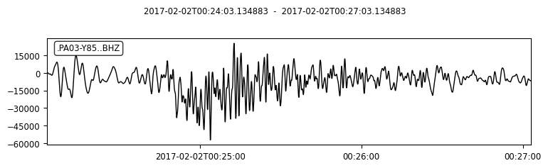
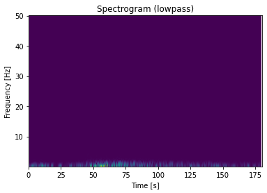
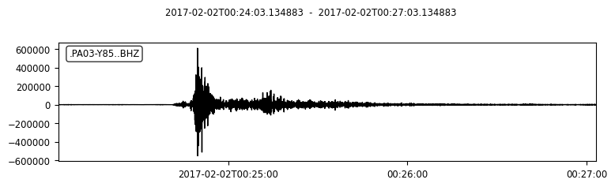
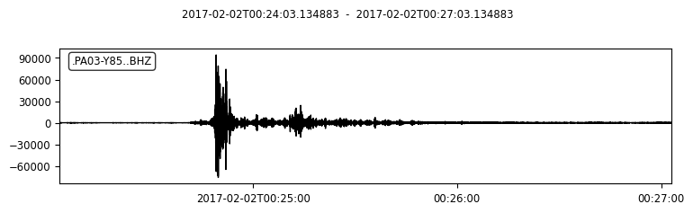
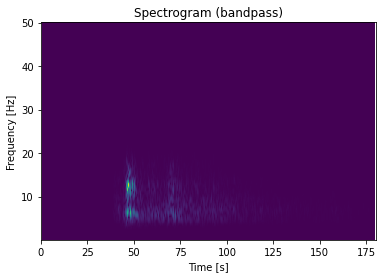
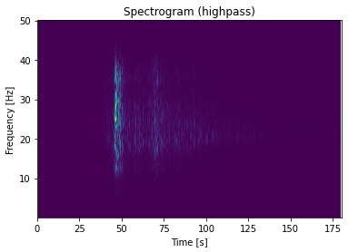
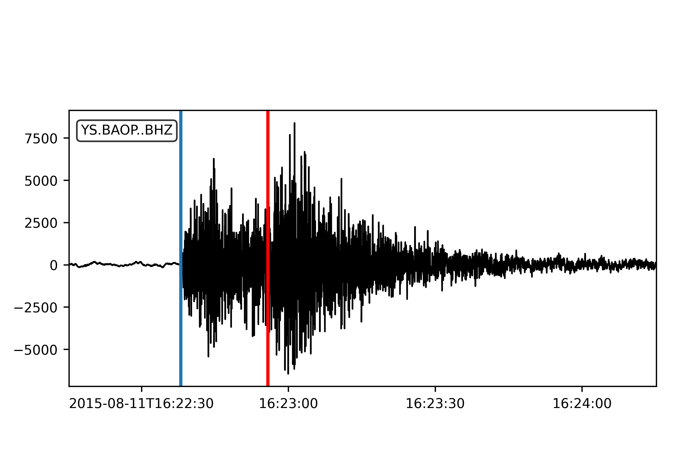
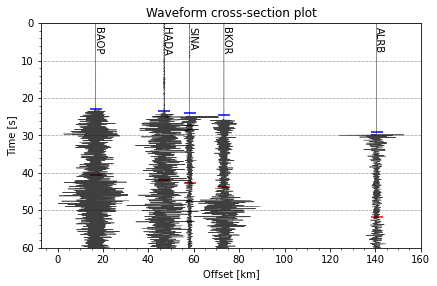

Python ObsPy Tutorial
=====================

Brief introduction
------------------

What is ObsPy?
**************

**ObsPy** is an open-source project dedicated to provide a **Python** framework for **processing seismological data**. It provides parsers for common file formats, clients to access data centers and seismological signal processing routines which allow the manipulation of seismological time series (copied from ObsPy Github page).

We assume that you already have some experience of using Python. If not, you are suggested to read this `small, incomplete introduction to the Python programming language <https://docs.obspy.org/tutorial/code_snippets/python_introduction.html>`_.

How to install ObsPy
********************

.. note::
 | It's strongly recommended to install ObsPy via conda.
 | We here assume you have already installed conda on your computer after finishing the previous GMT tutorial. 
 | If not, please first install it (suggest installation of `miniconda <https://docs.conda.io/en/latest/miniconda.html>`_). 

Open your terminal and run the following commands.

.. code:: 

 $ conda create --name obspy
 $ conda activate obspy
 $ conda install obspy=1.2

.. warning:: 

   Exclude $ sign and start without whitespace!

Contents of this tutorial
*************************

We will introduce how to request, read, visualize, and further process seismic data using a few basic ``functions`` in the ObsPy ``module``. it includes:

#. UTC DateTime
#. Basic Seismic Data Processing
#. Theoreotical Travel Time Calculation
#. Cross-section Plot with TauP arrivals

Developed by LAU Tsz Lam Zoe under the instructions of Junhao SONG, Han CHEN, and Suli Yao.

--------

1 UTC Date Time 
----------------------------

Now let's introduce the UTC DateTime format. 

The UTC DateTime is a Coordinated Universal Time. Usually we could see that HKT (UTC+8) or BJT (UTC+8), which means that Hong Kong or Beijing time is 8 hours earlier than UTC time. We usually use UTC Datetime to present the origin time of an earthquake. Seismic time-series data like digital seismograms also use UTC Datetime to present the time of each sample.

1.1 DateTime Initialization
***************************

First in the terminal, type ``python`` and then type ``enter``:

**Method 1**

.. code-block:: python

 >>>from obspy import UTCDateTime
 >>>year = 2022
 >>>month = 1
 >>>day = 7
 >>>hour = 17
 >>>minute = 45
 >>>second = 30.0
 >>>UTCDateTime(year, month, day, hour, minute, second)
 UTCDateTime(2022, 1, 7, 17, 45, 30)

**Method 2**

.. code::

 >>>UTCDateTime("2012-09-07T12:15:00")
 UTCDateTime(2012, 9, 7, 12, 15)

Description of some lines in the above example:

``from obspy import UTCDateTime`` import the module.

``UTCDateTime`` make the UTCDateTime object according to the argument.

.. note::

 | There are many ways to produce the UTCDateTime object.
 | Method 1 & 2 are examples. You can explore others `here <https://docs.obspy.org/packages/autogen/obspy.core.utcdatetime.UTCDateTime.html#obspy.core.utcdatetime.UTCDateTime>`_. 

1.2 DateTime Attribute Access
*****************************

Now we can assign the UTCDateTime object to a variable "time".

. code::

 >>>time = UTCDateTime("2012-09-07T12:15:00")
 >>>print(time)
 2012-09-07T12:15:00.000000Z
 >>>print(type(time))
 <class 'obspy.core.utcdatetime.UTCDateTime'>

Then, since it's a python class object, we can extract different time information by using UTCDateTime built-in functions/atttributes.

.. code::

 >>>print(time.year)
 2012
 >>>print(time.julday)
 251
 >>>print(time.timestamp)
 1347020100.0
 >>>print(UTCDateTime("1970-01-01").timestamp)
 0.0

Description of some lines in the above example:

``.year`` only output the year of "time".

``.julday`` output the Julian day of "time".

.. note::
  
  | Julian Day is a continuous count of days since the beginning of the year.
  | Simple example: What is the July of 1st Feb, 2022?
  | Ans: 32

``.timestamp`` output the UNIX timestamp format of "time".

.. note::
  
  | The UNIX timestamp format means the number of seconds since the Epoch. 
  | Let's try the following code and see the output. 
  | The reference time: "1970-01-01" 

1.3 Handling time differences
*****************************

Calculate the time difference or add seconds into original "time"

.. code::

 >>>print(time - UTCDateTime("2012-09-07"))
 44100.0
 >>>time2 = time + 3600
 >>>print(time2)
 2012-09-07T13:15:00.000000Z
 
Clearly, we can see that "time2" is 1 hour (3600 seconds) later than "time".

----------------------

2 Basic Seismic Data Processing
-------------------------------

Flow chart
**********

2.1 Choose an event
*******************

You can select one event in the event list. 

.. note::
 | Here is the header information of the event list
 | indx year mon day time sec_relative_to_day res lat lon dep mag
 | 9393 2015 08 11 16:22:15.200000 58935.2000 1.403 -8.624 123.202 171.9 3.9

Input the origin time, coordinates and magnitude of the selected event.

.. code::
 
 from obspy import UTCDateTime
 origin_time = UTCDateTime("2015-08-11T16:22:15.200000")

 # Coordinates and the magnitude of the event 
 eq_lon = 123.202
 eq_lat = -8.624
 eq_dep = 171.9
 eq_mag = 3.9

2.2 Choose a station
********************

Choose one station from the station list.
Make sure the selected station is operating during the event. 

.. note::

 | Here is the header information of the station list.
 | Network | Station | Location | Channel | Latitude | Longitude | Elevation | Depth | Azimuth | Dip |   SensorDescription | Scale | ScaleFreq | ScaleUnits | SampleRate | StartTime | EndTime

 | YS|BAOP||BHZ|-8.4882|123.2696|67.0|0.0|0.0|-90.0|Nanometrics Trillium 120 Sec Response/Taurus Stand|1.19642E9|0.3|m/s|50.0|2014-10-31T00:00:00|2016-12-31T23:59:59

2.3 Get waveforms
*****************

Import the web service providers and input station information.

.. code::
 
 from obspy.clients.fdsn import Client

 # IRIS is one of those providers.
 client = Client('IRIS')

 # Input station informations
 # network
 net = 'YS'
 # station
 sta = 'BAOP'
 # location
 loc = ''
 # channel
 cha = 'BHZ'

 # starttime
 stt = origin_time
 # endtime
 edt = origin_time + 120

 # Get the waveforms from client
 st = client.get_waveforms(net, sta, loc, cha, stt, edt)
 print(st)

.. note::
  | FDSN web services for data access to different web service providers.
  | IRIS is one of the web service providers which is commonly used.

``Client()`` to initialize a client object. 

``client.get_waveforms()`` to get the waveform by the corresponding argument from clients.

2.4 Meta data
*************

We can print the meta data inside the stream.

.. code::

 print(st[0].stats)

 #You can print the corresponding attributes by calling them individually.
 print(st[0].stats.sampling_rate)

.. image:: metadata.png
   :width: 80%

``.stats`` contains all header information of a Trace object. 

There are some default attributes. 

 | 1. ``sampling rate`` : Sampling rate in hertz.

 | 2. ``network`` : Network code

 | 3. ``station`` : Station code

 | 4. ``channel`` : Channel code

 | 5. ``starttime`` : UTCDateTime of the first data sample

 | 6. ``endtime`` : UTCDateTime of the last data sample

 | 7. ``gcarc`` : Epicentral distance 

 | 8. ``baz`` : Back azimuth

.. Tip::

 For ``gcarc`` and ``bac`` , they are available in sac file. You can print them by: 

 .. code::

   print(st[0].stats.sac.gcarc)
   
   # If the header value is empty, you can assign value into the header.
   st[0].stats.sac.gcarc = 10000

2.5 Plot the waveforms
**********************

Here we plot the waveforms without any preprocessing procedure.

.. code::

 st.plot();
 st.spectrogram();

.. note::

 Spectrogram is a frequency content of a seismogram. You can check the energy level of the waves over time. 

2.6 Waveform Cross-section Plot
*******************************

Plot a record section.

2.6.1 Get the waveform data with more than 1 station
****************************************************

For our example, station 'BAOP', 'HADA', 'SINA' 'BKOR' and 'ALRB' are located near the epicentre of the earthquake.
It is expected that these 5 stations can record the event well. 

.. code::
 
 # Set up a list for bulk request
 bulk = [('YS', 'BAOP', '', 'BHZ', origin_time, origin_time+120), 
         ('YS', 'HADA', '', 'BHZ', origin_time, origin_time+120), 
         ('YS', 'SINA', '', 'BHZ', origin_time, origin_time+120), 
         ('YS', 'BKOR', '', 'BHZ', origin_time, origin_time+120), 
         ('YS', 'ALRB', '', 'BHZ', origin_time, origin_time+120)]

 st_bulk = client.get_waveforms_bulk(bulk)
 print(st)

``get_waveforms_bulk`` send a bulk request for waveforms to the server

2.6.2 Calculate the great circle distance from stations to earthquake
*********************************************************************

.. code::

 # Input the coordinates of stations 
 ALRB_loc = [-8.2194, 124.4115]
 BAOP_loc = [-8.4882, 123.2696]
 BKOR_loc = [-8.4868, 122.5509]
 HADA_loc = [-8.3722, 123.5454]
 SINA_loc = [-8.1838, 122.9124]
 
 from obspy.geodetics import gps2dist_azimuth

 # Loop, get the station coordinates and calculate the distance 
 for tr in st_bulk:
     sta = tr.stats.station
     if sta == 'ALRB':
         sta_lat = ALRB_loc[0]
         sta_lon = ALRB_loc[1]
     if sta == 'BAOP':
         sta_lat = BAOP_loc[0]
         sta_lon = BAOP_loc[1]
     if sta =='BKOR':
         sta_lat = BKOR_loc[0]
         sta_lon = BKOR_loc[1]
     if sta =='HADA':
         sta_lat = HADA_loc[0]
         sta_lon = HADA_loc[1]
     if sta =='SINA':
         sta_lat = SINA_loc[0]
         sta_lon = SINA_loc[1]
    
     tr.stats.distance = gps2dist_azimuth(sta_lat, sta_lon,eq_lat, eq_lon)[0]

 # To check the result, you can print the distance with stations.
 for tr in st_bulk:
    print(tr.stats.station, tr.stats.distance)

``gps2dist_azimuth`` calculate the distance between two geographic points and forward and backward azimuths between these points

.. note::
 
 | As the mseed file does not contain the location of station, we have to get the information from the station list.
 | We also have to save the calculated distance into the metadata, as the value is empty initially. 

2.6.3 Plot the waveform cross-section plot
******************************************

.. code::

 st_bulk.plot(type='section')

``plot(type='section')`` a record section can be plotted

.. image: st_bulk_raw.png
   :width: 70%

.. note::

 We can get the apparent velocity of P - and S - waves from the plot.
 Besides, it is also a good way for us to recognise different seismic phases.

2.7 Detrend / Filter Data
*************************

``detrend()`` to remove a trend from the trace. 

There are many methods listed for detrend function.

To better visualise and demonstrate the effect of detrend, we will provide you some examples.
Please download the following waveform data. 

**2.7.1 Remove Mean**

You can download the waveform file here. :download:`PA01.bhy <./PA01.bhy>`
We first read the downloaded waveform file.

.. code::

 from obspy import read
 rmean_raw = read('PA01.bhy')

 # Plot the waveform without any processing and copy the stream.
 rmean_raw.plot()
 rmean_processed = rmean_raw.copy()

``read`` Read waveform files into an ObsPy Stream object.

``copy()`` Copy the stream

.. tip::

  | If you want to see the difference before and after the processing of data. It is better to copy the stream as the processing will overwrite the original waveforms. 

We detrend the waveforms and plot it again. 

.. code::

 rmean_processed.detrend("demean")
 rmean_processed.plot()

 # You can compare the raw and processed waveforms by overlapping them. 
 import matplotlib.pyplot as plt

 plt.figure(figsize=(13,5))
 for tr in rmean:
     data1 = tr.data
 plt.plot(data1,color='red',label='raw')

 for tr in rmean_test:
     data2 = tr.data
 plt.plot(data2,color='blue',label='removed mean')

 plt.legend()

Here is the result. 

**2.6.2 Remove Linear trend**

You can download the waveform file here. :download:`LLT.E.Vel.BF.SAC <./LLT.E.Vel.BF.SAC>`
The procedures are the same with remove mean.

``.detrend("linear")`` Remove linear trend

.. image:: linear_shift.png
   :width: 80%

After detrend, you can plot the waveform plot and spectrogram again.
Compare the results with the previous plots. 

.. image:: plot_detrend.png
   :width: 80%

2.7 Filter Data
***************

The purpose of filtering data is to remove the noise so that we can identify the phases easier in the filtered waveforms.

You can apply different filters to filter the data. For example, "bandpass", "highpass" and "lowpass". 

To further understand the effects of different filter, you can download the waveform file here :download:`PA03.bhz <./PA03.bhz>` for practice. 

.. code::

  from obspy import read

  # Read the waveform file
  raw_data = read('./PA03.bhz')
  
 
  # Plot the raw waveform
  raw_data.plot()
  raw_data.spectrogram()
 
  # Copy the waveform for further processing
  processed_low = raw_data.copy()

  # Filter the waveform with lowpass filter
  processed_low.filter("lowpass",freq=1)

  # Plot the waveform and spectrogram to see the difference
  processed_low.plot(starttime=start_time,endtime=start_time+80)
  processed_low.spectrogram(title='lowpass')

You can try with different filters using the above code. 

**Summary**

Here is the comparison using different filters

Then, you can decide which filter to be used in this tutorial.

2.8 Waveform rotation
*********************

We can rotate the North - East components of a seismogram to radial and transverse components. 

After rotation you can identify SV and SH of shear waves, Love waves and Rayleigh waves. 

You can download the waveform file here. :download:`BINY.N <./BINY.N>` and :download:`BINY.E <./BINY.E>`
The procedures are the same with remove mean.

Read the waveform of the North - East components

.. code::

 from obspy import read
 
 # Read the North-East components
 rotation_N = read('BINY.N')
 
 # Read the South-West components
 rotation_E = read('BINY.E')

 # print out the meta data
 print(rotation_N[0].stats)

Get the data of the North - East components and the back azimuth.

.. code::

 # The data of North -East components
 north = rotation_N[0].data
 
 east = rotation_E[0].data

 # Get the back azimuth.
 Baz = rotation_N[0].stats.sac.baz

Rotate and Plot the radial and transverse components.

.. code::

 from obspy.signal import rotate
 import matplotlib.pyplot as plt
 
 # Rotation
 Radial, Transverse = rotate.rotate_ne_rt(north,east,Baz)

 # Plot the result
 plt.plot(Radial)
 plt.plot(Transverse)

``rotate.rotate_ne_rt`` rotate waveforms from North - East components to radial and transverse component

.. image:: rotate_radial.png
   :width: 55%

2.9 Seismic Phases in seismogram
********************************

Many seismic phases can be presented in the seismogram. For beginners, we can focus on P - and S - waves. Here is the demonstration of picking P - and S - waves in a teleseismic earthquake. 

We will introduce the picking method in next section!

----------------------------

3 TauP
----------------------------

TauP is a toolkit to calculate the seismic travel time calculator. It handles many types of velocity models and calculate times for virtually any seismic phase with a phase parser. 

.. note::

 Seismic velocity model is the velocity profile of P and S waves along depth. IASP91 model is commonly used.

TauP can provide us a reference for identifying different phases. We can also compare it with the real arrivals, the difference between actual and theoretical arrival may interpret as a site effect. 

3.1 Source Configuration
************************

Input the information of the source (earthquake)

.. code::

 eq_lat = -8.624
 eq_lon = 123.202
 eq_dep = 171.9

3.2 Receiver Configuration
**************************

Input the information of the receiver (station)

.. code::

 sta_lat = -8.4882
 sta_lon = 123.2696

3.3 Travel Time Calculation
***************************

There are 2 methods to calculate the travel time.

Method 1
********

.. code::

 from obspy.taup import TauPyModel
 # Import the velocity model 
 model = TauPyModel(model="iasp91")

 from obspy.geodetics import locations2degrees

 for tr in st: 
     # calculate the distance in degree between the source and receiver
     deg_distance = locations2degrees(sta_lat, sta_lon,eq_lat, eq_lon)
     print(deg_distance)

    
     # Get the arrivals using the model configured
     arrivals = model.get_travel_times(source_depth_in_km=eq_dep, distance_in_degree=deg_distance, )

``location2degrees`` calculate the great circle distance between 2 points on a spherical earth

``model.get_travel_times`` get the travel times of the phases

Method 2
********

.. code::
 
 p_arrival,s_arrival = model.get_travel_times_geo(source_depth_in_km=eq_dep,
                                         source_latitude_in_deg=eq_lat,
                                         source_longitude_in_deg=eq_lon,
                                         receiver_latitude_in_deg=float(sta_lat),
                                         receiver_longitude_in_deg=float(sta_lon),
                                         phase_list=["p","s"])

``model.get_travel_times_geo`` get the travel times of the phases given geographical data

Then you can get the travel time of P - and S waves.

.. code::

 print(p_arrival, "\n", s_arrival)

 #Output P - and S waves arrival time(s)
 print(p_arrival.time, s_arrival.time)

3.4 Visualise the result
************************

Plot the theoretical travel time onto the waveform.

.. code::

 # Import matplotlib module
 import matplotlib.pyplot as plt
 from matplotlib.dates import date2num
 
 # Make figure
 fig = plt.figure()
 st.plot(fig=fig)
 
 # Axis of the plot 
 ax = fig.axes[0]
 # Add vertical line across the axes
 ax.axvline(date2num((origin_time+p_arrival.time).datetime),lw=2)
 ax.axvline(date2num((origin_time+s_arrival.time).datetime),lw=2,color='r')
 plt.show()
 fig.savefig('taup_single_waveform.png',dpi=500)

----------------------------

4 Section Plot
----------------------------

4.1 Waveform cross-section plot
*******************************

We have introduce how to make a waveform cross-section plot in 2.6. For this section, we would like to add the calculated TauP arrivals onto to waveform cross-section plot. 

.. code::

 bulk = [('YS', 'BAOP', '', 'BHZ', origin_time, origin_time+120),
         ('YS', 'HADA', '', 'BHZ', origin_time, origin_time+120),
         ('YS', 'SINA', '', 'BHZ', origin_time, origin_time+120),
         ('YS', 'BKOR', '', 'BHZ', origin_time, origin_time+120),
         ('YS', 'ALRB', '', 'BHZ', origin_time, origin_time+120)]

 st = client.get_waveforms_bulk(bulk)
 print(st)

 # Input the coordinates of stations
 ALRB_loc = [-8.2194, 124.4115]
 BAOP_loc = [-8.4882, 123.2696]
 BKOR_loc = [-8.4868, 122.5509]
 HADA_loc = [-8.3722, 123.5454]
 SINA_loc = [-8.1838, 122.9124]

 # Loop, get the station coordinates and calculate the distance
 for tr in st:
     sta = tr.stats.station
     if sta == 'ALRB':
         sta_lat = ALRB_loc[0]
         sta_lon = ALRB_loc[1]
     if sta == 'BAOP':
         sta_lat = BAOP_loc[0]
         sta_lon = BAOP_loc[1]
     if sta =='BKOR':
         sta_lat = BKOR_loc[0]
         sta_lon = BKOR_loc[1]
     if sta =='HADA':
         sta_lat = HADA_loc[0]
         sta_lon = HADA_loc[1]
     if sta =='SINA':
         sta_lat = SINA_loc[0]
         sta_lon = SINA_loc[1]

     tr.stats.distance = gps2dist_azimuth(sta_lat, sta_lon,eq_lat, eq_lon)[0]

 # To check the result, you can print the distance with stations.
 for tr in st:
    print(tr.stats.station, tr.stats.distance)

4.2 TauP travel time
********************

.. code::

 from obspy import taup

 # velocity model configuration 
 model = taup.TauPyModel(model="iasp91")

 p_time = []
 s_time = []
 sta = []
 for tr in st_bulk:
     # Get the station location for the input 
     station_coordinate = str(tr.stats.station)+"_loc"
     
     p_arrival ,s_arrival = model.get_travel_times_geo(source_depth_in_km=eq_dep,
						source_latitude_in_deg=eq_lat,
						source_longitude_in_deg=eq_lon,
						receiver_latitude_in_deg=float(eval(station_coordinate)[0]),
						receiver_longitude_in_deg=float(eval(station_coordinate)[1]),
						phase_list=["p","s"])
     print(p_arrival, s_arrival)
     # Append lists by stations, p & s arrivals 
     sta.append(tr.stats.station)
     p_time.append(p_arrival.time)
     s_time.append(s_arrival.time)

The goal for us is to get the P - and S wave arrival of each station and save them into lists so that we can handle the result later. 

4.3 Output the TauP result as text file for further processing
**************************************************************

As we are handling the data with more than 1 station, it is better for us to save the TauP result in a txt file. 

.. code::

 # Make a table using pandas and save it to the text file 
 import pandas as pd
 # List to pandas.dataframe 
 Station = pd.DataFrame(sta)
 P_arrival = pd.DataFrame(p_time)
 S_arrival = pd.DataFrame(s_time)

 # Combine the column together and make a table 
 tauP_result = pd.concat([Station, P_arrival, S_arrival], axis=1)

 # Output the table as a text file
 tauP_result.to_csv('taup_result.txt',sep=' ', index=False, header=False)
 print(tauP_result[0])

.. note:: 

 | Pandas is a python library which is used to analyse data.

``pd.DataFrame`` Data structure

``pd.concat`` concatenate pandas objects along a particular axis with optional set logic along the other axes

``pd.to_csv`` write object to a comma-separated values (csv) file

4.4 Trim and filter data
************************

.. code::

 # Trim the waveform data - shorter time range
 st.trim(origin_time, origin_time + p_time[0]+150)
 # Filter the waveform 
 st.detrend('linear')
 st.filter('bandpass', freqmin=2, freqmax=15)

``trim()`` cut all traces with given start time and end time

4.5 Add more components on your plot
************************************

Then you can add more components in the plot. For example, station name, calculated P - and S wave arrival time.

.. code::

 # Add more components onto the section plot 
 import numpy as np

 ax = fig.axes[0]
 # Add title 
 ax.set_title('Waveform cross-section plot')

 # Add station names next to the waveforms 
 for tr in st:
     ax.text((tr.stats.distance / 1e3)+1, 1, tr.stats.station, rotation=270,va="top", ha="center", zorder=10)

 # Load the tauP output text file 
 ps_pick = np.loadtxt('taup_result.txt', dtype=str)
 # Mark the P & S arrival onto the waveform plot 

 for tr in st:
     # Find the P & S arrivals by stations 
     sta = tr.stats.station
     print(ps_pick[ps_pick[:,0] == sta,1 ])
    
     # Y-axis
     p_pick = float(ps_pick[ps_pick[:,0] == sta,1 ])
     s_pick = float(ps_pick[ps_pick[:,0] == sta,2 ])
     # Offset (x-axis) in km 
     offset = tr.stats.distance/1e3
     # Make the scatter plot 
     ax.scatter(offset,p_pick, c ='b', marker = '_',s=150)
     ax.scatter(offset,s_pick, c ='r', marker = '_',s=150) 
 
``axes.set_title`` set a title for the axes

``axes.text`` add text to the axes

``np.loadtxt`` load the data from the text file

``axes.scatter`` a scatter plot of y vs. X with varying marker size and/or colour

.. code::

 # plot again 

 st.plot(type='section', recordstart=0, recordlength=60, time_down=True, linewidth=.5, grid_linewidth=.5, show=False, fig=fig)

 # Save the figure 
 # dpi = how many pixels the figure comprises 
 fig.savefig('section_plot.png',dpi=500)

The section plot is just a recap of the previous section. Let's have a try!!

----------------------------

5 Exercises
----------------------------

Here is the event information of a magnitude 7.7 earthquake occurred in 2018.

.. note::

 | Origin time: 2017/07/17 23:34:13.870 (UTC)
 | Location (lat/lon/dep): 54.4715| 168.8148|  10.99
 | Magnitude: mww,7.7,us
 | Region: KOMANDORSKIYE OSTROVA REGION

1. The above is an earthquake with magnitude 7.3, try to find a station that was operating during the event and download the waveform data. (10 marks)

2. Visualize the waveforms and the frequency content of the phases (10 marks)

3. Make filter to highlight the phases of the seismic trace. and Plot the waveform again with clear P- and S-waves arrivals (20 marks)

4. Try to identify the Love and Rayleigh waves and estimate their arrivals. (30 marks)

5. Plot a cross-section with title(5) , station names(5) , P - and S - wave arrival(10). And estimate the apparent velocity of  P and S wave(10). (30 marks)

