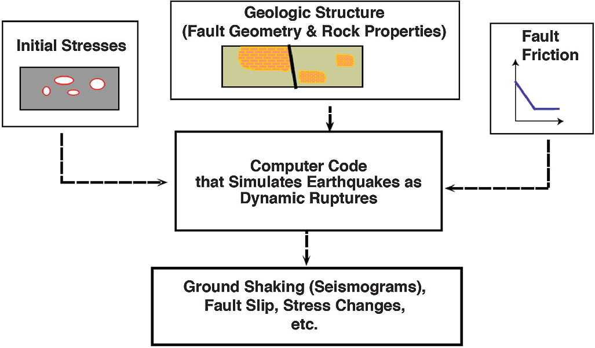
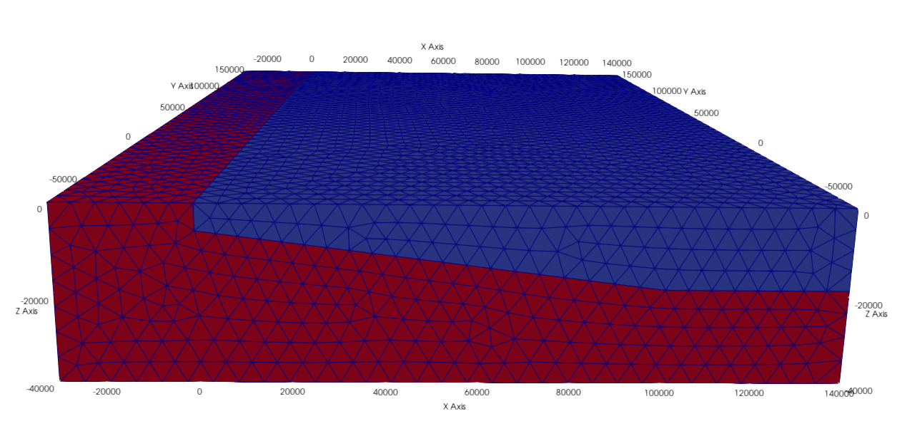
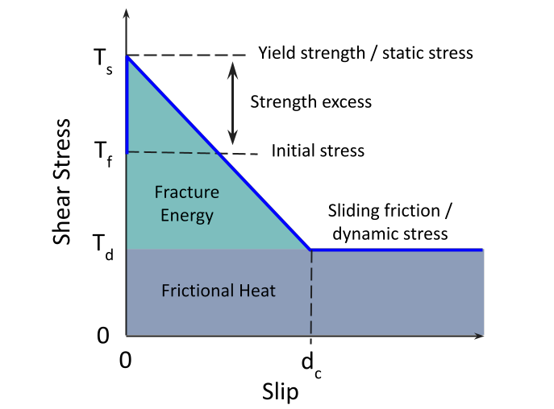
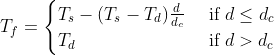
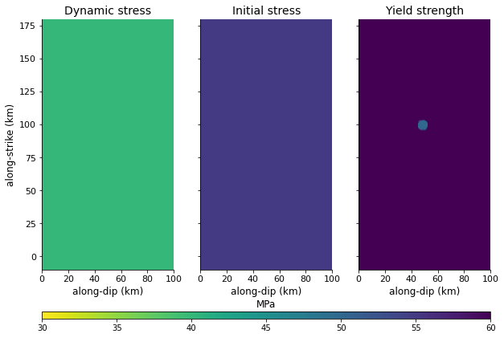

Modeling earthquake using Pylith - dynamic
==========================================

Brief introduction
------------------

Dynamic modeling of earthquakes provides important insights in the physics of earthquake rupture processes. For example, earthquake initiation, propagation, arrest, afterslip, locking, and interseismic stress accumulation can be solved. In particular, dynamic earthquake rupture codes compute the physical earthquake behaviors over short time scales, producing possible earthquake size, fault slip amount, ground motion, and crustal deformation, which are crucial for risk assessment. 

Currently, dynamic rupture simulations are actively used in seismology research for reconstructing well-recorded earthquakes as well as investigating the complex factors controlling earthquakes, such as fault geometry, fault frictional properties, and initial stresses.

Aim of this module
******************

There are different dynamic earthquake rupture codes for a range of code types, including finite element, discontinuous Galerkin finite element, and spectral element methods. In this module, we will focus on **PyLith** which is a finite-element code. 

In this tutorial, we are going to conduct a dynamic rupture simulation using a simple 3D example. As illustrated in the below figure, the inputs of PyLith requires the fault geometry and rock properties, initial stresses, and fault friction. 

figure 1. Key ingredients of a dynamic (spontaneous) earthquake rupture simulation (Harris et al. 2018)

The fault geometry is described by the given mesh. In this example, we will assume the materials to be elastic. For the rock properties, we will use a spatial database to specify a simple depth-dependent material properties, including density, compressional wave velocity (vp), and shear wave velocity (vs). 

figure 2. 3D mesh given in this tutorial with dimensions in kilometers

There are different fault frictional laws. Here we are going to introduce the linear slip-weakening law, which is described by yield strength/stress, initial stress, sliding-friction/dynamic stress, and critical slip distance dc. Yield strength/stress is the maximum stress level that can be applied before the fault slips. Sliding friction is the background stress level. The difference between the initial stress and the yield strength is known as the strength excess. A fault has to overcome this strength excess to allow ruptures. 

figure 3. Schematic diagram of linear slip-weakening model

We can also take a look at the equation for the traction on the fault plane using linear slip-weakening law. When the fault slip (d) is within the critical slip distance (dc), the stress level (Tf) decreases linearly from the static (Ts) to dynamic level (Td). When the fault slip exceeds the critical slip distance, the stress level is the same as the sliding friction. 

In **PyLith**, we would use friction coefficients to specify the frictional properties of the fault. Yield strength is the product of static coefficient and fault normal traction while sliding friction is the product of dynamic coefficient and fault normal traction. In this example, we are using homogeneous initial stresses and dynamic stress on fault. To initiate the rupture, we lower the yield stress below the initial stress level within a circular zone. You can also visualize the yield strength, initial stress, and dynamic stress as the following plot.

figure 4. Plot of the stresses on the fault in our example

Now, you already have a general picture of our problem in this tutorial. In the following, you will learn:

| 1. the input parameters
| 2. initiating a rupture simulation
| 3. visualizing the output

.. note::
 | Here we assume that you have already installed and initialized PyLith. If not, you may refer to `our module on static simulations <https://cuseistut.readthedocs.io/en/latest/pylith_static/index.html>`_ .

Simple 3D case study - Nepal
----------------------------

| 1. Download the tutorial package :download:`pylith_dynamic.tar.gz <./pylith_dynamic.tar.gz>` and move it to your working directory
| 2. Run this command to decompress the package

.. code::

 $ tar xvf pylith_dynamic.tar.gz

| 3. ``ls`` different folders in the directory to familiarize yourself with the different files required for a dynamic simulation

For running the dynamic simulation, you will need configuration files (.cfg) that specifies the problem, mesh (.exo) where the simulation takes place, spatial database files (.spatialdb) that describes the variables in space. Here we have three spatial database files - material property, frictional property, and traction. Since the mesh generating softwares are commercial, only the configuration and spatial database files will be illustrated in the following. 

Basic structure of a configuration (.cfg) file
**********************************************

Now, let's take a took at the **dynamic_rupture_model.cfg** under the **pylith_dynamic** directory. For a simulation in PyLith, you would need a **configuration file (.cfg)** which specifies the basic parameters of the simulation. Many of the commands are the same with those used in a `static simulation <https://cuseistut.readthedocs.io/en/latest/pylith_static/index.html>`_ so the following will only introduce some parameters specified for dynamic simulations.

| **1. Problem**

simulations.
``normalizer`` used to nondimensionalize the equations.
``shear_wave_speed`` specifies the shear wave speed used to nondimensionalize length and pressure (default is 3.0 km/s).
``mass_density`` specifies the mass density to nondimensionalize density and pressure (default is 3.0e+3 kg/m3).
``wave_period`` specifies the period of seismic waves used to nondimensionalize time (default is 1.0 s).

| **2. Boundary condition**

``pylith.bc.AbsorbingDampers`` specifies absorbing boundary condition. Note that this function does not perfectly absorb all incident waves. Please refer to the :download:`manual <./pylith-2.2.2_manual.pdf>` for more details.

| **3. Faults**

``pylith.faults.FaultCohesiveDyn`` specifies dynamic fault interface.
``pylith.friction.SlipWeakening`` specifies linear slip-weakening friction fault constitutive model. There are also other friction models, e.g. rate and state friction, and linear time-weakening friction model.
``friction.db_properties.idhandler.filename`` specifies the filename for the friction parameters.
``traction_perturbation`` specifies initial tractions on fault surface.
``db_initial.data`` specifies the left lateral shear traction, updip shear traction, and normal traction (tension is positive, compression is negative) to be 0 MPa, 55 MPa, -100 MPa.

.. note::
 | The above only documents the some parameters that we may change specified to our static simulation. Note that under this directory, there is also another configuration file **pylithapp.cfg**. **pylithapp.cfg** is not a self-contained simulation configuration file but it specifies the general parameters common to the simulations under this directory. This file is necessary for running our simulation.
 | For more functions and information, please browse through the :download:`PyLith manual <./pylith-2.2.2_manual.pdf>`. 

Basic structure of a spatial database (.spatialdb) file
*******************************************************

After knowing what the configuration files do, let's learn about the spatial database files under the spatialdb directory. The structure and parameter settings of the spatial database files used here are basically the same with those introduced in the `static simulation tutorial <https://cuseistut.readthedocs.io/en/latest/pylith_static/index.html>`_ but their contents are different, thus ``value-names``, ``value-units``, and ``data-dim`` are changed.

| **1. friction.spatialdb**

This spatial database file specifies the parameters required in the frictional law. As we are using the linear slip-weakening friction model, the static coefficient, dynamic coefficient, critical slip distance, and cohesive stress are specified in this file. 

| **2. mat_concrust_1D.spatialdb** 

This spatial database file specifies the material properties. Here we prescribe depth dependent material properties - density, compressional wave velocity vp, and shear wave velocity vs. 

Running the dynamic simulation
******************************

Now that we have a general picture of the files required for our simulation, let's run the simulation.

.. code::

 $ cd your_working_directory/pylith_dynamic/
 $ pylith dynamic_rupture_model.cfg

Now the current timesteps are displayed in the terminal, and you can wait for the simulation to finish.

Visualizing results
-------------------

After finishing the simulation, you should be able to see different output files under the **output** directory. In this tutorial, you will learn how to process the fault output in .h5 format using Python. Hierarchical Data Format (HDF) is a set of file formats (HDF4, HDF5) designed to store and organize large amounts of scientific data. We assume that you already have some experience of using Python and installed h5py. If not, please refer to `our static simulation tutorial <https://cuseistut.readthedocs.io/en/latest/pylith_static/index.html>`_ .

How to install h5py
*******************

.. code::

 $ conda create --name pylith
 $ conda activate pylith
 $ conda install h5py

Please also make sure your have installed matplotlib in your environment. Now, let's run the following commands.

| **1. Import the necessary packages**

.. code:: 

    import h5py
    import matplotlib.pyplot as plt
    from mpl_toolkits.axes_grid1 import make_axes_locatable
    import matplotlib.animation as manimation

| **2. Read the .h5 files**

.. code:: 
        
    filename = 'C:/Users/ypbow/OneDrive/Desktop/mphil/teaching_modules/pylith_dynamic/output/v5/Nepal_dynamic_model-fault.h5'
    f = h5py.File(filename,'r')
    fields = list(f)

If you check ``fields``, you would realize that there are four fields in this file - geometry, time, topology, and vertex_fields. In this tutorial, we will plot results using data from the vertices under ``geometry``, time in ``time`` as well as the slip, slip rate, and traction under ``vertex_fields``. For your reference, the figure below illustrates the general layout of a PyLith HDF5 file (extracted from the :download:`PyLith manual <./pylith-2.2.2_manual.pdf>`). 

.. image:: hdf5_structure.png
   :width: 80%

figure 5. General layout of a PyLith HDF5 file. The orange rectangles with rounded corners identify the groups and the blue
rectangles with sharp corners identify the datasets. The dimensions of the data sets are shown in parentheses. Most HDF5 files
will contain either vertex_fields or cell_fields but not both. (Adopted from PyLith Manual)

| **3. Extract the data**

Since our simulation prescribed zero left-lateral shear traction, we will only focus on the updip shear traction and slip patterns in our plot.

.. code:: 

    time = f.get('/time')
    slip = f.get('/vertex_fields/slip')
    slip_rate = f.get('/vertex_fields/slip_rate')
    traction = f.get('/vertex_fields/traction')
    geometry_vertices = f.get('/geometry/vertices')

    x_vertex = geometry_vertices[:,0]/1000   # along dip distance in km
    y_vertex = geometry_vertices[:,1]/1000   # along strike distance in km
    dip_slip = slip[:,:,1]            # updip slip in m
    dip_slip_rate = slip_rate[:,:,1]  # updip slip rate in m/s
    dip_traction = traction[:,:,1]/10**6    # updip traction in MPa

| **4. Make an animation for the updip slip distribution, slip rate, and traction during the rupture**

.. code:: 

    # Define the meta data for the movie
    FFMpegWriter = manimation.writers['ffmpeg']
    metadata = dict(title='updip_fault_movie', artist='Matplotlib')
    writer = FFMpegWriter(fps=5, metadata=metadata)

    # Plot figure
    fig = plt.figure(facecolor='white', figsize=(14, 14)) 
    size = 15

    with writer.saving(fig, "updip_fault.mp4", 100):    # or .gif 
        for t in range(len(time)): 
            ax1 = fig.add_subplot(131, aspect='equal') 
            scat = ax1.scatter(x_vertex,y_vertex, s = size,c=dip_slip[t,:],cmap = 'jet',vmin = 0,vmax = 65) 
            plt.xticks(fontsize=11) 
            plt.yticks(fontsize=11) 
            plt.title('Updip slip',size = 14) 
            ax1.set_xlabel('along-dip (km)', size = 12) 
            ax1.set_ylabel('along-strike (km)', size = 12) 
            plt.xlim([0, 100]) 
            plt.ylim([-10,180]) 
            divider = make_axes_locatable(ax1) 
            cax = divider.append_axes('right', size='5%', pad=0.05) 
            cbar1 = fig.colorbar(scat,cax=cax, orientation='vertical') 
            cbar1.ax.set_title('m') 
            cbar1.ax.tick_params(labelsize=10) 
            ax1.spines['right'].set_visible(False) 
            ax1.spines['top'].set_visible(False) 

            ax2 = fig.add_subplot(132, aspect='equal')
            reversed_map = plt.cm.get_cmap('inferno').reversed()
            scat = ax2.scatter(x_vertex,y_vertex, s = size,c=dip_slip_rate[t,:],cmap = reversed_map,vmin = 0,vmax = 4)
            plt.xticks(fontsize=11)
            plt.yticks(fontsize=11)
            plt.title('Updip slip rate',size = 14)
            ax2.set_xlabel('along-dip (km)', size = 12)
            ax2.set_ylabel('along-strike (km)', size = 12)
            plt.xlim([0, 100])
            plt.ylim([-10,180])
            divider = make_axes_locatable(ax2)
            cax = divider.append_axes('right', size='5%', pad=0.05)
            cbar2 = fig.colorbar(scat,cax=cax, orientation='vertical')
            cbar2.ax.set_title('m/s')
            cbar2.ax.tick_params(labelsize=10)
            ax2.spines['right'].set_visible(False)
            ax2.spines['top'].set_visible(False)

            ax3 = fig.add_subplot(133, aspect='equal')
            reversed_map2 = plt.cm.get_cmap('viridis').reversed()
            scat = ax3.scatter(x_vertex,y_vertex, s = size,c=dip_traction[t,:],cmap = reversed_map2,vmin = 0,vmax = 60)
            plt.xticks(fontsize=11)
            plt.yticks(fontsize=11)
            plt.title('Updip traction',size = 14)
            ax3.set_xlabel('along-dip (km)', size = 12)
            ax3.set_ylabel('along-strike (km)', size = 12)
            plt.xlim([0, 100])
            plt.ylim([-10,180])
            divider = make_axes_locatable(ax3)
            cax = divider.append_axes('right', size='5%', pad=0.05)
            cbar3 = fig.colorbar(scat,cax=cax, orientation='vertical')
            cbar3.ax.set_title('MPa')
            cbar3.ax.tick_params(labelsize=10)
            ax3.spines['right'].set_visible(False)
            ax3.spines['top'].set_visible(False)

            fig.suptitle('Time = '+str(t)+' s', y = 0.77,size = 17)
            plt.tight_layout()
            #plt.show()
            writer.grab_frame()

You should be able to generate the following animation.

.. figure:: updip_fault.gif

figure 6. An animation of the updip slip distribution, slip rate, and traction during the rupture