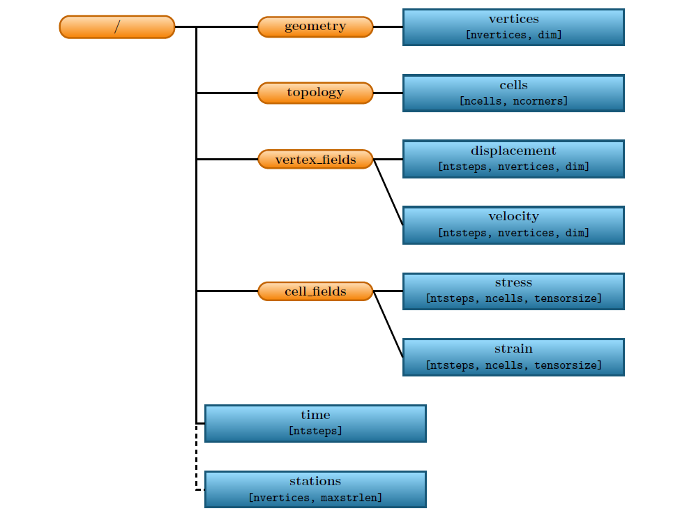
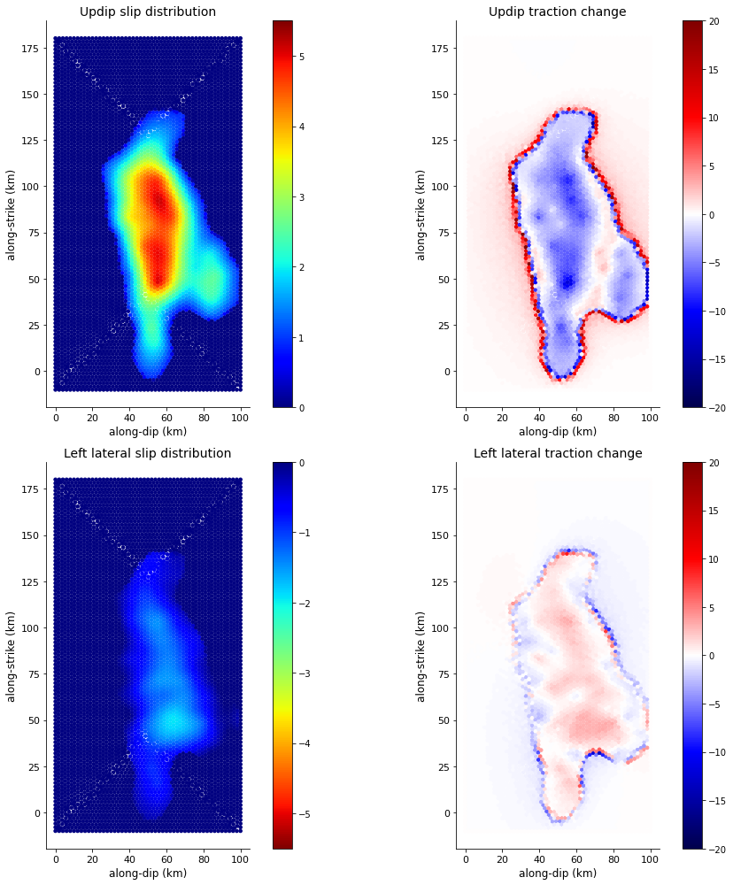

Static Stress Change - PyLith
=============================

Brief introduction
------------------

Earthquake modeling provides a broad range of possible earthquake scenarios using physics-based models, which is critical for seismic hazard assessment. By incorporating observations and laboratory tests into models, we have better understanding of earthquake behaviors by recreating past earthquakes, and explore the range of potential future earthquakes, thus bridging our knowns and unknowns. 

What is PyLith?
***************

PyLith is a finite-element code for quasi-static and dynamic simulations of crustal deformation, primarily earthquakes and volcanoes. Quasi-static problems, also known as implicit problems, solve for the governing equations while neglecting the inertial terms. There are different quasi-static problems related to earthquakes in PyLith, including coseismic stress changes and fault slip, strain accumulation associated with interseismic deformation, and postseismic relaxation of the crust.

Aim of this module
******************

In this teaching module, we will focus on solving for the stress change corresponding to a fault slip distribution. 

**Do you know why an earthquake would happen?**
When the stresses on a fault plane overcomes the friction, a sudden slip would occur on the fault, releasing energy in waves that travel through the earth's crust. This is known as an earthquake. Therefore, it is evident that there are stress changes on the fault after an earthquake.

In other words, given a slip distribution caused by an earthquake, there should be a corresponding stress change. This tutorial considers this as a quasi-static problem and aims to solve this problem through numerical simulation. In PyLith, the problem will be solved when the residual of the governing equation approaches zero.

In this tutorial, we will demonstrate a simple 3D case study. We will prescribe the heterogeneous slip distribution on the fault and the fault geometry using the mesh shown in the figure below.

.. image:: mesh.png
   :width: 80%

figure 1. 3D mesh given in this tutorial with dimensions in kilometers

Then we will run the static simulation to obtain the stress change, so you will learn:

| 1. the input parameters,
| 2. initiating a quasi-static simulation,
| 3. visualizing the output.

How to install PyLith?
**********************

| 1. Download the PyLith package suitable for your computer `here <https://github.com/geodynamics/pylith/releases/tag/v2.1.0>`_, and then move it into your working directory

| 2. Open a terminal in Linux or Mac OS X (Darwin) platform and run these commands sequentially. For Windows 10 Users, we recommend using the Windows Subsystem for Linux (WSL). The installation of WSL could be found `here <https://docs.microsoft.com/en-us/windows/wsl/install>`_ or searched online. Please note that PyLith is using Python2.7. For the new MacOS updates where Python2.7 is removed, you would need to set the environment.

.. warning::

   Exclude $ and start without whitespace!

.. code::

 $ tar xvf pylith-2.2.2-linux-x86_64.tar.gz
 $ cd pylith-2.2.2-linux-x86_64/
 $ source setup.sh

| 3. Check if it has been successfully installed

.. code::

 $ pylith
  >> {default}::
  -- pyre.inventory(error)
  -- meshimporter.meshioascii.filename <- ''
  -- Filename for ASCII input mesh not specified.  To test PyLith, run an example as discussed in the manual.
  >> {default}::
  -- pyre.inventory(error)
  -- timedependent.homogeneous.elasticisotropic3d.label <- ''
  -- Descriptive label for material not specified.
  >> {default}::
  -- pyre.inventory(error)
  -- timedependent.homogeneous.elasticisotropic3d.simpledb.label <- ''
  -- Descriptive label for spatial database not specified.
  >> {default}::
  -- pyre.inventory(error)
  -- timedependent.homogeneous.elasticisotropic3d.simpledb.simpleioascii.filename <- ''
  -- Filename for spatial database not specified.
 pylithapp: configuration error(s)

------------------

Simple 3D case study - Nepal
----------------------------

| 1. Download the tutorial package :download:`pylith_static.tar.gz <./pylith_static.tar.gz>` and move it to your working directory
| 2. Run this command to decompress the package

.. code::

 $ tar xvf pylith_static.tar.gz

| 3. ``ls`` different folders in the directory to familiarize yourself with the different files required for a static simulation

For running the static simulation, you will need configuration files (.cfg) that specifies the problem, mesh (.exo) where the simulation takes place, spatial database files (.spatialdb) that describes the variables in space. Here we have two spatial database files - one for the material property, and one for the fault slip distribution. Since the mesh generating softwares are commercial, we will only illustrate the structure and some important parameters of the configuration and spatial database files in the following. 

Basic structure of a configuration (.cfg) file
**********************************************

Now, let's take a took at the **Nepal_kinematic_model.cfg** under the **pylith_static** directory. For a simulation in PyLith, you would need a **configuration file (.cfg)** which specifies the basic parameters of the simulation.

| **1. Problem**

``[pylithapp.timedependent.formulation.time_step]`` Settings that control the time of the problem. Note that static, quasi-static, and dynamic simulations are also time dependent problems in PyLith.
``total_time`` specifies the total time. We adjust the total simulation time to 0 second because we are running a static simulation.
``dt`` specifies the time step size.

``[pylithapp.mesh_generator.reader]`` Settings that control mesh importing.
``filename`` specifies the filename of the mesh.

``[pylithapp.timedependent.materials]`` Settings that control the material type.
``db_properties.iohandler.filename`` specifies the name of the spatial database containing the physical properties for the material.
``db_properties.query_type`` specifies the type of search query to perform. This parameter can be set to 'linear' or 'nearest'.

| **2. Boundary condition**

``[pylithapp.timedependent]`` Settings that control the problem, including the spatial dimension of the mesh.
``bc`` specifies the boundary conditions for different sides of the mesh.
``bc_dof`` specfies which degrees of freedom are being constrained for the boundary conditions. Note that the Degree of freedoms are: x=0, y=1, and z=2. For instance, ``bc = [2]`` refers to fixed displacement in z direction, and ``bc = [0, 1]`` means fixed displacement in x and y-directions. 
``label`` specfies the name of the nodeset in ExodusII file from CUBIT/Trelis that defines the boundary.
``db_initial.label`` specfies the label for the spatial database which is required for informative error messages.

| **3. Faults**

``interfaces`` specifies an array containing the fault interfaces. Here we have one fault interface so we provide an array containing a single interface.

``[pylithapp.timedependent.interfaces]``
``fault`` specifies the type of fault interface condition. For this example we want to prescribe the fault slip, so the interface type is set to **FaultCohesiveKin**.

``[pylithapp.timedependent.interfaces.fault]`` 

``label`` specifies the name of the nodeset in CUBIT/Trelis that defines the fault interface.

``edge`` specifies the name of the nodeset in CUBIT/Trelis marking the buried edges of the fault. 

``quadrature.cell`` specifies the discretization components for fault cells. FIATSimplex deals with simplex finite-element cells, including point, line, triangle, and tetrahedron. We are having triangular cells on our fault interface mesh so FIATSimplex scheme is chosen here.

``quadrature.cell.dimension`` specifies the dimension of fault cells. The fault cells are 2D in our case.

``[pylithapp.timedependent.interface.fault.eq_scrs.rupture.slip_function]`` Settings for prescribing the coseismic slip distribution on the fault, including the final slip and slip initiation time.

``slip.iohandler.filename`` specifies the name of the spatial database containing the coseismic slip distribution.

``slip.query_type`` specifies the type of search query to perform. Here we define the slip to be a spatial database with linear interpolation.

``slip_time.data`` specifies the slip time within an earthquake rupture relative to the origin time.

| **4. Output** 

Settings related to output of the solution over the domain, subdomain (ground surface), and synthetic stations. 

``output`` specifies the outputs of simulation. Note that the default output is for the entire domain.

``output.station`` specifies the type of output for the stations. 

``[pylithapp.timedependent.formulation.output.domain]`` Settings for domain output.

``writer.filename`` specifies the filename of domain output.

``[pylithapp.timedependent.formulation.output.station]`` Settings for the station outputs.

``reader.filename`` specifies the file with coordinates of stations.

``writer.filename`` specifies the filename of station output.

``coordsys`` specifies coordinate system used in station file.

Similar output parameters for the fault and the materials.

.. note::
 | The above only documents the some parameters that we may change specified to our static simulation. Note that under this directory, there is also another configuration file **pylithapp.cfg**. **pylithapp.cfg** is not a self-contained simulation configuration file but it specifies the general parameters common to the simulations under this directory. This file is necessary for running our simulation.
 | For more functions and information, please browse through the :download:`PyLith manual <./pylith-2.2.2_manual.pdf>`. 

Basic structure of a spatial database (.spatialdb) file
*******************************************************

After knowing what the configuration files do, let's learn about the spatial database files under the spatialdb directory.

| **1. Slip_distribution.spatialdb**

This spatial database file specifies the distribution of slip on the fault surface. The slip is dependent on the x and y- directions but independent of the depth. 

``SPATIAL.ascii 1`` the magic header for spatial database files in ASCII format.

``SimpleDB`` specifies spatial database files contain a header describing the set of points and then the data with each line listing the
coordinates of a point followed by the values of the fields for that point.

``num-values`` number of values in the database

``value-names`` specifies the names and the order of the values as they appear in the data. Note that the names of the values must correspond to the names PyLith requests in querying the database. Here we are having the slip distributions in three different directions - left-lateral (along-strike), reverse (along-dip), and fault-opening (fault-normal).

``value-units`` specifies the units of the values in Python syntax (e.g. m, kg/m**3).

``num-locs`` specifies the number of locations where values are given.

``data-dim`` specifies the locations of data points form a line.

``space-dim`` specifies the spatial dimension in which data resides.

``cs-data`` specifies the coordinate system associated with the coordinates of the locations where data is given. We are using a Cartesian coordinate system here.

``to-meters`` specifies the coordinates in km.

``space-dim`` specifies the spatial dimension of the coordinate system. Note that this value must match the one associated with the database.

| **2. mat_concrust_1D.spatialdb** 

This spatial database file specifies the material properties. Here we prescribe depth dependent material properties - density, compressional wave velocity vp, and shear wave velocity vs. The parameter setting is basically the same with the spatial database file about slip distribution as illustrated above except ``value-names``, ``value-units``, and ``data-dim`` are changed.

Running the static simulation
*****************************

Now that we have a general picture of the files required for our simulation, let's run the simulation.

.. code::

 $ cd your_working_directory/pylith_static/
 $ pylith Nepal_kinematic_model.cfg

Congrats on running your first simulation! 

Visualizing results
-------------------

After finishing the simulation, you should be able to see different output files under the **output** directory. In this tutorial, you will learn how to process the fault output in .h5 format using Python. Hierarchical Data Format (HDF) is a set of file formats (HDF4, HDF5) designed to store and organize large amounts of scientific data. We assume that you already have some experience of using Python.

How to install h5py
*******************

.. code::

 $ conda create --name pylith
 $ conda activate pylith
 $ conda install h5py

Please also make sure your have installed matplotlib in your environment. Now, let's run the following commands.

| **1. Import the necessary packages**

.. code:: 

 import h5py
 import matplotlib.pyplot as plt

| **2. Read the .h5 files**

.. code:: 

   filename = 'your_directory/output/Nepal_kinematic_model-fault.h5'
   f = h5py.File(filename,'r')
   fields = list(f)

If you check ``fields``, you would realize that there are four fields in this file - geometry, time, topology, and vertex_fields. In this tutorial, we will plot results using data from the vertices under ``geometry``, and the slip and traction change under ``vertex_fields``. For your reference, the figure below illustrates the general layout of a PyLith HDF5 file (extracted from the :download:`PyLith manual <./pylith-2.2.2_manual.pdf>`). 

figure 2. General layout of a PyLith HDF5 file. The orange rectangles with rounded corners identify the groups and the blue
rectangles with sharp corners identify the datasets. The dimensions of the data sets are shown in parentheses. Most HDF5 files
will contain either vertex_fields or cell_fields but not both. (Adopted from PyLith Manual)

| **3. Extract the data**

.. code:: 

   slip = f.get('/vertex_fields/slip')
   traction_change = f.get('/vertex_fields/traction_change')
   geometry = f.get('/geometry')
   geometry_vertices = f.get('/geometry/vertices')

   x_vertex = geometry_vertices[:,0]/1000   # along dip distance in km
   y_vertex = geometry_vertices[:,1]/1000   # along strike distance in km
   dip_slip = slip[:,:,1]            # updip slip in m
   lateral_slip = slip[:,:,0]            # left lateral slip in m   
   dip_traction = traction_change[:,:,1]/10**6    # updip traction in MPa
   lateral_traction = traction_change[:,:,0]/10**6    # left lateral traction in MPa

| **4. Plot the slip distribution and traction change**

.. code:: 

   fig = plt.figure(facecolor='white', figsize=(14, 14))
   size = 13

   ax1 = fig.add_subplot(221, aspect='equal')
   scat = ax1.scatter(x_vertex,y_vertex, s = size,c=dip_slip,cmap = 'jet', vmin = 0, vmax = 5.5)
   plt.xticks(fontsize=11)
   plt.yticks(fontsize=11)
   plt.title('Updip slip',size = 14)
   ax1.set_xlabel('along-dip (km)', size = 12)
   ax1.set_ylabel('along-strike (km)', size = 12)
   cbar = fig.colorbar(scat,ax=ax1)
   cbar.ax.tick_params(labelsize=10)
   ax1.spines['right'].set_visible(False)
   ax1.spines['top'].set_visible(False)

   ax2 = fig.add_subplot(222, aspect='equal')
   scat = ax2.scatter(x_vertex,y_vertex, s = size,c=dip_traction,cmap = 'seismic', vmin = -20, vmax = 20)
   plt.xticks(fontsize=11)
   plt.yticks(fontsize=11)
   plt.title('Updip traction change',size = 14)
   ax2.set_xlabel('along-dip (km)', size = 12)
   ax2.set_ylabel('along-strike (km)', size = 12)
   cbar = fig.colorbar(scat,ax=ax2)
   cbar.ax.tick_params(labelsize=10)
   ax2.spines['right'].set_visible(False)
   ax2.spines['top'].set_visible(False)

   ax3 = fig.add_subplot(223, aspect='equal')
   reversed_map = plt.cm.get_cmap('jet').reversed()
   scat = ax3.scatter(x_vertex,y_vertex, s = size,c=lateral_slip,cmap = reversed_map, vmin = -5.5, vmax = 0)
   plt.xticks(fontsize=11)
   plt.yticks(fontsize=11)
   plt.title('Left lateral slip',size = 14)
   ax3.set_xlabel('along-dip (km)', size = 12)
   ax3.set_ylabel('along-strike (km)', size = 12)
   cbar = fig.colorbar(scat,ax=ax3)
   cbar.ax.tick_params(labelsize=10)
   ax3.spines['right'].set_visible(False)
   ax3.spines['top'].set_visible(False)
   #plt.ylim([-10, 210])

   ax4 = fig.add_subplot(224, aspect='equal')
   scat = ax4.scatter(x_vertex,y_vertex, s = size,c=lateral_traction,cmap = 'seismic', vmin = -20, vmax = 20)
   plt.xticks(fontsize=11)
   plt.yticks(fontsize=11)
   plt.title('Left lateral traction change',size = 14)
   ax4.set_xlabel('along-dip (km)', size = 12)
   ax4.set_ylabel('along-strike (km)', size = 12)
   cbar = fig.colorbar(scat,ax=ax4)
   cbar.ax.tick_params(labelsize=10)
   ax4.spines['right'].set_visible(False)
   ax4.spines['top'].set_visible(False)

   plt.tight_layout()
   plt.show()

You should be able to generate the following plot.

figure 3. A plot of the prescribed slip distributions and their corresponding stress changes
