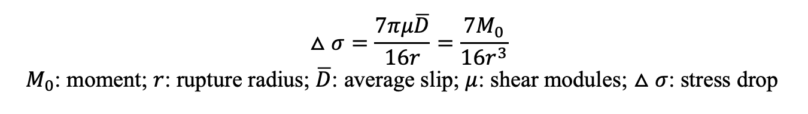

Spectral Analysis 
==================================

Introduction
----------------------------

What is earthquake stress drop?
************************************* 

Stress drop is an important earthquake source parameter, which is proportional to the ratio of fault slip to rupture extent (D/L). The higher stress drop means larger slip given the same rupture area. Since stress drop reflects the strength level on faults, the evolution of the stress drop may indicate some activities on faults such as fluid migration. 

Stress drop in a circular fault
*************************************
For a circular fault in a whole space, Eshelby(1957) obtained the relation between the average stress drop and the seismic moment: 

What is earthquake spectrum?
**********************************

We can calculate the spectrum for earthquakes from the seismograms after removing the effects from the path. The amplitude in the low frequency limit is determined by earthquake moment (M0). The spectrum starts to decay around corner frequency (fc), and keep a nearly constant decay rate in log-log domain in the high frequency. 

.. image:: spectra_case.png
   :width: 70%
Figure 1: (Figure 9.13 in Introduction to Seismology) The relationships between near-field displacement and far-field displacement and velocity for time series (left two panels) and spectra (right panel). 

Brune's model for far-field spectrum
*****************************************

Linking the spectra with the source parameters requires assumptions on the source. Brune (1970) assume a built up the relationship between the source spectra and the source parameters including the stress drop. He assumed that the stress pulse is tangential and rupture velocity is infinite on a circular rupture surface, then derived the near-filed displacement under the constraint of edge-effect. The slip (u) and slip rate (u ̇) on the fault evolve with time.

.. image:: brunesource1.png
   :width: 70%

 .. image:: brunesource2.png
    :width: 50%

Figure 2: The shape of slip and slip rate in Brune's model.

The conservation of energy density at high frequency and long-period limit(static field ) were applied to constrain the displacement in Brune's model. 

Brune’s model has been widely used in spectral analysis. In this tutorial, we will take a simple attempt on calculating the spectral following the Brune’s source model. The tool used in this tutorial is MatLab

