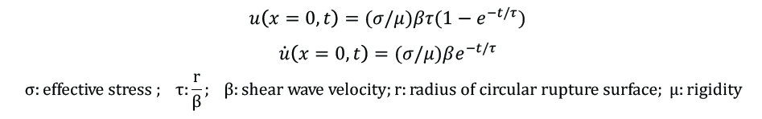
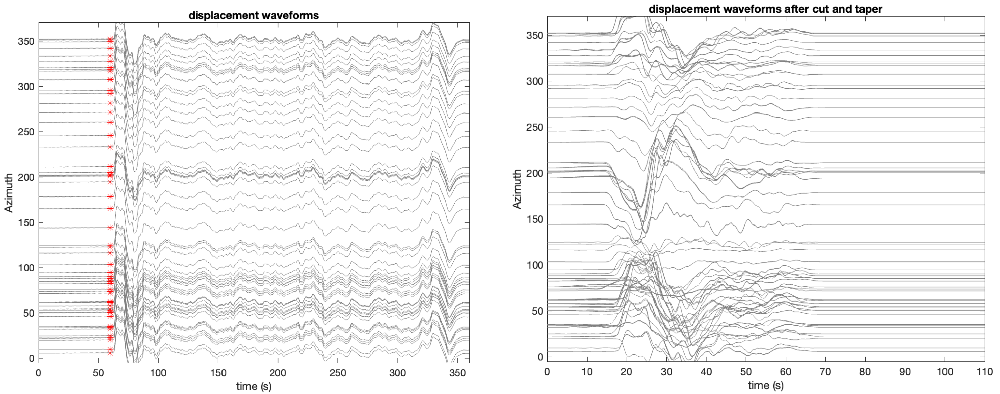
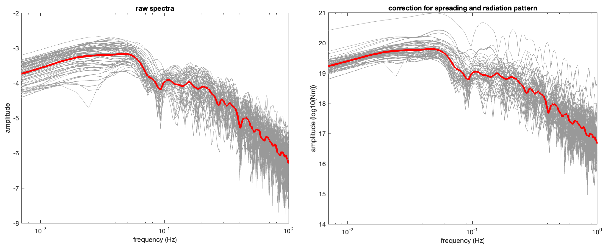
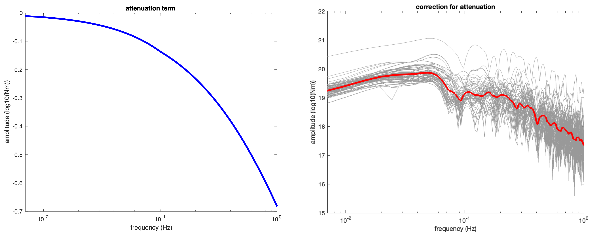
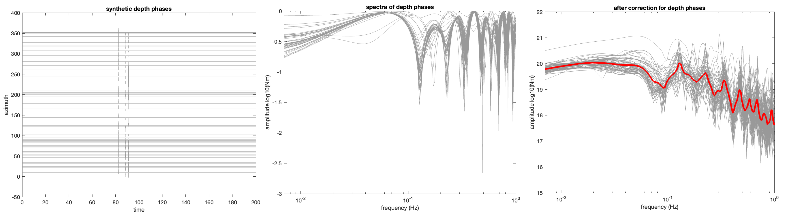

Spectral Analysis 
==================================

Introduction
----------------------------

What is earthquake stress drop?
************************************* 

Stress drop is an important earthquake source parameter, which is proportional to the ratio of fault slip to rupture extent (D/L). The higher stress drop means larger slip given the same rupture area. Since stress drop reflects the strength level on faults, the evolution of the stress drop may indicate some activities on faults such as fluid migration. 

Stress drop in a circular fault
*************************************
For a circular fault in a whole space, Eshelby(1957) obtained the relation between the average stress drop and the seismic moment: 

What is earthquake spectrum?
**********************************

We can calculate the spectrum for earthquakes from the seismograms after removing the effects from the path. The amplitude in the low frequency limit is determined by earthquake moment (M0). The spectrum starts to decay around corner frequency (fc), and keep a nearly constant decay rate in log-log domain in the high frequency. 

.. image:: spectra_case.png
   :width: 60%
Figure 1: (Figure 9.13 in Introduction to Seismology) The relationships between near-field displacement and far-field displacement and velocity for time series (left two panels) and spectra (right panel). 

Brune's model for far-field spectrum
*************************************

Linking the spectra with the source parameters requires assumptions on the source. Brune (1970) assume a built up the relationship between the source spectra and the source parameters including the stress drop. He assumed that the stress pulse is tangential and rupture velocity is infinite on a circular rupture surface, then derived the near-filed displacement under the constraint of edge-effect. The slip and slip rate on the fault evolve with time.

The functions of slip and slip rate on faults in Brune's model

 .. image:: brunesource2.png
    :width: 50%
Figure 2: the shape of slip and slip rate function in Brune's model.

The conservation of energy density at high frequency and long-period limit(static field ) were applied to constrain the displacement in Brune's model. Brune's model has been widely used in spectral analysis in the following format to link the spectra with the seismic moment and stress drop:

.. image:: equation_final.png
   :width: 80%

Path and free surface effects
*************************************
To calculate the source spectra, the effects from the path and depth phases should be removed. In this tutorial, we will try to remove the attenuation term. For earthquakes happened in shallow depth with relative long duration, the depth phases may overlap with P wave and impact the spectral shape (Hanks, 1981). Therefore, we need to calculate and remove the effect from those depth phases.

All those processing process will be included in the tutorial package :download:`spectral_analysis.zip <./spectral_analysis.zip>`. Following is an example of spectral analysis of 2017-11-13 M7.3 Iran earthquake.

Example: the 2017-11-12 Iran M7.3 earthquake 
-----------------------------------------------
Download the waveforms and pre=processing
*******************************************
We use waveforms with epicentral distances of 30-90 degree. We provide some waveforms in the tutorial packages. You can also download the waveforms from IRIS. Considering the duration of the earthquake, we select a time window of 40s, starting from the P arrival for the spectra calculation. We taper the waveforms in 15s windows at the two ends of the selected time windows.

.. note::
 | Pre-processing including taper, rmean, and so on are needed before start spectral analysis. Waveforms need to be transformed to displacement when removing the instrumental response. Please refer to the ObsPy tutorial. The waveforms provided in the package have been preprocessed. The codes for cutting and tapering are contained in the main script - spectral_analysis.m 

.. note::
 | We can see the waveform shape varies with azimuth due to the rupture directivity effect. It is suggested to use waveforms covering all the azimuth.

Calculate spectra
**************************************

Then we calculate the spectra for each waveform traces by conducting fast Fourier transform. The function used here is ``sacfft.m``

.. code ::

>>> function [amplitude, phase, frequency]=sacfft(displacement_seri, time_seri);
% Inputs: the displacement (m) and time series of the waveforms. 
% Outputs in the left: the amplitude, phase term, and the frequency of the spectra
>>> amplitude=log10(amplitude);
% following processing are all conducted in log domain

Correction for spreading term and radiation pattern
*****************************************************

It has been illustrated in equation (2) that the amplitude of the spectra decay with ray path length with 1/R and is proportional to the radiation term. Here, we correct for the two terms using the functions ``direct_P.m``

.. code ::

>>> function [radiationp,Ray_len,Amp_P]=direct_P(dist,depth,Azi,M,path)
% inputs in the right: epicentral distance (dist), source_depth(km,depth), azimuth of station (Azi), moment tensor (M),path to the folder TT_M (path)
% outputs in the left: p wave radiation term (radiationp), ray path length (ray_len), synthetic amplitude of P

The normalized moment tensor has been given as ``M.dat`` in the package. It can be downloaded from the GCMT website. The epicentral distance and azimuth info are extracted from the sac files. The ``TT_M`` folder contains info of the earth model and table for ray parameters. After calculate the synthetic amplitude given a normalized moment tensor, we correct the spectral by substract it from the raw spectra in the log domain. The the amplitude of the spectral should represent the seismic moment (Nm).

.. code ::

>>> amplitude=amplitude-log10(Amp_P);
% correction for the spreading term and the radiation pattern

.. note::
 | The amplitudes of spectra obviously become more concentrated after the correction, indicating that the scattering is mostly caused by the radiation pattern and the spreading term.

Correction for attenuation
*****************************************************

Here, we adopt the global attenuation model to correct the spectra (Choy and Boatwright, 1985). The correction is based on the function ``corre.m``. 

.. code ::
>>> function tp = corre(f)
% f: frequency; tp: correction factor for attenuation as a function of frequency
>>> amplitude=amplitude-log10(corr(f));
% correct for attenuation

Correction for the depth phases
************************************
The depth of the event is 19 km in the SAC files. Given the depth here, the relative arrival times of sP and pP phases are within 15 seconds and contribute to the spectra. Here, we calculate the synthetic spectra for the depth phases effect using the function ``depth_phase_spectrum.m``

.. code ::
>>> function [depth_time,response_depth,anp_dep,ph_dep,ffn_dep]=depth_phase_spectrum(filename,window_length,datalength,M,path)
% Inputs: the name of the sac file (filename); the length of the selected windows in second (window_length);
% Inputs: the length of the time series used in Fourier transform; moment tensor(M);path to the folder TT_M
% Outputs: time series(depth_time);synthetic waveforms normalized by P wave amplitude; 
% amplitude of spectra for depth phase effect (anp_dep); phase term (ph_dep); frequency (ffn_dep)
>>> amplitude=amplitude-log10(anp_dep);
% correct for depth phase term effect

.. note::
 | The depth phase will largely affect the waveform shape at low frequency. It is obvious that the spectra become more flat after correcting for the depth phases. 

Estimating the moment and stress drop
*******************************************
The average magnitude of spectra in the low frequency limit is ~ 4*10^19 Nm. The moment magnitude is 1.1*10^20 Nm. The moment magnitude is 7.3. The corner frequency is ~0.1 Hz. Assuming a P wave speed of 3900 km/s and a density of 3000kg/m^3, the stress drop is estimated to be 25 MPa, residing in the normal range for continental earthquakes.

.. note::
 | The fitting of the spectrum may bare considerable uncertainties according to your fitting algorithm. The uncertainties will be further amplified in the estimate for the stress drop. For example, if the corner frequency change by 20%, from 0.1 to 0.08 Hz, the estimated stress drop will decrease by half from 25 to 13 MPa. 

.. image:: fitting1.png
   :width: 60%

 

